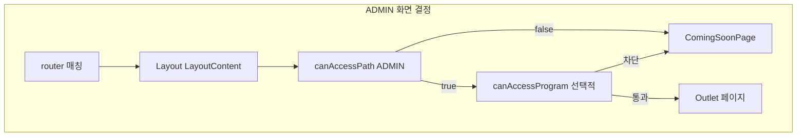

# CMS 관리자(ADMIN) 기준 컴포넌트 사용·미사용 정리 가이드

이 문서는 `apps/cms`에서 **ADMIN 역할이 레이아웃 가드를 통과한 뒤 실제로 마운트될 수 있는 경로**를 기준(Single Source of Truth)으로, UI 모듈(주로 `.tsx`)을 **사용 중**과 **미사용 후보**로 나누는 방법과 주의사항을 정리합니다.

**삭제·이전 결정은 이 문서와 자동 산출물만으로 하지 마세요.** `canAccessPath` 완화, 동적 import, 조건부 렌더링 때문에 “미사용”이 곧바로 dead code가 아닐 수 있습니다.

**파일 단위 목록:** 사용 중 / 미사용 후보 `.tsx`는 [admin-used-unused-components.md](./admin-used-unused-components.md)에서 폴더별로 정리합니다(스크립트 실행 시 JSON과 함께 갱신).

**필터·고아 단서:** 로그인·`/users`·`drawer` 제외를 적용한 목록과 `@/` 별칭 미참조 후보는 [admin-unused-components.md](./admin-unused-components.md)이며, `node scripts/build-admin-unused-components-doc.mjs`로 위 MD를 재생성합니다(`admin-reachable-modules.mjs` 실행 후).

---

## 1. 용어

| 용어 | 의미 |
|------|------|
| **ADMIN** | `User.role === 'ADMIN'`인 사용자. |
| **마스터 관리자** | `isMasterAdmin(user)` 등으로 구분되는 관리자 하위 권한(기능 플래그용). 경로 허용과는 별개일 수 있음. |
| **프로그램 역할** | 프로그램 담당자(OWNER / PARTNER / ASSISTANT 등). 사용자 역할(ADMIN·강사 등)과 혼동 주의. |
| **라우터 등록 경로** | [`src/app/router/index.tsx`](../src/app/router/index.tsx)에 정의된 URL. |
| **ADMIN 실접근 경로** | 아래 `canAccessPath`가 `true`인 pathname. LNB에 링크가 있어도 여기서 막히면 콘텐츠는 렌더되지 않음. |

---

## 2. ADMIN 실접근 경로 정의 (`canAccessPath`)

구현: [`src/shared/config/menu-config.tsx`](../src/shared/config/menu-config.tsx)의 `canAccessPath`.

`pathname`은 끝의 `/`를 제거한 값으로 비교합니다(`path === '/'`만 예외).

### 2.1 허용 규칙 (ADMIN 분기)

1. **`/`** — 관리자 홈. [`src/pages/home/index-page.tsx`](../src/pages/home/index-page.tsx)에서 ADMIN일 때 [`Dashboard`](../src/pages/dashboard.tsx) 렌더.
2. **`/programs/education`으로 시작하는 모든 경로** — 교육 프로그램 레이아웃·목록·수강/강사 모집·enrollment·준비중 일정 등.
3. **정확히 `/programs/economy-education`** — 경제 교육 프로그램 목록.
4. **`/programs/{첫_세그먼트}/…`** 이면서 첫 세그먼트가 아래 **예약 목록에 없을 때** 허용  
   → 프로그램 상세 `:id`, `:id/edit`, `:id/apply`, `:id/apply/complete` 등 **동적 id** 경로.

**예약 첫 세그먼트(이면 위 4번에서 허용되지 않음):**  
`education`, `economy-education`, `my`, `favorites`, `volunteer`, `new`, `satisfaction`

5. 위에 해당하지 않으면 **ADMIN에게는 `false`** → [`src/widgets/layout/layout.tsx`](../src/widgets/layout/layout.tsx)에서 `ComingSoonPage`(접근 권한 없음)만 표시.

### 2.2 주의: 경로만 허용된다고 전체 UI가 보이는 것은 아님

프로그램 관련 경로에서는 동일 레이아웃에서 [`canAccessProgram`](../src/features/permission-request/lib/program-acl.ts)으로 프로그램 단위 차단이 이어질 수 있습니다.  
**경로 허용(`canAccessPath`) ⊃ 실제 화면(ACL 통과)** 관계입니다.



### 2.3 라우터 매핑 요약 (ADMIN이 경로상 열 수 있는 주요 페이지 컴포넌트)

| URL 패턴 (개념) | 라우트에 매핑되는 주요 페이지 모듈 |
|-----------------|-----------------------------------|
| `/` | `IndexPage` → `Dashboard` |
| `/programs/education`, 하위 `student-recruitment`, `instructor-recruitment`, `enrollment` 등 | `EducationProgramLayout`, `ProgramListPage`, `EducationEnrollmentPage` |
| `/programs/education/schedule` | `ComingSoonPage` (라우트는 허용됨) |
| `/programs/economy-education` | `ProgramListPage` |
| `/programs/:id`, `/programs/:id/edit`, `/programs/:id/apply`, `/programs/:id/apply/complete` | `ProgramDetailPage`, `ProgramFormPage`, `ProgramApplicationPage`, `ProgramApplicationCompletePage` |

**에지 케이스**

- **`/programs` 단독**(끝 슬래시 없음): `startsWith('/programs/')`가 거짓이라 ADMIN `canAccessPath`는 **false**입니다. 직접 URL 입력 시 LNB 안에서도 Coming Soon 처리됩니다.
- **로그인·회원가입·MFA** 등은 `Layout` 바깥 라우트라, 본 문서의 “관리자 업무 화면” 시드에서 기본 제외됩니다. 전역은 [`src/main.tsx`](../src/main.tsx)의 Provider 트리가 담당합니다.

---

## 3. LNB 메뉴와 `canAccessPath` 불일치 (알려진 상태)

메뉴는 [`getMenuItemsByRole` / `allMenuItems`](../src/shared/config/menu-config.tsx)로 구성되지만, **ADMIN에 대해서는 `canAccessPath`가 별도로 매우 좁게** 잡혀 있습니다.  
그 결과 **사이드바에 보이는 항목을 눌러도 “접근 권한이 없습니다”(Coming Soon)가 뜨는 경우**가 있습니다.  
컴포넌트 정리 시 “메뉴에 있다 = 관리자가 쓴다”로 가정하면 오류가 납니다. 반드시 **2절의 ADMIN 규칙**을 기준으로 하세요.

---

## 4. “사용 중” 판정 규칙 (정적 그래프)

1. **시드(진입점)**  
   - **셸:** `widgets/layout`의 `layout`, `sidebar`, `main-header`, `header`  
   - **ACL:** 레이아웃이 직접 import하는 `features/permission-request/lib/program-acl.ts`  
   - **페이지:** 2.3절의 ADMIN 실접근에 대응하는 페이지 파일들 + 레이아웃이 차단 시 쓰는 `pages/error/coming-soon-page.tsx`

2. **전파**  
   시드 `.ts`/`.tsx`에서 **정적** `import` / `export … from`만 따라가며 BFS.  
   `@/` 별칭과 상대 경로를 `src` 기준 실파일로 해석합니다(`.tsx` / `.ts` / `index`).

3. **판정**  
   - 그래프에 포함된 `.tsx` → **ADMIN 업무 동선 기준 사용 중(정적 추적 한정)**  
   - `pages`·`features`·`widgets`·`entities`·`shared` 아래 `.tsx` 중 그래프에 없음 → **미사용 후보**

4. **한계 (반드시 예외 처리)**  
   - `React.lazy` / 동적 `import()` 문자열 — 그래프에 안 잡힘.  
   - 런타임 조건부 import·리플렉션.  
   - 배럴 파일(`index.ts`): 배럴을 거치면 “파일 단위 도달”과 “export 심볼 단위 사용”이 다를 수 있음.  
   - `data/mock`, 테스트 전용, 스토리북 등.  
   - 향후 `canAccessPath` ADMIN 분기가 완화되면 미사용 후보가 즉시 사용으로 바뀔 수 있음.

---

## 5. 자동 산출물 및 실행 방법

### 5.1 저장소에 포함된 스크립트

- 스크립트: [`scripts/admin-reachable-modules.mjs`](../scripts/admin-reachable-modules.mjs)  
- 보조: [`scripts/auth-users-reachable.mjs`](../scripts/auth-users-reachable.mjs) — 로그인·회원가입·MFA·`/users` 시드 기준 정적 도달 `.tsx` 출력(필터용).  
- 보조: [`scripts/build-admin-unused-components-doc.mjs`](../scripts/build-admin-unused-components-doc.mjs) — 그래프 JSON + 인증·`/users` 제외 + `drawer` 경로 제외 후 [`admin-unused-components.md`](./admin-unused-components.md) 생성(`@/` 미참조 후보 섹션 포함).

실행 (패키지 루트 `apps/cms`):

```bash
cd apps/cms && node scripts/admin-reachable-modules.mjs
node scripts/build-admin-unused-components-doc.mjs
```

- 결과 JSON: [`docs/admin-reachable-graph-output.json`](./admin-reachable-graph-output.json)  
  - `seeds`: 시드 목록  
  - `reachableRelative`: 도달 가능한 `src` 기준 상대 경로(`.ts`/`.tsx`만)  
  - `unreachableTsxRelative`: 스캔 범위 내 미도달 `.tsx` 목록  
- 같은 실행으로 목록 MD: [`docs/admin-used-unused-components.md`](./admin-used-unused-components.md) (사용 중 / 미사용 후보 `.tsx`를 `features/foo` 단위로 나열)

**최근 실행 스냅샷(참고용, 재실행 시 변동 가능)**

- 시드 파일 수: 15  
- 도달 모듈(`.ts`/`.tsx`): 약 346개  
- 도달 `.tsx`: 약 174개  
- 스캔 대상 `.tsx`(pages/features/widgets/entities/shared): 약 288개  
- 미도달 `.tsx`(미사용 후보): 약 114개  

### 5.2 다른 도구 (선택)

팀에서 그래프 시각화가 필요하면 다음을 `devDependencies`로 추가해 사용할 수 있습니다.

- **madge** — 순환 의존·import 그래프  
- **dependency-cruiser** — 규칙 기반 검사 및 그래프 출력  

이 경우에도 **시드를 ADMIN 실접근 페이지 + 셸로 한정**하는 점은 동일합니다.

---

## 6. 유지보수 체크리스트

라우트·권한·메뉴를 손댈 때 아래를 함께 갱신합니다.

- [ ] [`canAccessPath`](../src/shared/config/menu-config.tsx) ADMIN 분기  
- [ ] [`router/index.tsx`](../src/app/router/index.tsx) 매핑  
- [ ] [`scripts/admin-reachable-modules.mjs`](../scripts/admin-reachable-modules.mjs)의 `SEED_FILES` (페이지 진입 파일이 바뀌면)  
- [ ] `node scripts/admin-reachable-modules.mjs` 재실행 후 `admin-reachable-graph-output.json`, `admin-used-unused-components.md` 커밋 여부(팀 정책에 따름)  
- [ ] (선택) `node scripts/build-admin-unused-components-doc.mjs`로 `admin-unused-components.md` 갱신  
- [ ] 본 문서 2·3절 서술과 불일치 없는지 확인  

---

## 7. 요약

| 기준 | 사용할 것 |
|------|-----------|
| 관리자가 “진짜로” 볼 수 있는 경로 | `canAccessPath(path, 'ADMIN')` |
| 라우터에만 있고 ADMIN에 막힌 코드 | 다른 역할·향후 오픈·메뉴 불일치 후보로 분류 |
| Dead code 판단 | 정적 그래프 + `rg`/IDE 검색 + 제품 동선 검증 |

이 문서와 JSON은 **정리 작업의 출발점**이며, 최종 삭제는 리뷰와 검색으로 검증한 뒤 진행하세요.
