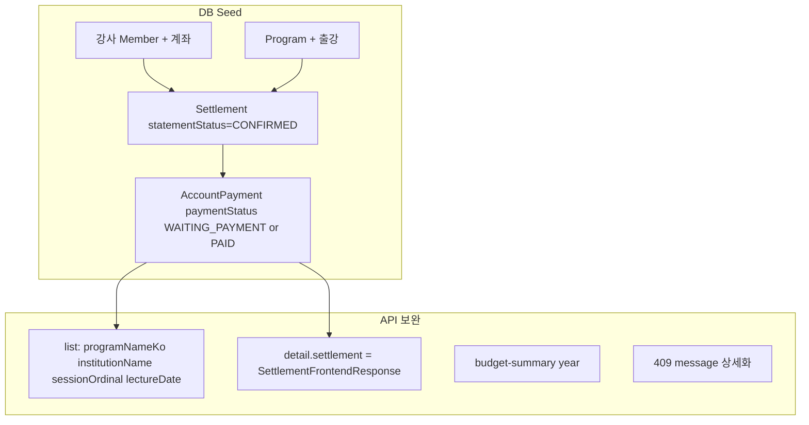

# 계좌 지급 확인 — 백엔드 API·DB Seeding 핸드오프

| 항목 | 값 |
|------|-----|
| **작성일** | 2026-08-27 |
| **대상** | 백엔드 (AccountPayment / Settlement / Budget / Export · local·staging seed) |
| **화면** | CMS LNB `정산 관리` → `계좌 지급 확인` (`/settlement-management/account-payments`) |
| **OpenAPI** | [`apps/cms/openapi/settlement.openapi.json`](../../openapi/settlement.openapi.json) |
| **FE mock SSOT** | [`account-payments-list.ts`](../../src/data/mock/account-payments-list.ts) |
| **상태 매핑** | [`settlement-status-mappers.ts`](../../src/features/settlement-management/api/shared/settlement-status-mappers.ts) |
| **목록 매퍼** | [`map-account-payment-rows.ts`](../../src/features/settlement-management/api/account-payments/map-account-payment-rows.ts) |
| **시드 스펙 JSON** | [`account-payments-seed-v1.spec.json`](./account-payments-seed-v1.spec.json) |
| **갭 상세** | [`settlement-api-backend-gaps.md`](./settlement-api-backend-gaps.md) §4~§5.2 · §7~§8 |
| **연동 명세** | [`settlement-api-integration.md`](./settlement-api-integration.md) |
| **OpenAPI P0 Cursor 프롬프트** | [`account-payments-openapi-p0-backend-cursor-prompt.md`](./account-payments-openapi-p0-backend-cursor-prompt.md) |
| **원장 연동 BE 프롬프트** | [`settlement-ledger-link-p0-backend-cursor-prompt.md`](./settlement-ledger-link-p0-backend-cursor-prompt.md) |
| **원장 DB Seed 업데이트** | [`settlement-ledger-link-db-seed-update-2026-08-27.md`](./settlement-ledger-link-db-seed-update-2026-08-27.md) |

**모듈 플래그:** `VITE_REAL_API_MODULES=...,accountPayments`

---

## 1. 개요

CMS 계좌 지급 확인을 **mock → remote**로 안정 검증하려면:

1. **DB seed** — 지급조서 `CONFIRMED` + AccountPayment 행이 FE mock(≥30건, 대기/완료 비율·시안 날짜)과 동등하게 존재
2. **API 보완** — 목록 필터/표시 필드, 상세 1회 embed, 예산 요약, 409 메시지, (선택) export downloadUrl

FE는 이미 `GET list` / `GET detail`(+ settlements 우회) / `PATCH paid` / `PATCH bulk-paid` / budget-summary hook을 호출한다. **시드만 넣어도 목록은 보이지만**, 아래 갭을 막지 않으면 상세·요약카드·필터·양식이 깨진다.



---

## 2. FE 화면 계약 (시안·Notion 2026-08)

| UI | 규칙 |
|----|------|
| **노출 조건** | 지급조서가 **확인 완료(`CONFIRMED`)** 인 건만 목록·캘린더에 노출 |
| **상태 필터/표기** | **2종만** — `계좌 지급 대기 중` / `계좌 지급 완료` |
| **목록 컬럼** | No · 신청자명 · 프로그램명 · 참여 기관명 · **강의 진행 차시** · 계좌 지급 현황 · 정산 예정금 · 이체 예정일 |
| **개인 프로그램** | `institutionName`·차시 없으면 UI `-` |
| **목록 필터 「이체 예정일」** | **`scheduledPaymentDate`(이체 예정일)** 기준. 시작일 선택 시 한 달 자동 구간 |
| **캘린더 일자** | **출강일(`lectureDate`)** 기준 배치. 숏 라벨: `지급 대기` / `지급 완료` |
| **요약 카드** | ① 연도 예산 총액 ② 연도 정산 완료 총액(`PAID` 합) ③ 필터 구간 내 **대기** 합 |
| **대량이체 양식** | **시안 9열** (입금은행~휴대폰). Notion 「강사비+세액 교대」는 **채택하지 않음** (세금신고 양식과 혼동) |
| **세금신고 양식** | 소득구분 그룹 + 소계 · **완료(`PAID`) 건만** |
| **이름** | 목록·상세 신청자명 **마스킹 금지** ([gaps §P0 이름](./settlement-api-backend-gaps.md)) |

### 2.1 API `paymentStatus` → FE UI

| API `paymentStatus` | FE UI key | 라벨 |
|---------------------|-----------|------|
| **`WAITING_PAYMENT`** / `FAILED` | `awaiting_confirmation` | 계좌 지급 대기 중 |
| `REQUESTED` (대기 버킷 **alias** — BE가 WAITING_PAYMENT+FAILED로 해석) | 동일 | 동일. **응답을 REQUESTED로 위장하지 않음** |
| `PAID` | `account_paid` | 계좌 지급 완료 |
| `CONFIRMED` | `partial_confirmation` | (목록 필터 미노출 — 시드에서 쓰지 말 것) |
| `CORRECTION_REQUESTED` | `payment_correction_requested` | (목록 필터 미노출 — 시드에서 쓰지 말 것) |

**시드 권장:** 목록용 건은 `WAITING_PAYMENT`(대기) / `PAID`(완료)만. (`REQUESTED`는 지급조서 축과 이름 겹침.)

---

## 3. API 인벤토리 · 업데이트 필요 항목

### 3.1 이미 있는 경로 (path 유지)

| Method | Path | FE | 비고 |
|--------|------|-----|------|
| GET | `/api/admin/account-payments` | 연동 | query/query 보강 필요 §3.2 |
| GET | `/api/admin/account-payments/{paymentId}` | 연동 | embed DTO §3.3 |
| PATCH | `/api/admin/account-payments/{paymentId}/paid` | 연동 | 409 message §3.4 |
| PATCH | `/api/admin/account-payments/bulk-paid` | 연동 | body `{ paymentIds[] }` · 409 동일 |
| GET | `/api/admin/settlements/budget-summary?year=` | hook 있음 | 응답 필드 확정 §3.5 |
| POST | `/api/admin/settlements/exports/bulk-transfer` | **화면 미연결** | FE는 Client Excel. downloadUrl 있으면 추후 연결 |
| POST | `/api/admin/settlements/exports/tax-report` | **화면 미연결** | 동일 |
| GET | `/api/admin/settlements/{settlementId}` | 상세 **우회** | §3.3 해결 후 계좌 상세에서 제거 |

### 3.2 ⭐ 목록 DTO / 쿼리 보강 (시딩과 동시 권장)

`AccountPaymentListItemResponse`에 **없거나 join 의존**인 필드 — FE는 settlement 목록 join 또는 extras로 우회 중.

| 필드 | UI | 요청 |
|------|-----|------|
| `programNameKo` (또는 `programName`) | 프로그램명 | **목록 응답에 포함** |
| `institutionName` | 참여 기관명 (개인=`null`/`""` → `-`) | **포함** |
| `sessionOrdinal` 또는 `sessionLabel` | 강의 진행 차시 | **포함** (`"2 ~ 3차시"` 가능하면 문자열 권장) |
| `lectureDate` | 캘린더 출강일 | **포함** (date) |
| (기존) `scheduledPaymentDate` | 이체 예정일·필터 | 유지 |
| (기존) `netPaymentAmount` | 정산 예정금 | 유지 |
| (기존) `bankName` / `maskedAccountNo` / `accountHolder` | 상세·확인 모달 | 유지 · **시드 필수** |

**쿼리 (목록):**

| query | 용도 |
|-------|------|
| `status` | `REQUESTED` \| `PAID` (또는 서버 enum). FE 필터 「대기/완료」 |
| `fromDate` / `toDate` | **이체 예정일** 구간 (출강일 아님) |
| `instructorName` / `programName` | contains 검색 |
| `year` 또는 기간 | 연도 탭 — 전년 12월~당해 12월 |
| `page` / `size` | 페이지 |

현재 OpenAPI `ListAccountPaymentsParams`가 `status`·`page`·`size`만이면 **날짜·이름 필터를 서버에 추가**하거나, FE가 전량 받아 클라이언트 필터한다는 전제를 문서화할 것. **시딩 규모 ≥30이면 서버 필터 권장.**

### 3.3 ⭐ 상세 embed — `GET .../account-payments/{id}` 1회

| | |
|---|---|
| **현재** | `payment` + `settlement`(`SettlementResponse`) → FE가 `GET /settlements/{id}` 추가 호출 |
| **요청** | `settlement`를 **`SettlementFrontendResponse`와 동일 계약**으로 embed (gaps §5.2 안 A) |
| **필수 UI** | 프로그램명·사업기간·진행회차·기관·차시·강의비 책정·사업소득자 · `items[]` + `calculationDetail` |

### 3.4 ⭐ 409 `PAYMENT_STATEMENT_STATUS_CONFLICT` message

`code` 유지. `message`만 운영자 행동 안내 (예: `지급조서 확인 완료 후 계좌 지급을 처리할 수 있습니다.`).  
권장: `error.details.statementStatus`.

### 3.5 예산 요약

`GET /api/admin/settlements/budget-summary?year=2026`

| 필드 (제안) | UI |
|-------------|-----|
| `annualBudgetAmount` | `{year}년 예산 총액` — 시드 검증값 **109_150_000** |
| `completedPaymentAmount` | 해당 연도 `PAID` 합 |

### 3.6 Export (P1)

대량이체·세금신고는 FE **Client Excel**이 SSOT. BE export는 downloadUrl/polling이 준비되면 연결.  
시드만으로 Client Excel 미리보기는 **목록 `PAID` + 계좌·휴대폰**이면 충분.

---

## 4. DB Seeding 요구사항

### 4.1 전제 엔티티

각 AccountPayment 행은 최소 다음을 가리켜야 한다.

1. **Member(강사)** — 실명(마스킹 금지), 정산 계좌(은행·계좌·예금주), 연락처(대량이체 휴대폰)
2. **Program** — 기관형(학교명) / 개인형(기관 없음)
3. **Settlement** — `statementStatus = CONFIRMED`, 산출 `items[]`(강의비·교통·숙박·원천징수 등), `lectureDate`, `sessionOrdinal`/`lectureSessionDisplay`, `netPaymentAmount`
4. **AccountPayment** — `settlementId`, `paymentStatus` ∈ {`REQUESTED`,`PAID`}, `scheduledPaymentDate`, `netPaymentAmount`, 계좌 스냅샷

### 4.2 시드 규모·분포 (FE mock 동등)

| 항목 | 값 |
|------|-----|
| 최소 건수 | **32** (목록 `no` 연출은 FE; BE는 id만) |
| 상태 | ~60% `REQUESTED`, ~40% `PAID` |
| 이체 예정일 | **2026-02** 중심 (시안 `2026-02-24` 포함) |
| 출강일 | **2026-01** 다수 (캘린더 월간 검증) |
| 금액 | `2_000_000`, `915_000`, `15_000` 중심 |
| 개인 프로그램 | **≥2건** — institution / session empty |
| 다차시 | `"2 ~ 3차시"` 표기 가능 건 ≥1 |
| 예산 | year=2026 → `annualBudgetAmount = 109150000` |

상세 행 스펙: [`account-payments-seed-v1.spec.json`](./account-payments-seed-v1.spec.json)

### 4.3 시드 시나리오 체크 (수용)

- [ ] `GET /account-payments` → CONFIRMED 연계 건만, 프로그램명·기관·차시·출강일·이체일이 비어 있지 않음(개인 제외)
- [ ] 필터 `status=REQUESTED` / `PAID` 와 이체일 구간이 동작
- [ ] 캘린더: 2026-01 출강일에 이벤트 다수
- [ ] `GET /account-payments/{id}` 1회(§3.3 후)로 상세·산출 표시
- [ ] `PATCH paid` / `bulk-paid` — CONFIRMED만 200, 미확인 409 + 상세 message
- [ ] `budget-summary?year=2026` → 예산 109150000, 완료 합 = PAID 시드 합과 일치
- [ ] `PAID` 선택 → 대량이체/세금신고 Client Excel에 계좌·금액 반영

---

## 5. 백엔드 Cursor 프롬프트 (복붙용)

아래 블록을 JABACK(또는 정산 백엔드) Cursor 에이전트에 그대로 전달한다.

````markdown
# 과제: 계좌 지급 확인 — DB seed + API 보완 (CMS FE 계약)

프론트 핸드오프 SSOT:
- `apps/cms/docs/api/account-payments-backend-seed-handoff-2026-08-27.md`
- `apps/cms/docs/api/account-payments-seed-v1.spec.json`
- `apps/cms/src/data/mock/account-payments-list.ts`
- `apps/cms/docs/api/settlement-api-backend-gaps.md` §4, §5.1, §5.2

## 목표

CMS `/settlement-management/account-payments` 가 `VITE_REAL_API_MODULES=...,accountPayments` 로 목록·캘린더·상세·일괄지급·요약카드를 검증할 수 있게 **local/staging seed** 와 **API 갭**을 맞춘다.

## 하지 말 것

- 신규 목록 path 만들지 마라. 기존 `/api/admin/account-payments` 유지.
- 목록 UI용 시드에 `paymentStatus=CONFIRMED` / `CORRECTION_REQUESTED` 를 주력으로 넣지 마라. **REQUESTED / PAID** 만.
- 신청자명 마스킹하지 마라.
- 대량이체 양식을 「강사비+세액 교대 행」으로 만들지 마라. (세금신고와 혼동. FE Client Excel 시안 9열.)

## 필수 API 작업

1. **목록 응답 보강**  
   각 item에 `programNameKo`(또는 programName), `institutionName`, `sessionOrdinal` 또는 session 표기, `lectureDate` 포함.  
   가능하면 list query에 `fromDate`/`toDate`(이체 예정일), `instructorName`, `programName`, `status`, year/기간 추가.

2. **상세 1회**  
   `GET /api/admin/account-payments/{id}` 의 `settlement` 를 `SettlementFrontendResponse` 와 동일 계약으로 embed.  
   FE가 `GET /settlements/{id}` 를 계좌 상세에서 제거 가능하게.

3. **409 message**  
   `PAYMENT_STATEMENT_STATUS_CONFLICT` code 유지. message 를 「지급조서 확인 완료 후 …」 형태로.  
   `details.statementStatus` 권장. paid / bulk-paid 동일.

4. **budget-summary**  
   `GET /api/admin/settlements/budget-summary?year=`  
   `annualBudgetAmount`, `completedPaymentAmount` 확정. seed year 2026 예산 **109150000**.

5. **Seed (≥32건)**  
   - Settlement `statementStatus=CONFIRMED` 만 계좌 목록에 연결  
   - AccountPayment ~60% REQUESTED / ~40% PAID  
   - scheduledPaymentDate ≈ 2026-02 (포함 2026-02-24)  
   - lectureDate ≈ 2026-01 (캘린더)  
   - 금액 2_000_000 / 915_000 / 15_000 중심  
   - 개인 프로그램 ≥2 (institution/session empty)  
   - 은행·마스킹계좌·예금주·(양식용) 평문 계좌·휴대폰 채움  
   - 상세용 settlement items: 강의비+교통+숙박+원천징수 샘플 ≥1

## 수용 테스트

- [ ] GET list 32+ · 프로그램/기관/차시/이체일/출강일 표시
- [ ] status + 이체일 구간 필터
- [ ] 2026-01 캘린더 이벤트
- [ ] GET detail 1회만으로 산출 테이블 (settlements 단건 불필요)
- [ ] bulk-paid 200 / 미확인 409 message
- [ ] budget-summary 2026 = 109150000 + PAID 합

OpenAPI 갱신 후 FE `pnpm --filter cms fetch:openapi && generate:api` 가능해야 한다.
````

---

## 6. FE 측 후속 (참고 · 이번 BE 작업 범위 밖)

| 항목 | 상태 |
|------|------|
| mock 32건 · 라벨 2종 · 차시 컬럼 · 엑셀 툴바 | **완료** (2026-08-27) |
| list extras 매핑 · settlements join 제거 · 상세 1회 | **완료** (OpenAPI는 FE codegen 패치로 임시 보강) |
| 목록 size=100 · 연도 탭≠목록 refetch · paid↔지급조서 교차 무효화 | **완료** |
| OpenAPI 정식 반영 후 FE `filter-openapi-settlement` P0 패치 제거 | BE `/v3/api-docs` 갱신 후 |
| export API → Client Excel 대체 | downloadUrl P1 · **미연결** |

**FE Network 스모크 (remote `accountPayments`):**

- 연도 탭만 변경 → `budget-summary`만 재호출, 동일 이체일 구간이면 목록 재호출 없음
- 상세 오픈 → `GET /account-payments/{id}`만 (`/settlements/{id}` 없음)
- paid / 지급조서 확인 후 → 계좌·지급조서 목록 캐시 갱신

---

## 7. 관련 링크

- Notion: 계좌 지급 확인 1~7 · 상세 1~2 (CMS 어드민 기능정의서)
- [`account-payments-openapi-p0-backend-cursor-prompt.md`](./account-payments-openapi-p0-backend-cursor-prompt.md) — **BE 전달용 Cursor 프롬프트**
- [`settlement-api-integration.md`](./settlement-api-integration.md)
- [`settlement-api-backend-gaps.md`](./settlement-api-backend-gaps.md)
- [`settlement-payment-order-detail-backend-handoff.md`](./settlement-payment-order-detail-backend-handoff.md) (산출 DTO SSOT)
