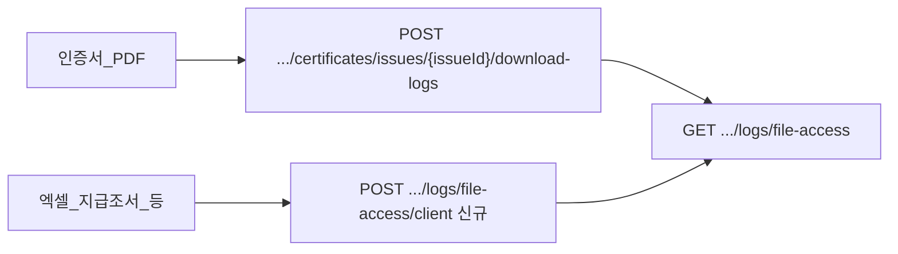

# 클라이언트 발급 문서 — 파일 다운로드 이력 적재 API (백엔드 핸드오프)

| 항목 | 값 |
|------|-----|
| 작성일 | 2026-09-03 |
| 우선순위 | **P0** |
| 범위 | CMS가 **브라우저에서 생성**한 파일(엑셀·지급조서 PDF 등) 저장 직전 감사 로그 |
| 관련 | [logs-api-backend-gaps.md](./logs-api-backend-gaps.md) · [logs-api-backend-cursor-prompt.md](./logs-api-backend-cursor-prompt.md) · [logs-api-integration.md](./logs-api-integration.md) · [certificate-serial-allocate-backend-prompt.md](./certificate-serial-allocate-backend-prompt.md) |

---

## 1. 배경 / 왜 필요한가

CMS **파일 다운로드 이력** 화면은 `GET /api/admin/logs/file-access`만 조회한다.

| 다운로드 유형 | 파일 생성 | 이력 적재 (현재) |
|---------------|-----------|------------------|
| 수료증·참가/활동 인증서 PDF | FE html2canvas | `POST /api/admin/certificates/issues/{issueId}/download-logs` → 서버가 `file-access` insert |
| 목록 엑셀, 지급조서 PDF, 첨부 placeholder 등 | FE ExcelJS / PDF blob | **적재 API 없음** → 이력 화면에 안 보임 |

인증서 경로는 `issueId`(certificate_issue 장부 PK)가 필수다. 엑셀·지급조서에는 발급 장부가 없다.  
`allocate` + `download-logs`를 억지로 쓰면 **인증서 고유번호 장부가 오염**되므로 금지한다.

FE가 임시로 `POST /api/admin/logs/file-access`(GET과 동일 path)를 호출했으나 스테이징에서 **405 METHOD_NOT_ALLOWED**.  
→ **GET path에 POST를 추가하지 말고**, 클라이언트 전용 write path를 신설한다.



---

## 2. 요청 계약 (확정안)

### 2.1 Endpoint

| 항목 | 값 |
|------|-----|
| Method / Path | `POST /api/admin/logs/file-access/client` |
| Auth | 관리자 Bearer JWT |
| 권한 | 다운로드 가능한 관리자(MASTER/PM 등). **VIEWER는 403** 권장 (FE도 다운로드 차단) |
| OpenAPI | `logs.openapi.json`에 추가 후 CMS Orval 재생성 |

### 2.2 Request body

`CertificateDownloadLogRequest`와 필드 정렬 (issueId 없음).

```json
{
  "fileName": "회원_목록_20260903.xlsx",
  "userAgent": "Mozilla/5.0 …",
  "ipAddress": "203.0.113.10"
}
```

| 필드 | 필수 | 설명 |
|------|------|------|
| `fileName` | **필수** | 저장 파일명. `GET .../file-access` 파일명 컬럼에 **그대로** 반영. trim 후 빈 문자열이면 400 |
| `userAgent` | 선택 | 클라이언트 User-Agent |
| `ipAddress` | 선택 | 없으면 **서버가 요청 IP**를 넣는다 |

### 2.3 Response

- 성공: `200` + 기존 CMS envelope `{ success, data }`. `data`는 `null` 또는 `{ "id": "<logId>" }`
- 실패: 4xx/5xx. FE는 **파일을 저장하지 않음** (인증서 `download-logs`와 동일 fail-closed)

### 2.4 적재 규칙 (핵심)

1. 성공 시 `GET /api/admin/logs/file-access`가 읽는 **동일 저장소/테이블**에 1행 insert
2. 목록 DTO는 기존 `DownloadLogFrontendResponse` (`id`, `fileName`, `userName`, `userId`, `ipAddress`, `downloadedAt`)
3. `userId` / `userName` = **요청한 관리자**(JWT subject). 회원 ID가 아님
4. `downloadedAt` = 서버 시각
5. 멱등 강제 불필요 — 동일 파일명 재다운로드마다 **새 행** 허용

---

## 3. 금지 / Out of scope

| 금지 | 이유 |
|------|------|
| `POST /api/admin/logs/file-access` (GET과 동일 path) | 이미 405. 목록 GET 계약과 섞지 말 것 |
| 엑셀·지급조서에 `POST .../certificates/issues/{issueId}/download-logs` 강제 | `issueId` 없음 · 장부 오염 |
| 엑셀·지급조서용 `allocateCertificateSerial` | 고유번호 시퀀스/장부 오염 |
| 인증서 실발급 흐름 변경 | 기존 `serial` + `download-logs` 유지 |
| `POST /api/admin/logs/privacy-access` | 본 범위 아님 |

서버 파일 relay / export API가 파일을 내려줄 때는 **그 API 성공 시 서버가 자동 적재**하는 기존 원칙을 유지한다.  
본 API는 **파일이 서버를 거치지 않는 FE blob 저장** 전용이다.

---

## 4. FE 적용 대상 (연동 예정)

API·OpenAPI·스테이징 200 확인 후 CMS가 `downloadBlob` / `downloadFile` 공통 경로에서 호출한다.  
인증서는 기존처럼 `skipAccessLog` + `download-logs`만 사용한다.

| 구분 | 예시 | 현재 FE |
|------|------|---------|
| 목록 엑셀 | 전체 회원·공지·실적 등 FilterTableLayout `excelExport` | `exportTableToExcel` → `downloadExcel` → `downloadBlob` |
| 지급조서 PDF | 회원 동의/발급 문서 다운로드 | `downloadBlob` (`member-consent-document-view-modal`, `generate-form-document-pdf` 등) |
| 기타 blob/첨부 | `downloadFile`, 세금/대량이체 엑셀 등 | 동일 공통 유틸 |
| 인증서 PDF | 수료증·참가/활동 인증서 | **본 API 사용 안 함** — `logCertificateIssueDownload` |

핸드오프 반영 전 FE는 원격 POST를 **호출하지 않는다**(405 방지). 메모리 stub만.

---

## 5. BE 완료 기준 (체크리스트)

- [ ] 관리자 JWT로  
  `POST /api/admin/logs/file-access/client`  
  body `{ "fileName": "회원_목록_20260903.xlsx" }` → **200**
- [ ] 직후 `GET /api/admin/logs/file-access?fileName=회원_목록`에  
  동일 파일명 · 다운로드한 관리자 · 일시 · IP **1행**
- [ ] 미인증 → **401**, VIEWER(또는 다운로드 불가 역할) → **403**, 행 없음
- [ ] `fileName` 누락/공백 → **400**
- [ ] OpenAPI(`logs`) 반영 + 스테이징 배포
- [ ] (권장) local/dev 시드에 client 적재 샘플 1건 — prod 마이그레이션에 넣지 말 것

---

## 6. Cursor prompt (백엔드 레포용 요약)

아래를 백엔드 레포에서 실행하라.

1. `POST /api/admin/logs/file-access/client` 컨트롤러·서비스 추가.
2. body: `fileName`(필수), `userAgent?`, `ipAddress?`. IP 없으면 요청 IP.
3. 성공 시 `GET /api/admin/logs/file-access`와 **같은 테이블**에 insert. 관리자 id/이름을 JWT에서 채운다.
4. **만들지 마라:** `POST /api/admin/logs/file-access` (GET path). 인증서 `download-logs` / `allocate` 변경.
5. OpenAPI logs subset에 operation 추가. 권한·에러 코드는 기존 로그 API envelope와 동일하게.

---

## 7. FE 후속 (이 문서 범위 밖)

스테이징 스모크 통과 후:

1. Orval / axios 클라이언트에 `POST .../file-access/client` 연결
2. `recordFileDownload`가 실세션일 때 해당 POST 호출 (fail-closed → 성공 후에만 `saveAs`)
3. 단위·수동 QA: 회원 목록 엑셀 · 지급조서 → 파일 다운로드 이력 화면
