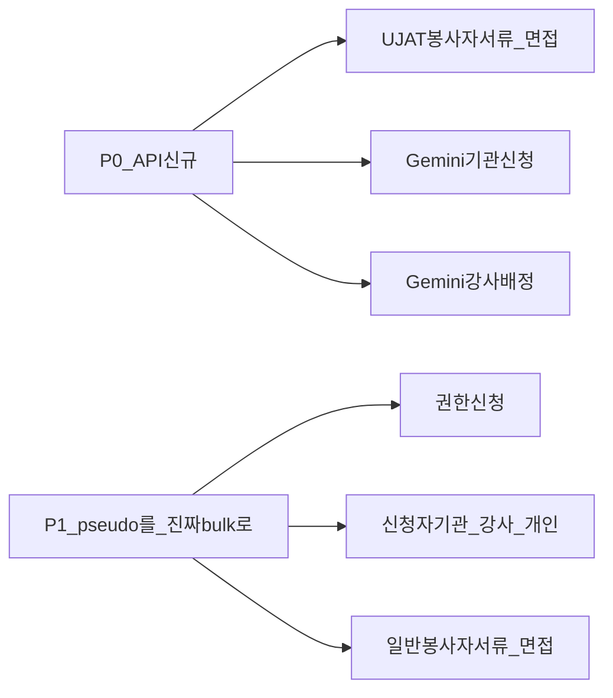

# CMS 테이블 일괄승인 API — 백엔드 핸드오프

CMS에서 테이블 **선택/일괄 승인**(및 페어 **반려**·면접 **합격/불합격**) UI가 있거나 필요한 케이스를 전수 조사한 결과입니다.  
OpenAPI/생성 클라이언트에 **multi-ID bulk approve/reject는 없으며**, FE는 대부분 단건을 N번 호출하는 **pseudo-bulk**로 동작합니다.

| 항목 | 값 |
|------|-----|
| 작성일 | 2026-07-21 |
| 범위 | `apps/cms` 목록·프로그램 상세 하위 테이블 (정산 일괄확인·삭제 selection·폼 에디터 제외) |
| 목적 | 엔티티별 bulk approve / bulk reject(또는 pass/fail) API 신설·계약 확정 |
| 관련 | [backend-handoff.md](./backend-handoff.md) · [cms-table-bulk-delete-api-backend-handoff.md](./cms-table-bulk-delete-api-backend-handoff.md) · [cms-table-bulk-download-api-backend-handoff.md](./cms-table-bulk-download-api-backend-handoff.md) · [programs-gemini-visiting-training-api-backend-handoff.md](./programs-gemini-visiting-training-api-backend-handoff.md) · [programs-api-backend-gaps-consolidated.md](./programs-api-backend-gaps-consolidated.md) (M-04~M-06) |

---

## 1. 현황 요약

| 구분 | 설명 |
|------|------|
| True multi-ID bulk approve/reject | **없음** (OpenAPI 전수) |
| Pseudo-bulk | FE가 `ids[]`를 받아 단건 approve/reject를 for-loop |
| Mock / API 미연동 | UI만 있거나 remote ON 시 Alert·미호출 |
| 신청 approve/reject Orval | 생성본에 없음 — FE [`applications-api-client.ts`](../../src/features/program/general/api/applications-api-client.ts) hand-written 단건만 |

**권장 계약 형태** (엔드포인트별 동일 패턴):

- `POST /api/admin/.../bulk-approve` + body `{ "ids": ["uuid", ...] }`
- `POST /api/admin/.../bulk-reject` + body `{ "ids": [...], "reason": "..." }` (사유 필드는 기존 단건과 동일)

트랜잭션·부분 실패 정책을 응답에 명시해 주세요.  
면접 선발은 라벨이 `합격`/`불합격`이어도 **동일 bulk 계약**(decision enum 또는 pass/fail 전용 path)으로 요청합니다.

정산 `bulkConfirm` / `bulkPaid` 등은 **승인이 아님** → 본 문서 범위 외.

---

## 2. 공통 요구사항 (모든 bulk approve / reject)

각 엔드포인트마다 동일하게:

1. **Request**: `ids: string[]` (UUID), 최소 1개. 반려는 기존 단건과 동일한 `reason`(또는 동등 필드)
2. **Response**: 성공 건수 / 실패 건수 + 실패 `id`·사유 (부분 성공 허용 여부 확정)
3. **비즈니스 가드**: FE와 동일 — 예) **PENDING만** 승인/반려; 이미 APPROVED/REJECTED면 실패 코드
4. **권한**: 기존 단건 approve/reject와 동일 RBAC
5. **멱등/감사**: 이미 처리된 id 처리, 감사 로그

---

## 3. 우선순위

| 우선순위 | 의미 | 케이스 |
|----------|------|--------|
| **P0** | approve/reject API **없음** 또는 remote 시 미연동 (mock만) | UJAT 봉사자 서류·면접(#5–6), Gemini 기관(#7), Gemini 강사(#8) |
| **P1** | UI·pseudo-bulk **이미 운영** → true bulk 권장 | 권한 신청(#1), 신청자 기관/강사/개인(#2), 일반 봉사자 서류·면접(#3–4) |
| **범위 외** | 단건만·dead code·비승인 selection | UJAT 기관 임시배정 단건, 정산 일괄확인, 삭제 selection 등 |



---

## 4. P0 — API 신규 / mock only (BE 범위 확정 요청)

아래는 **원격 승인·반려 API가 없거나 remote에서 호출하지 않는** 상태입니다.  
BE에서 **지원 여부·경로·단건/일괄**을 확정해 주세요.

### 4.1 확정 체크리스트 (BE 회신용)

- [ ] **UJAT 봉사자** 1차 서류: approve/reject (단건 + bulk)
- [ ] **UJAT 봉사자** 2차 면접: pass/fail (단건 + bulk)
- [ ] **Gemini 모집 기관 신청**: approve/reject (단건 + bulk) — 관련 M-04
- [ ] **Gemini 승인 연수 강사**: 단건 승인(배정) API + 필요 시 bulk — 관련 M-06. FE UI는 **1명만** 선택 가능(일괄이 아닌 단건 배정에 가까움)

| # | 화면 | CMS 경로 | FE 파일 | 버튼 | 현재 FE | 요청 |
|---|------|----------|---------|------|---------|------|
| 5 | UJAT 봉사자 1차 서류 | `/programs/ujat?…&tab=vh1_doc1\|vh2_doc1` | `features/program/ujat/…/doc-screening/` | `선택 승인` / `선택 반려` | **Mock only** (`patchUjatVolunteerDocumentScreeningStatus`) | 서류 결과 **bulk approve/reject API 신규** |
| 6 | UJAT 봉사자 2차 면접 | `…&tab=vh1_interview2\|vh2_interview2` | `features/program/ujat/…/interview2/` | `선택 합격` / `선택 불합격` | **Mock** | 면접 결과 **bulk pass/fail API 신규** |
| 7 | Gemini 모집 — 기관 신청 | `/programs/gemini/visiting-training` 상세 `lnb=institutions` | `features/program/gemini/ui/detail/institution-application-tab.tsx` | `선택 승인` / `선택 반려` | remote ON → **mutation 미연동 Alert**; OFF → mock | 기관 신청 **approve/reject + bulk 신규** |
| 8 | Gemini 승인 연수 — 강사 신청 | 승인 탭 상세 `lnb=instructors` | `features/program/gemini/ui/approved/detail-instructor-application-tab.tsx` | `선택 승인` (이미 승인 시 `강사 변경`) | **Mock** + TODO. **1명만** 선택; 다건 차단; 테이블 일괄 반려 없음 | **단건 승인(배정) API** 우선; bulk는 정책 확정 시 |

**P0 FE 기대 동작 (API 제공 시)**

1. remote 게이트 ON에서도 선택 승인/반려 동작
2. confirm → bulk 1회 호출 (N× 단건 루프 지양; #8은 단건 허용)
3. 부분 실패 시 실패 id·사유 표시

---

## 5. P1 — Pseudo-bulk → 진짜 bulk (이미 운영)

UI가 이미 있고, 단건 approve/reject를 N번 호출합니다. 트래픽·원자성·부분실패 UX를 위해 **bulk 엔드포인트**를 권장합니다.  
각 행은 **승인 + 반려(또는 합격 + 불합격)** 페어로 요청합니다.

| # | 화면 | CMS 경로 | FE 파일 | 버튼 | 현재 FE | 백엔드 요청 | 비즈니스 가드 (FE) |
|---|------|----------|---------|------|---------|-------------|-------------------|
| 1 | 권한 승인 (강사 / 관리자 탭) | `/admin/permission-requests` | `features/user/permission-management/members-permission-list.tsx`, `use-instructor-role-request-mutations.ts`, `use-admin-approval-request-mutations.ts` | `신청 승인` / `신청 반려` | `requestIds[]` / `adminIds[]` → **단건 N회**. 관리자 승인 시 role change도 N회 | instructor-role-requests · admin-approval-requests **bulk approve/reject** | **PENDING만**; 비대기 섞이면 차단 모달 |
| 2a | 교육 신청 기관 목록 | `/programs/general\|company-school\|trained-teachers?…&tab=institutions` | `features/program/shared/ui/program-detail/applicant-list/`, `use-applicants-detail.ts` | `선택 승인` / `선택 반려` | remote ON → `approveOrganization` / `reject…` **N회**; OFF → mock | organization applications **bulk approve/reject** | 미선택 Alert; 단건/다건 모달 분기 |
| 2b | 교육 신청 강사 목록 | 동일 `tab=instructors` | 동일 | `선택 승인` / `선택 반려` | `approveInstructor` / `reject…` **N회** | instructor applications **bulk** | 동일 |
| 2c | 개인(참여자) 신청 목록 | participant / individual screening | 동일 | `선택 승인` / `선택 반려` | `approveIndividual` / `reject…` **N회** | individual applications **bulk** | 동일 |
| 3 | 일반 봉사자 1차 서류 | `/programs/general?…&tab=vol_doc1` | `…/volunteer-screening/doc-screening-section.tsx`, `use-general-volunteer-applications-remote.ts` | `선택 승인` / `선택 반려` | `submitGeneralVolunteerDocumentResult` **N회** | volunteer document result **bulk** | 1건=단건 모달, 다건=일괄 모달 |
| 4 | 일반 봉사자 2차 면접 | `…&tab=vol_interview2` | `…/interview2-section.tsx` | `선택 합격` / `선택 불합격` | `applyRemoteFinalResult` **N회** | volunteer final result **bulk pass/fail** | 선택 건수·일괄 안내 |

**기존 단건 경로 (참고, FE 현재 사용)**

| 도메인 | 단건 (대략) |
|--------|-------------|
| 강사 권한 | `POST /api/admin/instructor-role-requests/{requestId}/approve` · `…/reject` |
| 관리자 권한 | `POST /api/admin/admin-approval-requests/{adminId}/approve` · `…/reject` |
| 기관/강사/개인 신청 | hand-written `applications-api-client` approve/reject (Orval 미생성) |
| 봉사자 서류·최종 | `submitVolunteerDocumentResultRemote` / `submitVolunteerFinalResultRemote` |

Bulk는 위 리소스의 **동일 권한·동일 상태 전이**를 유지해 주세요.  
연수강사(TT) 기관 신청은 공통 org approve를 재사용 중 — 스코프 검증은 [programs-trained-teachers-api-backend-handoff.md](./programs-trained-teachers-api-backend-handoff.md) 참고.

---

## 6. 범위 외 (당장 요청 아님)

| 화면 / 코드 | 비고 |
|-------------|------|
| UJAT 기관 신청 목록 | `선택 신청 반려` / `선택 임시 배정` 등 — **목록 일괄 승인 버튼 없음**. 상세 단건 `신청 승인`만 |
| UJAT 임시 배정 기관 확인 | 상세 단건만 |
| 정산 | `일괄 확인` / 지급 완료 — **승인 bulk 아님** |
| 회원·프로그램·공지·교재 등 | selection = **삭제** → [일괄삭제 핸드오프](./cms-table-bulk-delete-api-backend-handoff.md) |
| 일괄/선택 파일·엑셀 다운로드 | → [일괄다운로드 핸드오프](./cms-table-bulk-download-api-backend-handoff.md) |
| `ProgramApplicantsTab` | UI에 `선택 승인/반려` 있으나 **import 없음 (dead code)** |
| `use-progress-school-list.handleBulkApproveConfirm` | 훅만 존재, 진행현황 UI **미연결** |
| 회원 상세 권한 `신청 승인` | 단건 헤더 액션, 테이블 bulk 아님 |
| 레거시 `features/permission-request` | 단건 리뷰 모달만, rowSelection 없음 |

---

## 7. 제안 응답 스키마 (예시)

```json
{
  "requestedCount": 5,
  "successCount": 4,
  "failureCount": 1,
  "failures": [
    {
      "id": "uuid",
      "code": "NOT_PENDING",
      "message": "대기 상태가 아닌 신청은 승인할 수 없습니다."
    }
  ]
}
```

- **전부 실패** vs **부분 성공** 중 BE 기본 정책을 문서화해 주세요.
- FE는 부분 성공 시 성공 행만 목록에서 갱신하고 실패 사유를 안내할 예정입니다.

---

## 8. BE 체크리스트

### P0 (필수 회신)

- [ ] UJAT 봉사자 서류 approve/reject (+ bulk) 경로
- [ ] UJAT 봉사자 면접 pass/fail (+ bulk) 경로
- [ ] Gemini 기관 신청 approve/reject (+ bulk) 경로
- [ ] Gemini 강사: 단건 승인(배정) API · bulk 필요 여부

### P1 (권장)

- [ ] instructor-role-requests / admin-approval-requests bulk approve·reject
- [ ] organization / instructor / individual applications bulk approve·reject (OpenAPI 반영 권장)
- [ ] 일반 봉사자 document / final result bulk

### 공통

- [ ] OpenAPI에 bulk 스키마 반영 → FE Orval 재생성 (신청 approve는 단건부터 Orval화해도 됨)
- [ ] 가드 코드(409 / NOT_PENDING 등)와 메시지 계약
- [ ] 반려 reason 필드 단건·bulk 동일
- [ ] 감사 로그·멱등 동작

---

## 9. FE 측 후속 (BE 계약 확정 후)

1. P0: mock/Alert → remote mutation 연결
2. P1: `for (id of ids) approve…` 루프를 bulk 1회 호출로 교체
3. 신청 approve/reject Orval 생성본 사용으로 hand-written client 정리

문의: CMS FE. 본 문서 ID 번호(#1–#8)로 회신해 주시면 추적에 도움이 됩니다.
