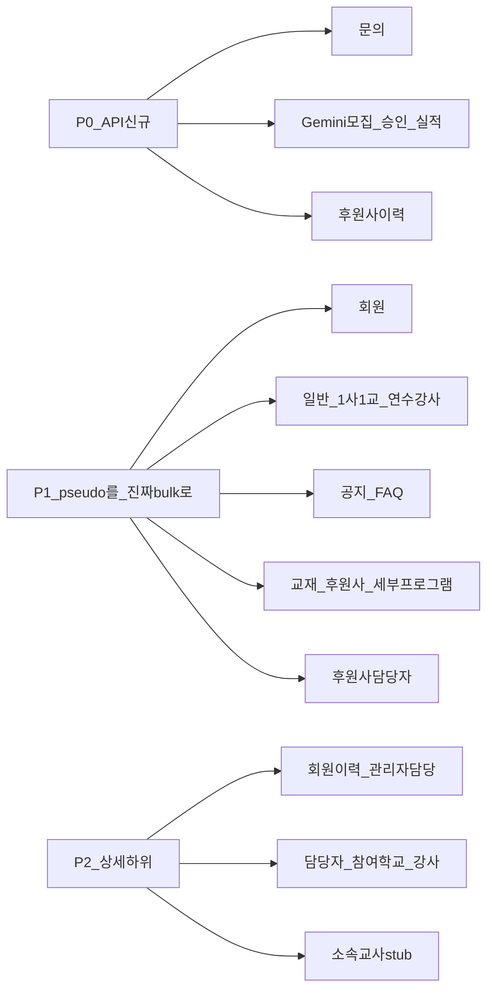

# CMS 테이블 일괄삭제 API — 백엔드 핸드오프

CMS에서 테이블 **선택/일괄 삭제** UI가 있거나 필요한 케이스를 전수 조사한 결과입니다.  
OpenAPI/생성 클라이언트에 **multi-ID bulk DELETE는 없으며**, FE는 대부분 단건 DELETE를 N번 호출하는 **pseudo-bulk**로 동작합니다.

| 항목 | 값 |
|------|-----|
| 작성일 | 2026-07-21 |
| 범위 | `apps/cms` 목록·상세 하위 테이블 (폼 에디터 UX·정산 승인 등 비삭제 selection 제외) |
| 목적 | 엔티티별 bulk DELETE(또는 soft-delete) API 신설·계약 확정 |
| 관련 | [backend-handoff.md](./backend-handoff.md) · [cms-table-bulk-approve-api-backend-handoff.md](./cms-table-bulk-approve-api-backend-handoff.md) · [cms-table-bulk-download-api-backend-handoff.md](./cms-table-bulk-download-api-backend-handoff.md) · [programs-gemini-performance-api-backend-handoff.md](./programs-gemini-performance-api-backend-handoff.md) · [data-management-api-integration.md](./data-management-api-integration.md) |

---

## 1. 현황 요약

| 구분 | 설명 |
|------|------|
| True multi-ID bulk DELETE | **없음** (OpenAPI 전수) |
| Pseudo-bulk | FE가 `ids[]`를 받아 단건 DELETE를 for-loop |
| API 자체 없음 | UI만 있거나 remote 시 버튼 비활성/숨김 |

**권장 계약 형태** (엔드포인트별 동일 패턴):

- `DELETE /api/admin/.../bulk` + body `{ "ids": ["uuid", ...] }`, 또는
- `POST /api/admin/.../bulk-delete` + body `{ "ids": [...] }`

트랜잭션·부분 실패 정책을 응답에 명시해 주세요.

---

## 2. 공통 요구사항 (모든 bulk DELETE)

각 엔드포인트마다 동일하게:

1. **Request**: `ids: string[]` (UUID), 최소 1개
2. **Response**: 성공 건수 / 실패 건수 + 실패 `id`·사유 (부분 성공 허용 여부 확정)
3. **비즈니스 가드**: FE 모달과 동일 규칙 (아래 표·§5 참고)
4. **권한**: 기존 단건 DELETE와 동일 RBAC
5. **멱등/감사**: 이미 삭제된 id 처리, 감사 로그

---

## 3. 우선순위

| 우선순위 | 의미 | 케이스 |
|----------|------|--------|
| **P0** | 단건·일괄 **삭제 API 자체가 없음** (FE UI만 또는 remote 가드) | 문의, Gemini 모집/승인/실적, 후원사 프로그램 이력 |
| **P1** | UI·pseudo-bulk **이미 운영** → 진짜 bulk로 교체 권장 | 회원, 프로그램 3종, 공지, FAQ, 교재, 후원사, 세부프로그램, 후원사 담당자 |
| **P2** | 상세 하위 / mock·stub | 회원·관리자 이력, 프로그램 담당자·참여 학교/강사, 소속 교사 |



---

## 4. P0 — API 신규 (BE 범위 확정 요청)

아래 항목은 **삭제 API가 없거나 FE가 remote에서 삭제를 막은 상태**입니다.  
BE에서 **지원 여부·경로·단건/일괄**을 확정해 주세요.

### 4.1 확정 체크리스트 (BE 회신용)

- [ ] **문의** 목록: 단건 DELETE + bulk DELETE 추가 여부
- [ ] **Gemini 모집 공고**: DELETE(단건/일괄) 추가 여부
- [ ] **Gemini 승인 연수**: DELETE(단건/일괄) 추가 여부
- [ ] **Gemini 실적**: DELETE 추가(Option A) vs 미지원 유지(Option B — FE는 remote 시 UI 숨김 중). 관련: [programs-gemini-performance-api-backend-handoff.md](./programs-gemini-performance-api-backend-handoff.md) §3
- [ ] **후원사 프로그램 진행 이력**: 삭제 API 추가 여부 (단건+일괄). **SSOT**: [data-management-api-backend-gaps.md](./data-management-api-backend-gaps.md) P0. 관련: [data-management-api-integration.md](./data-management-api-integration.md)

| # | 화면 | CMS 경로 | FE 파일 | 현재 FE | 요청 |
|---|------|----------|---------|---------|------|
| 7 | 문의 목록 | `/admin/posts/inquiries` | `pages/posts/admin-inquiry-page.tsx` | UI·확인 모달만, confirm 시 **실제 삭제 미호출**. remote 시 버튼 disabled | 문의 **일괄 삭제 API 신규** (단건도 없으면 함께) |
| 11 | Gemini 모집 공고 | `/programs/gemini/visiting-training` (모집) | `features/program/gemini/ui/recruitment/list.tsx` | mock만. remote 시 미연동 안내 | 모집 공고 **일괄 삭제 API 신규** |
| 12 | Gemini 승인 연수 | 동일 (승인 탭) | `features/program/gemini/ui/approved/list.tsx` | mock만. remote 시 미연동 | 승인 연수 **일괄 삭제 API 신규** |
| 13 | Gemini 실적 | `/programs/gemini/performance` | `features/program/gemini/ui/performance/list.tsx` | mock만. **remote ON이면 선택삭제 UI 숨김** | 실적 행 **일괄 삭제 API 신규** (또는 미지원 확정) |
| 18 | 후원사 상세 — 프로그램 진행 이력 | `/sponsor` + 상세 | `features/sponsor/ui/panels/sponsor-program-history-panel.tsx` | remote 시 **disabled**. remove no-op | 후원사 프로그램 이력 **삭제 API 신규** (단건+일괄). SSOT: [data-management-api-backend-gaps.md](./data-management-api-backend-gaps.md) |

**P0 FE 기대 동작 (API 제공 시)**

1. remote 게이트 ON에서도 선택 삭제 버튼·체크박스 노출
2. confirm → bulk DELETE 1회 호출 (N× 단건 루프 지양)
3. 부분 실패 시 실패 id·사유를 모달/토스트로 표시

---

## 5. P1 — Pseudo-bulk → 진짜 bulk (목록)

UI가 이미 있고, 단건 DELETE를 N번 호출합니다. 트래픽·원자성·부분실패 UX를 위해 **bulk 엔드포인트**를 권장합니다.

| # | 화면 | CMS 경로 | FE 파일 | 현재 FE | 백엔드 요청 | 비즈니스 가드 (FE) |
|---|------|----------|---------|---------|-------------|-------------------|
| 1 | 회원 목록 (전체/개인/학교/강사/관리자) | `/users/list?kind=*` | `pages/users/user-list-page.tsx` | `deleteUser` / `deleteAndAnonymize` **N회** | 회원(익명화) **일괄 삭제** | 학교: 소속 교사 있으면 삭제 차단 |
| 2 | 일반 프로그램 목록 | `/programs/general` | `pages/programs/general/page.tsx`, `features/program/general/api/admin-general-programs-service.ts` | **예정 필터일 때만** UI. `deleteGeneralPrograms(ids)` → 단건 루프 | 프로그램 **일괄 삭제** | 예정(scheduled)만 |
| 3 | 1사1교 프로그램 목록 | `/programs/company-school` | `pages/programs/program-list-page.tsx` | 예정 필터만. 단건 **N회** | 동일 | 예정만 |
| 4 | 연수강사 양성 프로그램 목록 | `/programs/trained-teachers` | `pages/programs/trained-teachers/page.tsx` | 예정 필터만. 단건 **N회** | 동일 | 예정만 |
| 5 | 공지사항 목록 | `/admin/posts/notices` | `pages/posts/admin-notice-list-page.tsx` | `deleteNotices(ids)` → 단건 루프 | 공지 **일괄 삭제** | — |
| 6 | FAQ 목록 | `/admin/posts/faq` | `pages/posts/admin-faq-page.tsx` | `deleteFaqs(ids)` → 단건 루프 | FAQ **일괄 삭제** | — |
| 8 | 교재 목록 | `/textbook` | `pages/data-management/textbook-page.tsx` | FE가 `POST /api/admin/textbooks/bulk-delete` 사용 | OpenAPI bulk 있음 | — |
| 9 | 후원사 목록 | `/sponsor` | `pages/data-management/sponsor-page.tsx` | FE가 `POST /api/admin/sponsors/bulk-delete` 사용 (1건은 단건 DELETE) | OpenAPI bulk 있음 | 진행 중 프로그램 있으면 차단 |
| 10 | 세부 프로그램(마스터) 목록 | `/detailed-program` | `pages/data-management/detailed-program-page.tsx` | FE가 `POST /api/admin/detailed-programs/bulk-delete` 사용 | OpenAPI bulk 있음 | — |
| 17 | 후원사 상세 — 담당자 | `/sponsor` + 상세 | `features/sponsor/ui/sponsor-detail-basic-info.tsx` | FE가 `POST /api/admin/sponsors/contacts/bulk-delete` 사용 | OpenAPI bulk 있음 | — |

**기존 단건 경로 (참고, FE 현재 사용)**

| 도메인 | 단건 (대략) |
|--------|-------------|
| 회원 | `POST /api/admin/users/{memberId}/delete` (익명화) |
| 프로그램 | `DELETE /api/admin/programs/{programId}` |
| 공지/FAQ | `DELETE …/notices/{id}`, `DELETE …/faqs/{id}` |
| 교재/후원사/세부프로그램/담당자 | data-management OpenAPI 단건 DELETE |

Bulk는 위 리소스의 **동일 권한·동일 soft/hard delete 의미**를 유지해 주세요.

---

## 6. P2 — 상세/하위 테이블

| # | 화면 | FE 파일 | 현재 FE | 백엔드 요청 |
|---|------|---------|---------|-------------|
| 14 | 회원 상세 — 프로그램 수강/강의/봉사 이력 | `features/user/detail/ui/member-program-lecture-history.tsx` | `이력 삭제` + selection. 단건 history DELETE는 OpenAPI에 있음. 학교 참여 뷰 `onBulkDelete` **no-op** | application / program-history **일괄 삭제** |
| 15 | 관리자 상세 — 담당 프로그램 이력 | `features/user/detail/ui/admin-managed-program-history.tsx` | 단건 `deleteMemberAdminProgramRemote` **N회** | admin-programs **일괄 삭제** |
| 16 | 학교 상세 — 소속 교사 | `features/user/detail/ui/school-affiliated-teachers-section.tsx` | `회원 탈퇴` UI만, **「준비 중입니다」 stub** | 소속 교사 일괄 탈퇴/삭제 (**정책 확정 후**) |
| 19 | 프로그램 상세 — 담당자 탭 | `features/program/general/ui/detail-modal/managers/program-managers-tab.tsx` | **local state만** (mock) | 프로그램 담당자 **일괄 해제/삭제** |
| 20 | 프로그램 진행 현황 — 참여 학교 | `…/program-status/program-progress-tab.tsx` | local list filter | 참여 기관 **일괄 삭제/제외** |
| 21 | 프로그램 진행 현황 — 참여 강사 | 동일 | local list filter | 참여 강사 **일괄 삭제/제외** |

이력 삭제 시 FE는 **프로그램 진행 중**이면 차단 모달을 띄웁니다. BE도 동일 시 409 등 명시적 거부를 권장합니다.

---

## 7. 범위 외 (일괄삭제 UI 없음 — 당장 요청 아님)

후속 검토용. 본 핸드오프의 필수 범위가 아닙니다.

| 화면 | 경로 | 비고 |
|------|------|------|
| UJAT 프로그램 목록 | `/programs/ujat` | 목록 선택삭제 없음 (단건 delete 훅만) |
| UJAT 교육 지역 | `/programs/ujat/regions` | 행별 단건 삭제만 |
| 템플릿 목록 | `/templates/form-management` | 일괄삭제 UI 없음 |
| 교육 기록 | `/education-records` | 없음 |
| 권한 신청 / 정산 / 신청자 승인·반려 | — | selection은 있으나 **삭제가 아님** → 승인·반려는 [일괄승인 핸드오프](./cms-table-bulk-approve-api-backend-handoff.md) |
| 일괄/선택 파일·엑셀 다운로드 | — | [일괄다운로드 핸드오프](./cms-table-bulk-download-api-backend-handoff.md) |
| 폼 에디터 표 헤더/행 “일괄 삭제” | 템플릿 에디터 | 에디터 UX, 서버 엔티티 목록 삭제 아님 |

---

## 8. 제안 응답 스키마 (예시)

```json
{
  "requestedCount": 5,
  "successCount": 4,
  "failureCount": 1,
  "failures": [
    {
      "id": "uuid",
      "code": "HAS_AFFILIATED_TEACHERS",
      "message": "소속 교사가 있어 삭제할 수 없습니다."
    }
  ]
}
```

- **전부 실패** vs **부분 성공** 중 BE 기본 정책을 문서화해 주세요.
- FE는 부분 성공 시 성공 행만 목록에서 제거하고 실패 사유를 안내할 예정입니다.

---

## 9. BE 체크리스트

### P0 (필수 회신)

- [ ] 문의 DELETE / bulk-delete 추가 여부·경로
- [ ] Gemini 모집·승인 DELETE / bulk 추가 여부·경로
- [ ] Gemini 실적: DELETE 추가 vs 미지원 확정
- [ ] 후원사 프로그램 이력 DELETE / bulk 추가 여부·경로

### P1 (권장)

- [ ] 회원 익명화 bulk
- [ ] 프로그램(일반·1사1교·연수강사) bulk (예정만 삭제 규칙 포함)
- [ ] 공지·FAQ bulk
- [ ] 교재·후원사·세부프로그램·후원사 담당자 bulk

### P2 (상세)

- [ ] 회원 program-history / applications bulk
- [ ] 관리자 admin-programs bulk
- [ ] 소속 교사 일괄 탈퇴 정책
- [ ] 프로그램 담당자·참여 기관·참여 강사 bulk 해제/제외

### 공통

- [ ] OpenAPI에 bulk 스키마 반영 → FE Orval 재생성
- [ ] 가드 코드(409 등)와 메시지 계약
- [ ] 감사 로그·멱등 동작

---

## 10. FE 측 후속 (BE 계약 확정 후)

1. P0: remote 가드 해제·실제 mutation 연결
2. P1: `deleteX(ids)` 내부 N× 루프를 bulk 1회 호출로 교체
3. P2: stub/mock → remote 연동

문의: CMS FE. 본 문서 ID 번호(#1–#21)로 회신해 주시면 추적에 도움이 됩니다.
)