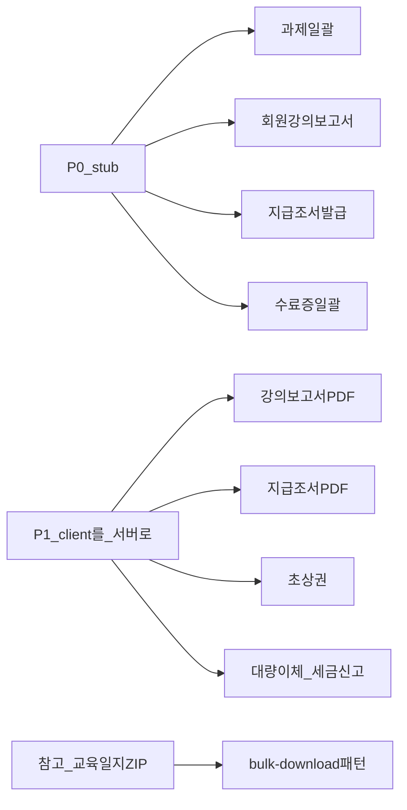

# CMS 테이블 일괄다운로드 API — 백엔드 핸드오프

CMS에서 테이블·상세의 **일괄/선택 다운로드**(파일 ZIP·PDF 묶음·선택 행 Excel) UI가 있거나 필요한 케이스를 전수 조사한 결과입니다.  
**True multi-ID bulk download API는 교육일지 ZIP 1건**뿐이며, 나머지는 클라이언트 PDF 순차·Excel 또는 stub입니다.

| 항목 | 값 |
|------|-----|
| 작성일 | 2026-07-21 |
| 범위 | 일괄 다운로드 · 선택 행 → 파일/엑셀 · 지급조서·강의보고서·과제·초상권·교육일지 ZIP · 수료증 멀티 선택 일괄 발급 |
| 목적 | 엔티티별 bulk-download / export API 신설·계약 확정 (교육일지 패턴 정렬) |
| 관련 | [backend-handoff.md](./backend-handoff.md) · [cms-table-bulk-delete-api-backend-handoff.md](./cms-table-bulk-delete-api-backend-handoff.md) · [cms-table-bulk-approve-api-backend-handoff.md](./cms-table-bulk-approve-api-backend-handoff.md) · [programs-trained-teachers-api-backend-handoff.md](./programs-trained-teachers-api-backend-handoff.md) · [settlement-api-backend-gaps.md](./settlement-api-backend-gaps.md) |

> **회원 상세 BE 전달:** 본 문서는 [members/README.md §필수 묶음](./members/README.md#회원-상세-이력정산--백엔드-전달-필수-묶음) **#5** 로 포함됩니다. 회원 상세 관련 항목 — §5.1 **#6~#9** (지급조서 · 과제 · 강의보고서 · 수료증 ZIP). ID 대응: [member-program-history REQ-011/014/015](./members/member-program-history-ui-api-parity-backend-handoff-2026-08-25.md) · [instructor PH-011/014/015 · SET-006](./members/instructor-member-detail-program-history-settlement-backend-handoff-2026-08-25.md).

---

## 0. 범위 정의

| 포함 | 제외 |
|------|------|
| 「일괄 다운로드」「선택 행 → 파일/엑셀」 | 행/상세 **단건** 다운로드 |
| 지급조서·강의보고서·과제·초상권·교육일지 ZIP | FilterTableLayout **목록 전체** `excelExport` (회원·공지·실적 등) |
| 선택 행 기반 대량이체·세금신고 엑셀 | 진행현황 수료증 **1명만** 허용 발급 |
| 회원 이력 **멀티 선택** 수료증/인증서 일괄 발급 UI | Gemini 일괄 다운로드 UI (없음) |

---

## 1. 현황 요약

| 구분 | 설명 |
|------|------|
| True multi-ID bulk download | **교육일지 ZIP 1건** — `POST …/trained-teacher/education-journals/bulk-download` |
| Filter/async export | 정산 `bulk-transfer` / `tax-report` (필터 기반; `ids[]` 아님). FE mutation 존재하나 **계좌지급 화면은 미호출** |
| Client PDF 순차 (pseudo) | 강의보고서·지급조서·초상권 — 브라우저 연속 blob 다운로드 (ZIP 아님) |
| Client Excel | 대량이체·세금신고(선택 행)·UJAT 1365(필터 목록)·배정표(일정 컬럼) |
| Missing / stub | 과제 일괄, 회원상세 강의보고서 일괄, 지급조서 발급(여러 화면), 회원 수료증 일괄 |
| Schema-only (미연동) | `CommonExport*`, privacy export, file-download job 등 OpenAPI 스키마만 |

**권장 계약 형태**

- 파일 묶음: `POST /api/admin/.../bulk-download` + body `{ "ids": [...] }` → ZIP `downloadEndpoint` 또는 async `jobId` (**교육일지 패턴**)
- 선택 행 Excel: `{ "selectedIds": [...] }` **또는** 기존 정산 filter export와 계약 통일을 문서화
- Content-Type: `application/zip` / `application/vnd.openxmlformats-officedocument.spreadsheetml.sheet`
- 만료 URL·부분 실패·감사 로그·RBAC·개인정보 exportPolicy

---

## 2. 공통 요구사항 (모든 bulk-download / export)

1. **Request**: `ids` / `selectedIds` (최소 1, 상한 명시). Excel은 필터 방식이면 필터 필드 SSOT 명시
2. **Response**: 즉시 `downloadEndpoint` **또는** `jobId` + 폴링/이력 (`GET …/exports`) — 정산 exports와 정렬
3. **부분 실패**: 누락 id·사유 (`failures[]`). ZIP 생성 전 validation 권장
4. **권한**: 단건 download와 동일 RBAC + 감사 로그 (fail-closed)
5. **멱등/만료**: 이미 삭제된 파일, URL TTL

---

## 3. 우선순위

| 우선순위 | 의미 | 케이스 |
|----------|------|--------|
| **P0** | UI 있으나 **서버 bulk 없음 / stub** | 지급조서 발급(#6), 과제(#7), 회원 강의보고서(#8), 수료증 일괄(#9) |
| **P1** | 동작 중 **client PDF/Excel** → 서버 ZIP·export 권장 | 강의보고서(#2), 지급조서 일괄(#3), 초상권(#4), 대량이체·세금신고(#5) |
| **참고** | 이미 true bulk | 교육일지 ZIP(#1) |
| **보조** | Client Excel (필터/컬럼 선택) | UJAT 1365·배정표(#10) — 서버화 우선순위 낮음 |
| **범위 외** | 목록 전체 Excel, 단건 다운로드, Gemini | §7 |



---

## 4. 참고 구현 — 교육일지 ZIP (True bulk)

| # | 화면 | CMS 경로 | FE 파일 | 버튼 | 현재 FE | 비고 |
|---|------|----------|---------|------|---------|------|
| 1 | 연수강사 양성 → 참여 기관 상세 → 교육일지 | `/programs/trained-teachers` (+ 상세) | `features/program/trained-teachers/ui/institution-detail/education-journal-section.tsx`, `api/education-journals-client.ts` | `교육일지 일괄 다운로드` | **True bulk**: `POST …/education-journals/bulk-download` → ZIP. Remote off: mock 또는 단건 순차 fallback | 타 도메인 bulk-download **레퍼런스**. 상세: [programs-trained-teachers-api-backend-handoff.md](./programs-trained-teachers-api-backend-handoff.md) |

---

## 5. P0 — API 신규 / stub (BE 범위 확정 요청)

### 5.1 확정 체크리스트 (BE 회신용)

- [ ] **지급조서 발급** (선택 라인 → PDF/ZIP): 단건·bulk 경로
- [ ] **과제 일괄 다운로드**: 제출 파일 ZIP
- [ ] **회원 기준 강의보고서 일괄**: ZIP 또는 기존 단건 download N회 대체
- [ ] **회원 프로그램 이력 수료증/인증서 일괄 발급·다운로드**

| # | 화면 | CMS 경로 | FE 파일 | 버튼 | 현재 FE | 요청 |
|---|------|----------|---------|------|---------|------|
| 6 | 지급조서 확인 상세·목록 / 회원·교사 정산 탭 | `/settlement-management/payment-orders?…`, 회원 상세 | `payment-order-detail-filter-table.tsx`, `payment-order-*-settlement-table.tsx`, `instructor-payment-tab.tsx`, `teacher-settlement-tab.tsx` | `지급조서 발급` | **Stub** — 전부 confirmed면 `준비 중입니다.`; 미확인 시 차단 모달; 목록은 `onClick` no-op | 선택 라인 **지급조서 bulk 발급/다운로드 API 신규** |
| 7 | 참여자 상세 과제 / 회원 과제·설문 모달 | `/programs/general` (+ participant), `/users/list` 상세 | `assignment-submission-history-table.tsx`, `assignment-submission-modal.tsx`, `participating-individual-participant-assignment-section.tsx` | `과제 일괄 다운로드` (푸터 160px · h40) | **FE path 연결** — FilterTableLayout **7열 SSOT** · bulk POST · preview 단건 `submissionFileIds` **BE 대기** | 제출 파일 **ZIP bulk-download** · `submissionFileIds[]` |
| 8 | 회원 상세 → 강의보고서 제출 내역 | `/users/list?kind=…` | `lecture-report-submission-history-modal.tsx` | `강의보고서 일괄 다운로드` (푸터 200px · h40) · `강의보고서 보기` (열 300px) | **FE path 연결** — FilterTableLayout **5열** · bulk POST · 단건 `reportFileIds` 또는 `GET .../lecture-reports/{id}/download` **BE 대기** | 회원 기준 강의보고서 **bulk-download** · 단건 download |
| 9 | 회원 상세 → 수강/봉사/강의 이력 | `/users/list?kind=…` | `member-program-lecture-history.tsx`, `certificate-bulk-issue-reason-modal.tsx` | `수료증/참여인증서 발급`, `활동인증서 발급` | **Missing** — 선택 행 기준 다운로드 API 미연동 (`FEATURE_COMING_SOON`) | 선택 이력 **일괄 발급·다운로드 API 신규** |

**P0 FE 기대 동작 (API 제공 시)**

1. stub/Alert 제거 → bulk 1회 호출 (또는 job 폴링)
2. ZIP/PDF 묶음 다운로드 (브라우저 N× 순차 지양)
3. 부분 실패 시 실패 id·사유 표시

---

## 6. P1 — Client PDF/Excel → 서버 bulk 권장

| # | 화면 | CMS 경로 | FE 파일 | 버튼 | 현재 FE | 백엔드 요청 | 가드 (FE) |
|---|------|----------|---------|------|---------|-------------|-----------|
| 2 | 참여 강사 상세 → 강의보고서 | `/programs/general` · `/programs/company-school` (+ 상세) | `participating-instructor-lecture-reports-section.tsx`, `lib/download-lecture-reports-bulk-pdf.ts` | `강의보고서 일괄 다운로드` | **Client PDF 순차** (400ms gap). rowSelection 없음 — 제출 완료 행 전부 | 강의보고서 **ZIP bulk-download** | `제출 완료` + 조회 가능만 |
| 3 | 참여 강사 상세 → 정산 현황 | 동일 | `participating-instructor-settlement-section.tsx` | `지급조서 일괄 다운로드` | **Client PDF 순차**. 단건 `downloadPaymentStatement` bulk 미사용 | 지급조서 **ZIP bulk-download** | 진행 완료·신청 있음·`payment_statement_verified` \| `account_paid` |
| 4 | 참여 학교 상세 → 학생 명단 | `/programs/general` 등 (+ 학교 상세) | `school-detail-student-list-section.tsx`, `portrait-consent-bulk-pdf-export-host.tsx` | `초상권 동의 확인` | **Client PDF 순차** + **rowSelection** | 초상권 동의서 **ZIP bulk-download** | 편집 모드 차단·미선택·미제출 행 제외 |
| 5 | 계좌 지급 확인 | `/settlement-management/account-payments` | `account-payments-page.tsx`, `bulk-transfer-excel.ts`, `tax-filing-excel.ts` | `대량이체 양식 발급` / `세금 신고 양식 발급` → `엑셀 다운로드` | **Client Excel**. `useBulkTransferExportMutation` / `useTaxReportExportMutation` **화면 미호출** (필터 export, ids[] 아님) | **선택 행 `selectedIds` export** 또는 filter export SSOT 확정 후 FE 연결 | 선택 필수·전부 `account_paid` |

**기존 단건 / export (참고)**

| 도메인 | 경로 (대략) |
|--------|-------------|
| 교육일지 단건 | `GET …/education-journals/{journalId}/download` |
| 지급조서 단건 | `GET …/settlements/{id}/payment-statement/download` |
| 정산 export | `POST …/settlements/exports/bulk-transfer`, `…/tax-report` |
| 폼 제출 파일 | `GET …/form-submission-files/{id}/download` (과제 단건 후보) |

---

## 7. 보조 · 범위 외

### 7.1 보조 (Client Excel — 서버화 우선순위 낮음)

| # | 화면 | 버튼 | 현재 FE | 비고 |
|---|------|------|---------|------|
| 10a | UJAT 진행현황 → 참여 봉사자 | `1365 봉사시간 등록 양식` → 엑셀 | Client Excel — **체크박스 선택 아님**, 현재 필터 목록 전체 | 필요 시 filter export API |
| 10b | UJAT 진행현황 → 지역 배정 | `배정표 다운로드` → 엑셀 | Client Excel — **교육 일정 컬럼** 다중 선택 | 행 selection이 아님 |

### 7.2 범위 외

| 항목 | 비고 |
|------|------|
| FilterTableLayout `excelExport` | 회원·공지·FAQ·로그·데이터관리·프로그램 목록·실적 등 **목록 전체** 클라이언트 Excel |
| 진행현황 수료증/활동인증서 | **1명만** 선택 후 단건 PDF |
| 행 단위 「보기」「단건 다운로드」 | 강의보고서·지급조서·교육일지 단건 |
| Gemini / 게시글 | 일괄 다운로드 UI 없음 |
| 정산 `bulkConfirm` / `bulkPaid` | 다운로드가 아님 → [일괄승인 핸드오프](./cms-table-bulk-approve-api-backend-handoff.md) 범위와도 별개 |

삭제·승인 selection은 각각 [일괄삭제](./cms-table-bulk-delete-api-backend-handoff.md) · [일괄승인](./cms-table-bulk-approve-api-backend-handoff.md) 참고.

---

## 8. 제안 응답 스키마 (예시)

교육일지 / CommonExportJob 정렬:

```json
{
  "requestedCount": 5,
  "successCount": 4,
  "failureCount": 1,
  "downloadEndpoint": "/api/admin/.../downloads/job-uuid.zip",
  "expiresAt": "2026-07-21T12:00:00Z",
  "failures": [
    {
      "id": "uuid",
      "code": "FILE_NOT_FOUND",
      "message": "제출 파일이 없습니다."
    }
  ]
}
```

비동기 job이면 `jobId` + `GET …/exports/{jobId}` (또는 정산 `listExportHistories` 패턴)로 통일해 주세요.

---

## 9. BE 체크리스트

### P0 (필수 회신)

- [ ] 지급조서 선택 발급/다운로드 (bulk) 경로
- [ ] 과제 제출 파일 ZIP bulk-download
- [ ] 회원 강의보고서 bulk-download
- [ ] 회원 수료증·인증서 일괄 발급/다운로드

### P1 (권장)

- [ ] 강의보고서·지급조서·초상권 ZIP (교육일지와 동일 계약)
- [ ] 대량이체·세금신고: `selectedIds` vs filter SSOT + FE 연동
- [ ] CommonExport OpenAPI → Orval 생성·FE 연결 여부

### 공통

- [ ] ZIP content-type·파일명·만료
- [ ] 감사 로그·RBAC·개인정보
- [ ] 부분 실패 코드 계약

---

## 10. FE 측 후속 (BE 계약 확정 후)

1. P0: stub → remote bulk mutation
2. P1: client PDF 순차 → ZIP 1회 다운로드; 계좌지급 화면을 정산 export API에 연결
3. 교육일지 bulk를 Orval subset에 편입 (현재 hand-written)

문의: CMS FE. 본 문서 ID 번호(#1–#10)로 회신해 주시면 추적에 도움이 됩니다.
