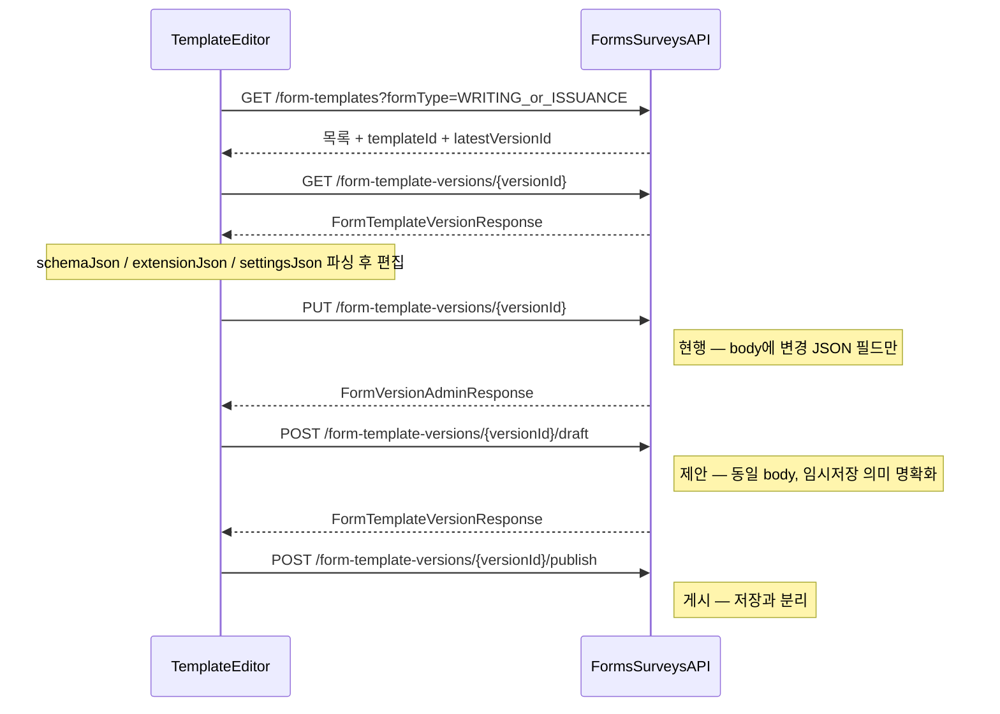

# 양식 관리 API JSON 계약 (BE/FE SSOT)

`/templates/form-management` **작성 양식**(30종) · **발급 양식**(14종)의 API 응답·저장 JSON 형식을 정의합니다.  
양식 테스트(`form-test-*`) 및 Platform 런타임 제출 API는 범위 밖입니다.

**관련 문서**

- [forms-surveys-api-integration.md](./forms-surveys-api-integration.md) — 엔드포인트·코드 위치
- [forms-surveys-api-backend-gaps.md](./forms-surveys-api-backend-gaps.md) — 미구현 갭
- [forms-surveys-api-migration-guide.md](./forms-surveys-api-migration-guide.md) — PHASE 0–6 마이그레이션
- [issuance-form-api-follow-up.md](./issuance-form-api-follow-up.md) — 발급 양식 API 후속 (BE 시드·미완료)
- [form-template-seeds/](./form-template-seeds/) — 대표 3종 시드 JSON 샘플

**코드 SSOT**

- 작성 양식 catalog: `src/features/template/api/form-template-catalog.ts`
- 발급 양식 목록: `src/pages/templates/issuance-form-tab.tsx`
- draft 직렬화: `src/features/template/api/adapters/form-template-draft-adapters.ts`
- draft 타입: `src/features/template/model/writing-form-draft.schema.ts`

---

## 1. 전체 플로우



### 핵심 원칙

1. **GET 응답** = 메타데이터 + 3개 JSON **string** 필드 (`schemaJson`, `extensionJson`, `settingsJson`)
2. **저장 요청** = FE가 편집한 JSON 필드만 body에 포함. `templateVersionId`, `createdAt` 등 메타는 **보내지 않음**
3. 각 string 필드 값은 **이중 stringify 아님** — DB/API 컬럼 값 자체가 JSON text
4. BE v1은 `schemaJson` / `extensionJson` / `settingsJson` **내부 구조 검증 없음** (opaque blob)

---

## 2. 목록 API

### `GET /api/admin/form-templates`

| Query | 값 |
|-------|-----|
| 작성 양식 탭 | `formType=WRITING` + `category` (선택) |
| 발급 양식 탭 | `formType=ISSUANCE` |
| 공통 | `page`, `size`, `useYn` |

**응답 항목 (`FormTemplateListItemResponse`)**

| 필드 | 설명 |
|------|------|
| `templateId` | number — 버전 API 호출용 (FE localStorage 캐시) |
| `templateCode` | string — FE 라우트·localStorage 키 SSOT |
| `templateName` | 표시명 |
| `formType` | `WRITING` \| `ISSUANCE` |
| `category` | `REGISTRATION` \| `RECRUITMENT` \| `APPLICATION` \| `SURVEY` \| `AGREEMENT` \| `ISSUANCE` |
| `latestVersionId` | 에디터 진입 시 `GET .../versions/{id}` 에 사용 (**P0: BE 확인**) |
| `latestVersionNo` | 버전 번호 |
| `latestVersionStatus` | `DRAFT` \| `PUBLISHED` 등 |
| `availableActions` | 목록 행 액션 버튼 |

---

## 3. 버전 상세 응답: `FormTemplateVersionResponse`

`GET /api/admin/form-template-versions/{versionId}`

OpenAPI: `src/shared/api/generated/forms-surveys/schemas/formTemplateVersionResponse.ts`

### 3.1 필드별 역할

| 필드 | FE 사용 | 저장 시 재전송 |
|------|---------|---------------|
| `templateVersionId` | 버전 식별·캐시 | X (read-only) |
| `templateId` | 템플릿 식별·캐시 | X |
| `versionNo` | UI 표시 | X |
| `versionLabel` | UI 표시 | O (선택, `versionLabel` 단독 수정 시) |
| `versionStatus` | 배지·편집 가능 여부 | X |
| `schemaJson` | 단락 draft (`WritingFormDraft`) | O (대부분 양식) |
| `extensionJson` | overlay / editorState / uiState | O |
| `settingsJson` | 인증서·로고 설정 | O (인증서 계열) |
| `responseCount`, `activeBindingCount` | 통계 | X |
| `effectiveFrom`, `effectiveTo`, `publishedAt` | 게시 메타 | X |
| `createdAt`, `updatedAt` | 표시 | X |
| `availableActions` | 버튼 노출 (`VIEW`, `EDIT`, `PUBLISH` 등) | X |

### 3.2 실제 BE 응답 예시 (`registration-general`, DRAFT)

```json
{
  "templateVersionId": 3,
  "templateId": 1,
  "versionNo": 1,
  "versionLabel": "v1 local seed",
  "versionStatus": "DRAFT",
  "schemaJson": "{\"schemaVersion\":1,\"formSettings\":{\"titleNumbering\":\"numeric\"},\"paragraphs\":[]}",
  "extensionJson": "{\"overlay\":{},\"editorState\":{},\"uiState\":{}}",
  "settingsJson": "{\"orgLogo\":null,\"orgLogo02\":null,\"certificateBackground\":null,\"chairmanSeal\":null}",
  "responseCount": 0,
  "activeBindingCount": 0,
  "effectiveFrom": null,
  "effectiveTo": null,
  "publishedAt": null,
  "createdAt": "2026-07-08T02:03:22.742016Z",
  "updatedAt": "2026-07-08T02:03:22.742016Z",
  "availableActions": ["VIEW", "COPY_AS_DRAFT", "EDIT", "PUBLISH", "DELETE_DRAFT"]
}
```

### 3.3 BE 시드 요구사항 (현재 갭)

위 예시에서 `schemaJson`의 `paragraphs: []`는 **시드 누락**입니다.  
`registration-general`은 6개 시드 단락이 있어야 에디터가 정상 표시됩니다.  
→ [부록 A](#부록-a-대표-시드-json-샘플) 및 `form-template-seeds/registration-general.json` 참고.

---

## 4. 저장 API

### 4-A. 현행: `PUT /api/admin/form-template-versions/{versionId}`

Body: `FormTemplateVersionUpdateRequest`

```json
{
  "versionLabel": "v2 draft",
  "schemaJson": "{\"schemaVersion\":1,\"formSettings\":{\"titleNumbering\":\"numeric\"},\"paragraphs\":[...]}",
  "extensionJson": "{\"overlay\":{},\"editorState\":{...},\"uiState\":{}}",
  "settingsJson": "{\"titleName\":\"수료증\",...}"
}
```

| 규칙 | 설명 |
|------|------|
| 포함 필드 | **변경한 JSON 필드만** body에 넣어도 되는지 / 전체 교체인지 → **BE 확인 TODO** |
| `schemaJson` | `writingFormDraftToSchemaJson(draft)` 결과 string |
| `extensionJson` | `JSON.stringify({ overlay, editorState, uiState })` |
| `settingsJson` | 인증서·이미지 설정 object string |
| 응답 | `FormVersionAdminResponse` |
| 전제 | `versionStatus === DRAFT` (게시된 버전 수정 불가 — **BE 확인 TODO**) |

**FE 현재 구현 갭:** `admin-form-templates-service.ts`는 **`schemaJson`만** PUT 전송.

### 4-B. 제안: `POST /api/admin/form-template-versions/{versionId}/draft`

| 항목 | 내용 |
|------|------|
| 목적 | 임시저장 의미 명확화 (PUT과 동일 payload) |
| Body | PUT과 동일 — `schemaJson`, `extensionJson`, `settingsJson`, `versionLabel` (모두 optional string) |
| Response | `FormTemplateVersionResponse` (갱신된 `updatedAt`, `availableActions`) |
| 멱등성 | 동일 body 반복 호출 시 마지막 내용으로 덮어쓰기 |
| 전제 | `versionStatus === DRAFT` |

게시는 기존대로 `POST /api/admin/form-template-versions/{versionId}/publish` (저장과 분리).

### 4-C. 저장 플로우 요약

```
1. GET  .../form-template-versions/{versionId}     → 전체 응답 수신
2. FE   schemaJson / extensionJson / settingsJson 파싱 → 에디터 state
3. 사용자 편집
4. FE   편집 결과만 직렬화
5. PUT  (또는 POST /draft) body = { schemaJson?, extensionJson?, settingsJson? }
6. (선택) GET 재조회로 updatedAt·availableActions 갱신
```

---

## 5. JSON 필드 내부 스키마

### 5-A. `schemaJson` → `WritingFormDraft`

대상: 작성 양식 대부분, 발급 양식 중 문서형(보고서·지급조서 등).

```json
{
  "schemaVersion": 1,
  "formSettings": {
    "titleNumbering": "numeric"
  },
  "paragraphs": []
}
```

| 필드 | 타입 | 설명 |
|------|------|------|
| `schemaVersion` | `1` | 고정 |
| `formSettings.titleNumbering` | `"numeric"` \| `"alpha"` \| `"q_repeat"` \| `"q123"` \| `"none"` | 단락 번호 매김 |
| `paragraphs` | `WritingFormParagraph[]` | 단락 배열 |

**단락 discriminant:** `kind` + `variant`

| kind | 대표 variant |
|------|-------------|
| `description` | `survey_title_with_period` |
| `single_item` | `horizontal_table`, `user_profile`, `multiple_choice`, `short_essay`, `file_attachment`, … |
| `table` | `vertical_table` |
| `closing` | `agreement_closing` |
| `system` | `agreement_system` |

직렬화: `writingFormDraftToSchemaJson()` / 역직렬화: `schemaJsonToWritingFormDraft()`  
타입 SSOT: `writing-form-draft.schema.ts`

### 5-B. `extensionJson` → 에디터 부가 상태

```json
{
  "overlay": {},
  "editorState": {},
  "uiState": {}
}
```

| 키 | 용도 | 대상 양식 |
|----|------|----------|
| `overlay` | 단락 밖 UI state (UJAT 모집 한도, 배정 인원 등) | UJAT 등록·모집·신청 |
| `editorState` | 훅 로컬 state (참여 대상, 프로그램 유형, 차시 수 등) | `registration-general` 등 |
| `uiState` | 향후 확장 | 예비 |

#### `editorState` — `registration-general` 기본값

`program-registration-editor-state.ts` 기준:

```json
{
  "participant": {
    "individual": true,
    "organization": false,
    "teacherInstructor": false,
    "volunteer": false
  },
  "programType": "curriculum",
  "sessionRoundType": "single",
  "educationFormScheduleDetail": "common",
  "participationScheduleDetail": "common",
  "ipsScheduleDetail": "common",
  "curriculumSessionCount": 1,
  "curriculumChartSessionCount": 1,
  "scheduleCurriculumDetailCount": 1,
  "scheduleCurriculumGroupCount": 1,
  "scheduleCurriculumPreEducation": false,
  "trainedTeachersTeacherTrainingEnabled": true,
  "educationScheduleMode": "date",
  "activeParagraphId": null
}
```

| 필드 | 타입 | 값 |
|------|------|-----|
| `programType` | string | `"curriculum"` \| `"schedule"` |
| `sessionRoundType` | string | `"single"` \| `"multi"` |
| `educationFormScheduleDetail` 등 | string | `"common"` \| `"perSchedule"` |
| `educationScheduleMode` | string | `"date"` \| `"period"` |

**FE 현재 갭:** `extensionJson` 파싱·PUT 전송 미구현.

### 5-C. `settingsJson` → 인증서·이미지 설정

대상: 발급 양식 인증서 5종, 일부 BE 시드의 기본 null 필드.

```json
{
  "orgLogo": null,
  "orgLogo02": null,
  "certificateBackground": null,
  "chairmanSeal": null,
  "titleName": "수료증",
  "bodyContent": "귀하는 위의 과정에 참여하여\n교육과정을 수료하였음을 확인합니다.",
  "participantRowVisibility": [true, true, true, true, true, true]
}
```

| 필드 | 타입 | 설명 |
|------|------|------|
| `orgLogo`, `orgLogo02`, `certificateBackground`, `chairmanSeal` | `null` \| file ref | 이미지 — `fileId` 또는 URL (**BE 합의 TODO**) |
| `titleName` | string | 타이틀 (최대 9자) |
| `bodyContent` | string | 본문 (멀티라인) |
| `participantRowVisibility` | boolean[6] | 성명·생년월일·소속·프로그램명·활동기간·발급목적 행 노출 |

`schemaJson` 없이 `settingsJson`만 사용하는 양식: 인증서 5종 (`document-2` ~ `document-5`, `document-participation-certificate`).

---

## 6. Payload 종류 범례

| 코드 | 의미 | 저장 body |
|------|------|-----------|
| **A** | `schemaJson` only | `{ schemaJson }` |
| **B** | `schemaJson` + `extensionJson.editorState` | `{ schemaJson, extensionJson }` |
| **C** | `schemaJson` + `extensionJson.overlay` (± editorState) | `{ schemaJson, extensionJson }` |
| **D** | `settingsJson` only (또는 파일) | `{ settingsJson }` |
| **E** | 미정의 플레이스홀더 | BE·FE 합의 후 결정 |

---

## 7. 작성 양식 30종

`formType=WRITING`. SSOT: `TEMPLATE_CODE_CATALOG` (30 entries).

### 7.1 REGISTRATION (4)

| templateCode | templateName | Payload | 시드 factory |
|--------------|--------------|---------|--------------|
| `registration-general` | 일반 프로그램 등록 폼 | **B** | `createProgramRegistrationDraft('general')` |
| `registration-economy` | 1사 1교 프로그램 등록 폼 | **A** | `createProgramRegistrationDraft('economy')` |
| `registration-ujat` | UJAT 프로그램 등록 폼 | **C** | `createUjatProgramRegistrationDraft()` |
| `registration-trained-teachers` | 교육받은 교사 프로그램 등록 폼 | **A** | `createProgramRegistrationDraft('trainedTeachers')` |

**`registration-general` 시드 단락 id (6개)**

| id | paragraphTitle |
|----|----------------|
| `program-registration-seed-basic-info` | 기본 정보 |
| `program-registration-seed-business-kpi` | 사업 KPI 목표 |
| `program-registration-seed-wage-info` | 임금 정보 |
| `program-registration-seed-type-settings` | 프로그램 유형 설정 |
| `program-registration-seed-education-curriculum` | 교육 진행 (커리큘럼) |
| `program-registration-seed-education-schedule-settings` | 교육 진행 일정 설정 |

공통 단락 구조: `kind: single_item`, `variant: horizontal_table`, `tableFlavor: text`.

### 7.2 RECRUITMENT (6)

| templateCode | templateName | Payload | 시드 factory |
|--------------|--------------|---------|--------------|
| `recruitment-participant-school` | 프로그램 참여자 모집 폼 (학교) | **A** (+ overlay local) | `createApplicantRecruitFormInstitutionDraft()` |
| `recruitment-participant-individual` | 프로그램 참여자 모집 폼 (개인) | **A** | `createApplicantRecruitFormIndividualDraft()` |
| `recruitment-instructor` | 프로그램 강사 모집 폼 | **A** | `createRecruitFormInstructorDraft()` |
| `recruitment-volunteer` | 프로그램 봉사자 모집 폼 | **A** | `createRecruitFormVolunteerDraft()` |
| `recruitment-ujat-school` | UJAT 프로그램 학교 모집 폼 | **C** | `createUjatRecruitFormInstitutionDraft()` |
| `recruitment-ujat-volunteer` | UJAT 프로그램 봉사자 모집 폼 | **C** | `createUjatRecruitFormVolunteerDraft()` |

### 7.3 APPLICATION (11)

| templateCode | templateName | Payload | 시드 factory |
|--------------|--------------|---------|--------------|
| `application-participant-school` | 프로그램 참여자 신청 폼 (학교) | **A** | `createProgramApplicationFormInstitutionDraft()` |
| `application-participant-individual` | 프로그램 참여자 신청 폼 (개인) | **A** | `createProgramParticipantApplicationDraft()` |
| `application-instructor` | 프로그램 강사 신청 폼 | **A** | `createProgramApplicationFormInstructorDraft()` |
| `application-volunteer` | 프로그램 봉사자 신청 폼 | **A** (+ editorState) | `createProgramApplicationFormVolunteerDraft()` |
| `application-economy` | 1사1교 프로그램 참여자 신청 폼 | **A** | `createProgramApplicationFormEconomyDraft()` |
| `application-trained-teachers` | 교육받은 교사 프로그램 참여자 신청 폼 | **A** | `createProgramApplicationFormTrainedTeachersDraft()` |
| `application-gemini-visiting-training-instructor` | Gemini 찾아가는 연수 강사 신청 폼 | **A** | `createGeminiVisitingTrainingApplicationFormInstructorDraft()` |
| `application-gemini-visiting-training-school` | Gemini 찾아가는 연수 참여 기관 신청 폼 | **A** | `createGeminiVisitingTrainingApplicationFormInstitutionDraft()` |
| `application-ujat-school` | UJAT 프로그램 학교 신청 폼 | **C** | `createUjatProgramApplicationFormInstitutionDraft()` |
| `application-ujat-volunteer` | UJAT 프로그램 봉사자 신청 폼 | **C** (+ editorState) | `createUjatProgramApplicationFormVolunteerDraft()` |

**`application-participant-individual` 시드 단락 id (5개)**

| id | paragraphTitle |
|----|----------------|
| `program-participant-application-seed-personal-info` | 개인정보 수집·이용 |
| `program-participant-application-seed-third-party` | 개인정보 제3자 제공 |
| `program-participant-application-seed-self-intro` | 자기소개 |
| `program-participant-application-seed-team-info` | 팀 정보 |
| `program-participant-application-seed-schedule` | 희망 일정 선택 |

### 7.4 SURVEY (4)

| templateCode | templateName | Payload | 시드 factory |
|--------------|--------------|---------|--------------|
| `survey-default` | 설문조사 | **A** | `createDefaultSurveyDraft()` |
| `survey-student` | 만족도조사 (학생용) | **A** | `createDefaultSurveyDraft()` + templateName |
| `survey-teacher` | 만족도조사 (교사용) | **A** | 동일 |
| `survey-admin` | 강의 평가 (관리자용) | **A** | 동일 |

대표 paragraphs: `survey_title_with_period`, `user_profile`, `multiple_choice` / `score_select` / `subjective` 등.  
`formSettings.titleNumbering` 기본 `"q123"`.

### 7.5 AGREEMENT (5)

| templateCode | templateName | Payload | 시드 factory |
|--------------|--------------|---------|--------------|
| `agreement-third-party` | 지급조서 사전 동의서 | **A** | `createPaymentStatementPreConsentDraft()` |
| `agreement-crime` | 성범죄 경력조회 동의서 | **D** | 없음 (정적 A4 + 파일 교체 UI) |
| `agreement-notice` | 행정정보 공동이용 사전 동의서 | **A** | `createAgreementNoticeDraft()` |
| `agreement-expense` | 교육진행자 동의 서약서 | **A** | `createEducatorFacilitatorPledgeDraft()` |
| `agreement-portrait` | 초상권 수집·이용 동의서 | **A** | `createAgreementPortraitDraft()` |

**특이 케이스:** `agreement-third-party`와 발급 `document-payment-order-pre-consent`는 동일 `createPaymentStatementPreConsentDraft()` 콘텐츠이나 **templateCode 분리**.

---

## 8. 발급 양식 14종

`formType=ISSUANCE`, `category=ISSUANCE` (서브분류 `REPORT` / `DOCUMENT` — **BE 확인 TODO**).  
SSOT: `issuance-form-tab.tsx` `issuanceRows` + `documentRows`.

### 8.1 보고 양식 (6)

| templateCode | templateName | Payload | 시드 factory |
|--------------|--------------|---------|--------------|
| `issuance-1` | UJAT 결과리포트 | **E** | 없음 (플레이스홀더) |
| `issuance-2` | UJAT 교육계획서 | **A** | `createUjatEducationPlanIssuanceDraft()` |
| `issuance-ujat-edu-journal` | UJAT 교육일지 | **A** | `createUjatEducationJournalIssuanceDraft()` |
| `issuance-3` | 강의보고서 | **A** | `createLectureReportIssuanceDraft()` |
| `issuance-4` | 정산 신청서 | **A** | `createSettlementApplicationIssuanceDraft()` |
| `issuance-5` | 결과보고서 | **E** | 없음 (미리보기만) |

### 8.2 서류 양식 (8)

| templateCode | templateName | Payload | 시드 factory |
|--------------|--------------|---------|--------------|
| `document-payment-order-issue` | 지급조서(발급용) | **A** | `createPaymentStatementIssuanceDraft()` |
| `document-payment-order-pre-consent` | 지급조서 사전 동의서 | **A** | `createPaymentStatementPreConsentDraft()` |
| `document-1` | 지출증빙서류(필수폼) | **E** | 없음 (플레이스홀더) |
| `document-2` | 휴가 인증서 | **D** | 없음 (`settingsJson`) |
| `document-3` | 수료증 | **D** | 없음 (`settingsJson`) |
| `document-participation-certificate` | 참여인증서 | **D** | 없음 (`settingsJson`) |
| `document-4` | 강사 활동 인증서 | **D** | 없음 (`settingsJson`) |
| `document-5` | 봉사 활동 인증서 | **D** | 없음 (`settingsJson`) |

### 8.3 발급 양식 대표 `schemaJson` 구조

| 대표 templateCode | 핵심 paragraph variant |
|-------------------|------------------------|
| `document-payment-order-issue` | `survey_title_with_period`, `horizontal_table`(text), `closing` |
| `issuance-4` (정산 신청서) | `survey_title_with_period`, `horizontal_table` ×4 |
| `issuance-2` (UJAT 교육계획서) | `user_info`, `session_plan_short_essay` |
| `issuance-ujat-edu-journal` | `ujat_journal_education_info`, `short_essay`, `file_attachment` |
| `issuance-3` (강의보고서) | `lecture_report_program_progress`, `session_plan_short_essay` |

---

## 9. 카테고리별 `schemaJson` 요약

| 카테고리 | 대표 templateCode | paragraphs 핵심 |
|----------|-------------------|-----------------|
| REGISTRATION | `registration-general` | 6× `horizontal_table` 시드 |
| RECRUITMENT | `recruitment-participant-school` | 모집 정보·상세 정보 |
| APPLICATION | `application-participant-individual` | 개인정보 표·일정 선택 |
| SURVEY | `survey-default` | 제목/기간 + 설문자 정보 + 문항 |
| AGREEMENT | `agreement-third-party` | 동의 본문·표·서명·마무리 |
| ISSUANCE(보고) | `issuance-3` | 강의 진행·차시별 서술 |
| ISSUANCE(서류) | `document-payment-order-issue` | 지급조서 제목·표·마무리 |

---

## 부록 A. 대표 시드 JSON 샘플

파일: [`form-template-seeds/`](./form-template-seeds/)

| 파일 | templateCode | 포함 필드 |
|------|--------------|----------|
| `registration-general.json` | `registration-general` | `schemaJson` + `extensionJson.editorState` |
| `application-participant-individual.json` | `application-participant-individual` | `schemaJson` |
| `document-3-certificate.json` | `document-3` | `settingsJson` only |
| `document-payment-order-issue.json` | `document-payment-order-issue` | `schemaJson` (발급 Payload A) |
| `document-payment-order-pre-consent.json` | `document-payment-order-pre-consent` | `schemaJson` (발급 Payload A) |

DB/API 저장 시 위 object를 **각각 JSON string으로 stringify**하여 `schemaJson` / `extensionJson` / `settingsJson` 컬럼에 넣습니다.

---

## 부록 B. FE 구현 상태

> **2026-07-09 갱신:** 발급 양식 상세는 [issuance-form-api-follow-up.md](./issuance-form-api-follow-up.md) §1·§4 참고.

### 작성 양식 (WRITING)

- [x] `extensionJson` / `settingsJson` 파싱·저장 (`admin-form-templates-service.ts`)
- [x] PUT body — `schemaJson` + 선택 `extensionJson` / `settingsJson`
- [x] 28종 draft load/save (템플릿 관리 탭)
- [x] API `paragraphs: []` 시드 보정 (`form-template-seed-registry.ts`)
- [ ] POST `/draft` 전용 엔드포인트 (제안안 — 현행 PUT 사용)

### 발급 양식 (ISSUANCE)

- [x] 목록 GET + mock fallback (`use-issuance-form-sections.ts`)
- [x] Payload A 6종 + Payload D 인증서 5종 load/save (11종)
- [x] `schemaJson: null` + `settingsJson` only 로드
- [x] 프로그램 실발급 PDF — 템플릿 `settingsJson` 반영
- [ ] Payload E 3종 (`issuance-1`, `issuance-5`, `document-1`) save/load
- [ ] BE 시드 JSON 11종 잔여 (P0 지급조서 2종 FE 시드 완료) — [issuance-form-api-follow-up.md §2.1](./issuance-form-api-follow-up.md)

### 레거시·정리 대기

- [ ] `form-template-api.ts` mock 저장 (→ API persist로 대체 완료, 파일 삭제 대기)
- [ ] `form-tab.tsx` 개발용 모달 — `templateCode` 없이 저장 무음

---

## 부록 C. BE 확인 TODO

- [ ] PUT partial update vs full replace
- [ ] `POST .../draft` 채택 여부
- [ ] `settingsJson` 이미지 필드 형식 (`fileId` vs URL object)
- [ ] ISSUANCE `category` enum (`ISSUANCE` vs `REPORT`/`DOCUMENT`)
- [ ] `latestVersionId` 목록 DTO 포함
- [ ] `versionStatus` 값 목록 및 publish 전이 규칙
- [ ] 플레이스홀더 3종(`issuance-1`, `issuance-5`, `document-1`) 시드 스펙

---

## 변경 이력

| 날짜 | 변경 |
|------|------|
| 2026-07-08 | 초안 — 작성 30종·발급 14종 JSON 계약, PUT/POST 저장 플로우 |
