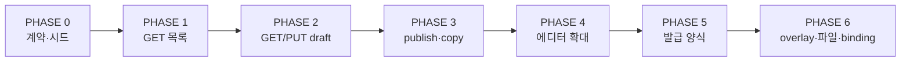

# 템플릿 양식 API 전환 마이그레이션 가이드

**작성 기준**: 2026-07-01  
**대상 화면**: CMS `/templates/form-management` (작성 양식 · 발급 양식)  
**관련 API 도메인**: Swagger `forms-surveys`  
**연동 명세**: [forms-surveys-api-integration.md](./forms-surveys-api-integration.md)  
**백엔드 갭 핸드오프**: [forms-surveys-api-backend-gaps.md](./forms-surveys-api-backend-gaps.md)  
**발급 양식 후속**: [issuance-form-api-follow-up.md](./issuance-form-api-follow-up.md)  
**공통 가이드**: [backend-handoff.md](./backend-handoff.md) · [api-routes-and-client.md](./api-routes-and-client.md)

---

## 0. 문서 목적

이 문서는 **시니어 개발자·백엔드·QA가 같은 PHASE 순서로 템플릿 양식 mock → 실 API 전환**을 진행할 수 있도록 작성했습니다.

- 각 PHASE마다 **목표 · 선행 조건 · BE/FE 작업 · env · 검증 · 롤백 · 완료 기준(DoD)** 을 정의합니다.
- **한 번에 전환하지 않습니다.** env 토글 + mock fallback으로 단계별 롤백 가능합니다.
- 코드 인프라(Orval, 서비스, 어댑터)는 이미 준비돼 있으나, **대부분의 에디터·발급 탭은 아직 localStorage/mock** 입니다.

---

## 1. 현재 상태 스냅샷 (2026-07-01)

### 1.1 준비 완료

| 항목 | 상태 | 위치 |
|------|------|------|
| OpenAPI subset + Orval | ✅ | `openapi/forms-surveys.openapi.json`, `generated/forms-surveys/` |
| 모듈 키 `formsSurveys` | ✅ | `real-api-modules.ts` |
| mock/실 분기 서비스 | ✅ | `admin-form-templates-service.ts` |
| draft ↔ schemaJson 어댑터 | ✅ | `adapters/form-template-draft-adapters.ts` |
| 목록 파일럿 훅 | ✅ | `use-writing-form-sections.ts` |
| 버전 load/save/publish 함수 | ✅ (서비스만) | `admin-form-templates-service.ts` |
| templateCode 카탈로그 27종 | ✅ | `form-template-catalog.ts` |
| 연동 명세 | ✅ | `forms-surveys-api-integration.md` |

### 1.2 아직 mock / 부분 연동

| 항목 | 현재 소스 | API 연동 |
|------|-----------|----------|
| `.env` `formsSurveys` | **미포함** (기본 mock) | — |
| 작성 양식 목록 UI | `useWritingFormSections` | env 켜면 GET, 실패 시 mock |
| 신청/모집 에디터 (participant-application) | `load/persistWritingFormTemplateDraft` | **1개 훅만** 연동 |
| 등록 양식 (일반/UJAT) | `registration-local-save`, `ujat-registration-*` | ❌ |
| 설문/동의 에디터 | writing-form-template-local-save 직접 또는 셸 | ❌ |
| 발급 양식 탭 | `issuance-form-tab.tsx` 하드코딩 | ❌ |
| 양식 설정(로고·인장) | `form-template-api.ts` 스텁 | ❌ |
| publish UI | 없음 | ❌ |
| overlay / editorState | localStorage only | ❌ (schemaJson 외부) |

### 1.3 SSOT (전환 중에도 유지)

| 개념 | SSOT | 비고 |
|------|------|------|
| 화면·라우트·localStorage 키 | `templateCode` (string) | 예: `registration-general` |
| 에디터 본문 | `WritingFormDraft` | `schemaJson`으로 직렬화 |
| 목록 UI 타입 | `TemplateSection` / `TemplateRow` | mock·API 공통 |
| API 숫자 ID | `templateId`, `templateVersionId` | `form-template-version-cache.ts`에 캐시 |

---

## 2. 전환 원칙

1. **Contract-first** — 엔드포인트 연결 전 `schemaJson` v1 + `templateCode` 시드표 확정.
2. **Read before write** — GET 목록/상세 검증 후 PUT 저장.
3. **One pilot template** — 양식 1종 E2E 통과 후 에디터·templateCode 확대.
4. **localStorage는 안전망** — save는 local 먼저, load는 API 우선·실패 시 local.
5. **env 롤백** — `VITE_REAL_API_MODULES`에서 `formsSurveys` 제거 = 즉시 mock 복귀.
6. **프로그램 유형 격리** — `features/program/**` 수정 시 general/UJAT/Gemini/1c-1s 분기 유지 ([program-type-isolation](../../../.cursor/rules/program-type-isolation.mdc)).

---

## 3. PHASE 개요



| PHASE | 한 줄 목표 | env `formsSurveys` | mock fallback |
|-------|------------|--------------------|---------------|
| **0** | BE/FE 계약 + DB 시드 | off | 100% mock |
| **1** | 작성 양식 목록 GET | on (스테이징) | 목록 mock merge |
| **2** | 파일럿 1종 save/load | on | save local, load fallback |
| **3** | publish · duplicate | on | copy 실패 → stub |
| **4** | 27종 에디터 전환 | on | 에디터별 local 유지 |
| **5** | 발급 탭 + ISSUANCE | on | 발급 mock 유지 |
| **6** | overlay · 파일 · binding | on | v1 범위 외 |

**권장 파일럿 templateCode**: `application-participant-individual`  
(이미 `use-program-participant-application-editor`가 draft API 경로 사용)

---

## PHASE 0 — 계약 고정 & DB 시드

### 목표

백엔드·프론트가 **같은 데이터 모델**로 시드와 API를 구현. 이 PHASE에서 **프론트 env는 켜지 않음**.

### 선행 조건

- OpenAPI 최신 (`pnpm fetch:openapi` + `pnpm generate:api`)
- [forms-surveys-api-integration.md](./forms-surveys-api-integration.md) 리뷰 일정

### 백엔드 작업

| # | 작업 | 산출물 |
|---|------|--------|
| B0-1 | `formType` / `category` enum 확정 | Swagger enum 또는 문서 1장 |
| B0-2 | `versionStatus` 값 확정 (`DRAFT`, `PUBLISHED` 등) | 상태 전이 다이어그램 |
| B0-3 | **27개 `templateCode` 시드** | migration SQL / seed JSON |
| B0-4 | template당 **initial version 1개** + `schemaJson` | seed data |
| B0-5 | `schemaJson` 검증 정책 | opaque string vs JSON schema |
| B0-6 | 스테이징 Swagger smoke | curl 3종 (목록·버전 GET·PUT) |

**시드 메타 예시 (1행)**

```json
{
  "templateCode": "application-participant-individual",
  "templateName": "프로그램 참여자 신청 폼 (개인)",
  "formType": "WRITING",
  "category": "APPLICATION",
  "useYn": true
}
```

**시드 schemaJson 예시**

- `schemaJson` 컬럼에는 **string**으로 저장 (이중 JSON)
- 내용은 `{ "schemaVersion": 1, "formSettings": {...}, "paragraphs": [...] }`
- 출처: 프론트 `createXxxDraft()` → `normalizeWritingFormDraft()` → `writingFormDraftToSchemaJson()`

### 프론트 작업

| # | 작업 | 산출물 |
|---|------|--------|
| F0-1 | `form-template-catalog.ts` ↔ BE 시드표 diff | PR 코멘트 / 이슈 |
| F0-2 | **시드 export 스크립트** (권장) | `scripts/export-form-template-seeds.mjs` + `seed/*.json` |
| F0-3 | integration 문서 TODO 체크리스트 owner 지정 | GitHub issues |
| F0-4 | 대표 3종 JSON 샘플 BE 전달 | registration-general, application-participant-individual, survey-default |

### v1에서 **제외** (PHASE 6로)

- `overlay`, `editorState` (UJAT 모집 등)
- 등록 양식의 `program` mock 객체 (`registration-local-save`)
- 발급 양식 `issuance-*` templateCode
- 로고·인장·수료증 배경 파일

### 검증 (DoD)

- [ ] BE/FE가 [Contract v1](#부록-a-contract-v1-체크리스트) 문서에 서명(PR approve)
- [ ] 스테이징 `GET /api/admin/form-templates?formType=WRITING` → 27개 `templateCode` 존재
- [ ] 파일럿 3종 `GET .../form-template-versions/{id}` → `schemaJson` parse 성공 (FE adapter)
- [ ] `pnpm typecheck` green

### 롤백

해당 없음 (env off, mock 유지).

---

## PHASE 1 — 작성 양식 목록 GET (읽기 전용)

### 목표

**작성 양식 탭 목록만** 실 API. 저장·에디터는 mock/localStorage 유지.

### 선행 조건

- PHASE 0 DoD 완료
- 스테이징 JWT + MFA 로그인 가능

### env 설정 (스테이징)

```env
VITE_API_SERVER=https://<backend-host>/
VITE_REAL_API_MODULES=...,formsSurveys
```

> `formsSurveys`만 추가. 다른 모듈은 기존 유지.

### 코드 경로 (이미 구현)

```
template-form-tab.tsx
  → useWritingFormSections()
    → remoteEnabled ? getWritingFormSectionsRemote() : getMockWritingFormSections()
    → API 실패/미활성 → writingSections (template.schema.ts)
```

### 백엔드 작업

| # | 작업 |
|---|------|
| B1-1 | `GET /api/admin/form-templates?formType=WRITING&page=0&size=200` 안정화 |
| B1-2 | 응답 `templateCode`, `templateName`, `category`, `latestVersionNo` 필드 확인 |
| B1-3 | CORS / ngrok / JWT 401 시나리오 문서화 |

### 프론트 작업

| # | 작업 |
|---|------|
| F1-1 | 스테이징에서 env on 후 목록 5개 섹션 렌더 확인 |
| F1-2 | API row + mock row merge 동작 확인 (`form-template-adapters.ts`) |
| F1-3 | (선택) 목록 로딩 스피너 / remote 배지 UI |

### 수동 검증 체크리스트

- [ ] 등록/모집/신청/설문/동의 5섹션 타이틀·설명 mock과 동일
- [ ] 각 섹션 row `id`(=templateCode) 클릭 → 에디터 URL `?mode=edit&id=<code>` 정상
- [ ] BE 목록 일부 누락 시 mock row로 보완되는지
- [ ] env off → 즉시 하드코딩 목록으로 복귀
- [ ] 401/500 → mock fallback, 화면 빈 목록 아님

### 롤백

```env
# formsSurveys 제거
VITE_REAL_API_MODULES=...,notices,faqs  # formsSurveys 없음
```

재배포 없이 dev server restart만으로도 반영 (Vite env).

### DoD

- [ ] 스테이징 QA: 목록 smoke pass
- [ ] `form-template-version-cache`에 templateId 채워짐 (localStorage `cms.jakorea.formTemplateVersionCache.v1`)

---

## PHASE 2 — 파일럿 1종 draft load/save (GET/PUT version)

### 목표

**templateCode 1개**에 대해 에디터 열기 → 수정 → 임시저장 → 새로고침 → 복원 E2E.

**권장 파일럿**: `application-participant-individual`

### 선행 조건

- PHASE 1 DoD
- BE: 해당 templateCode의 `templateVersionId` 존재

### 데이터 흐름

```
저장: persistWritingFormTemplateDraft
  → localStorage (cms.jakorea.writingFormTemplateSaves.v1)  // 항상
  → PUT /api/admin/form-template-versions/{versionId}       // formsSurveys on

로드: loadWritingFormTemplateDraft
  → GET version (schemaJson)                                // 우선
  → localStorage fallback                                   // 실패 시
```

### 백엔드 작업

| # | 작업 |
|---|------|
| B2-1 | `GET /api/admin/form-template-versions/{versionId}` — `schemaJson` 반환 |
| B2-2 | `PUT /api/admin/form-template-versions/{versionId}` — `schemaJson` string 수용 |
| B2-3 | `GET /api/admin/form-templates/{templateId}/versions` — DRAFT 버전 조회 |
| B2-4 | PUT 후 GET 재조회로 persistence 확인 |

### 프론트 작업

| # | 작업 | 파일 |
|---|------|------|
| F2-1 | 파일럿 에디터 save/load가 `*WritingFormTemplateDraft` 사용 | `use-program-participant-application-editor.ts` ✅ |
| F2-2 | 저장 실패 UX (toast) | 해당 에디터 또는 공통 |
| F2-3 | DevTools: PUT 200 + localStorage 동시 확인 | — |
| F2-4 | (선택) React Query `versionDraft` 캐시 | `form-template-query-keys.ts` |

### E2E 시나리오 (QA)

1. MFA 로그인 → 작성 양식 → **프로그램 참여자 신청 폼 (개인)** 편집
2. 단락 제목/필드 수정 → 임시저장
3. Network: `PUT .../form-template-versions/` 200
4. 브라우저 hard refresh → 수정 내용 유지 (API load)
5. env off → localStorage 내용으로仍 복원되는지
6. BE DB `schemaJson` 직접 조회 → FE 수정 반영

### 알려진 제한 (파일럿)

- `editorState` (봉사자 일정 등)는 **localStorage only**
- UJAT overlay 미포함

### 롤백

- env off → load/save 모두 local only (PHASE 1 이전 UX)
- BE 데이터 오염 시: FE local draft로 복구 후 PUT 재시도

### DoD

- [ ] 파일럿 1종 E2E pass (스테이징)
- [ ] PUT 실패 시 toast 또는 배지 (silent warn 제거)
- [ ] 담당자 1명이 rollback rehearsal 완료

---

## PHASE 3 — publish · duplicate

### 목표

버전 **게시**와 템플릿 **복제** API를 UI/서비스에 연결.

### 선행 조건

- PHASE 2 DoD
- BE: `versionStatus` 전이 규칙 확정

### API ↔ 서비스 (구현됨)

| API | 서비스 함수 | UI |
|-----|-------------|-----|
| `POST .../versions/{versionId}/publish` | `publishFormTemplateVersion()` | **미구현** |
| `POST .../{templateId}/versions/copy` | `duplicateWritingTemplate()` | template-create-modal |

### 백엔드 작업

| # | 작업 |
|---|------|
| B3-1 | publish 후 `versionStatus` 변경 규칙 |
| B3-2 | copy 시 새 `templateCode` 정책 (동일 code vs suffix) |
| B3-3 | 409 중복/동시 수정 응답 형식 |

### 프론트 작업

| # | 작업 |
|---|------|
| F3-1 | 게시 버튼 + confirm (TemplatePreviewModal 또는 관리 UI) |
| F3-2 | publish 성공 후 version 캐시 invalidate |
| F3-3 | duplicate: BE가 새 code 반환 시 FE 라우트 반영 (현재 stub은 원본 id) |
| F3-4 | copy 실패 fallback UX |

### 검증

- [ ] DRAFT 저장 → publish → GET status `PUBLISHED`(또는 합의값)
- [ ] duplicate → 새 version/template 식별 가능
- [ ] publish 전 프로그램 binding 노출 정책 (BE/PO 확인)

### 롤백

- publish UI feature flag 또는 env off
- duplicate는 stub fallback 유지

### DoD

- [ ] publish 1종 manual pass
- [ ] duplicate happy path + fallback documented

---

## PHASE 4 — 작성 양식 에디터 전면 전환 (27종)

### 목표

모든 작성 양식 `templateCode`에 대해 `load/persistWritingFormTemplateDraft` 패턴 적용.

### 전환 매트릭스

| category | templateCode 수 | 에디터 / 저장소 | PHASE 4 작업 |
|----------|-----------------|-----------------|--------------|
| REGISTRATION | 3 | `use-program-registration-editor`, UJAT registration — **별도 local** | draft만 API, program mock 분리 |
| RECRUITMENT | 6 | `use-program-participant-application-editor` (variant) | variant별 templateId 매핑 |
| APPLICATION | 10 | 동일 훅 | PHASE 2 패턴 확장 |
| SURVEY | 4 | `use-writing-form-editor-with-user-preview` | local-save → Draft API |
| AGREEMENT | 5 | Agreement shell / crime modal | shell별 draft 연동 |

**registry 참조**: `features/template/model/template-registry/template-registry.ts`

### 권장 rollout 순서 (리스크 낮은 순)

1. APPLICATION (participant-application 훅 — 이미 시작)
2. RECRUITMENT (동일 훅, UJAT overlay 주의)
3. SURVEY
4. AGREEMENT
5. REGISTRATION (program local-save와 경계 협의)

### 프론트 작업 (에디터당)

1. `loadWritingFormTemplateSave` → `loadWritingFormTemplateDraft`
2. `persistWritingFormTemplateSave` → `persistWritingFormTemplateDraft`
3. UJAT recruit: `ujat-recruit-template-local-save` — overlay PHASE 6
4. 등록: `registrationDraft`만 API, `program`은 programs API (별 프로젝트)

### 백엔드 작업

- 27종 `schemaJson` 시드 품질 검증
- category 필터별 목록 count QA

### 검증 (샘플링)

전수 27 E2E 대신 **카테고리당 1종 + UJAT 1종 + Gemini 1종**:

- [ ] REGISTRATION: `registration-general`
- [ ] RECRUITMENT: `recruitment-volunteer`
- [ ] APPLICATION: `application-gemini-visiting-training-school`
- [ ] SURVEY: `survey-student`
- [ ] AGREEMENT: `agreement-expense`

### DoD

- [ ] 매트릭스 전 row에 FE PR 링크 또는 “의도적 제외” 사유
- [ ] regression: env off → 전 에디터 mock/local 정상

---

## PHASE 5 — 발급 양식 (ISSUANCE)

> **2026-07-09:** FE 1차 구현 완료. 남은 BE 시드·Payload E 등은 [issuance-form-api-follow-up.md](./issuance-form-api-follow-up.md).

### 목표

`issuance-form-tab.tsx` 하드코딩 → `formType=ISSUANCE` API.

### 선행 조건

- PHASE 4 DoD (작성 양식 안정)
- **발급 templateCode 카탈로그 확정** (FE `ISSUANCE_TEMPLATE_CODE_CATALOG` — BE 시드 합의 대기)

### 추가 설계 필요

| 항목 | 현재 | 필요 |
|------|------|------|
| templateCode | FE SSOT 14종 | BE 시드 등록·합의 |
| formType | `ISSUANCE` (FE 사용 중) | BE enum 확정 |
| draft | `*-issuance-draft.ts` | Payload A 시드 JSON export (`exportIssuanceFormTemplateSeeds` — P0 완료) |
| PDF/미리보기 | 클라이언트 생성 | API 범위 외 |

### 작업 개요

1. [x] FE: `ISSUANCE_TEMPLATE_CATALOG` + adapter
2. [ ] BE: ISSUANCE 시드 + GET 목록 (FE JSON: P0 지급조서 2종 + `document-3` 완료, 잔여 미작성)
3. [x] FE: `use-issuance-form-sections` + 탭 연동
4. [x] 에디터별 draft save 11종 + 인증서 `settingsJson` + 프로그램 실발급 연동
5. [x] FE: P0 시드 JSON 2종 (`document-payment-order-issue` / `pre-consent`)

### DoD

- [x] 발급 목록 GET + mock fallback
- [x] 발급 save/load E2E (11종 — `document-payment-order-issue` 파일럿 포함)
- [x] FE 시드 JSON P0 (지급조서 2종) — [issuance-form-api-follow-up.md §3.2](./issuance-form-api-follow-up.md)
- [ ] BE 시드 14종 DRAFT 등록
- [ ] FE 시드 JSON P1/P2 잔여
- [ ] Payload E 3종 제품 스펙

---

## PHASE 6 — overlay · 파일 · program binding

### 목표

v1에서 제외한 부가 state·파일·프로그램 연동 완료.

### 범위

| # | 항목 | API 후보 |
|---|------|----------|
| 6-1 | overlay / editorState | template meta JSON extension 또는 version 필드 추가 |
| 6-2 | 로고·인장·수료증 | file API + template PATCH |
| 6-3 | form-responses (양식 테스트) | `GET/POST .../form-responses` |
| 6-4 | program form-bindings | `GET/POST .../programs/{id}/form-bindings` |
| 6-5 | localStorage 마이그레이션 일괄 | one-time import script |

### DoD

- PO sign-off on v2 scope
- binding이 **published version만** 참조하는지 E2E

---

## 4. env · 롤백 · 관측

### env

```env
VITE_API_SERVER=https://<host>/
VITE_REAL_API_MODULES=adminAuth,...,formsSurveys
```

| 조건 | API 호출 |
|------|----------|
| `formsSurveys` ∉ modules | 100% mock/local |
| modules 포함 + JWT 없음 | mock/local |
| modules + JWT | remote 시도, 실패 fallback |

### 롤백 playbook

| 증상 | 조치 |
|------|------|
| 목록 깨짐 | env off → mock 목록 |
| 저장 오염 | env off, local draft 사용, BE version rollback |
| 잘못된 schemaJson | BE seed 재적재, FE normalize 확인 |
| templateId 캐시 꼬임 | localStorage `cms.jakorea.formTemplateVersionCache.v1` 삭제 |

### 관측 (권장)

- Network tab: `form-templates`, `form-template-versions`
- Console: `[form-templates] remote ... failed` warn
- BE audit log: templateCode correlation

---

## 5. 역할별 RACI (요약)

| PHASE | Backend | Frontend | QA | PO |
|-------|---------|----------|-----|-----|
| 0 | R/A seed | C contract | I | A enum |
| 1 | R API | R env/list | R smoke | I |
| 2 | R GET/PUT | R pilot editor | R E2E | I |
| 3 | R publish/copy | R UI | R | C publish 정책 |
| 4 | C seed fix | R editors | R sample | I |
| 5 | R ISSUANCE | R issuance tab | R | A codes |
| 6 | R extension | R | R | A scope |

R=Responsible, A=Accountable, C=Consulted, I=Informed

---

## 6. 이슈 · PR 템플릿

### GitHub Issue (PHASE 시작)

```markdown
## PHASE N — [제목]

### 목표
-

### 선행 PHASE
- [ ] PHASE N-1 DoD

### Backend
- [ ]

### Frontend
- [ ]

### QA
- [ ]

### Rollback
-
```

### PR 제목 convention

```
feat(cms/template): [PHASE-N] forms-surveys — <templateCode or scope>
```

---

## 부록 A. Contract v1 체크리스트

BE/FE 공동 sign-off:

- [ ] `templateCode` 27개 목록 확정 ([integration doc](./forms-surveys-api-integration.md))
- [ ] `formType`: `WRITING` | `ISSUANCE` (발급은 PHASE 5)
- [ ] `category`: `REGISTRATION` | `RECRUITMENT` | `APPLICATION` | `SURVEY` | `AGREEMENT`
- [ ] `schemaJson` = `WritingFormDraft` JSON string, `schemaVersion: 1`
- [ ] BE는 `schemaJson` 내부 필드 검증 **하지 않음** (v1 opaque)
- [ ] `versionStatus` 값 목록 + publish 전이
- [ ] overlay/editorState **v1 미포함** (PHASE 6)
- [ ] initial seed = 프론트 factory export 기준

---

## 부록 B. templateCode → 시드 factory 매핑

| templateCode | Seed factory (파일) |
|--------------|---------------------|
| `registration-general` | `createProgramRegistrationDraft('general')` — `program-registration-draft.ts` |
| `registration-economy` | `createProgramRegistrationDraft('economy')` |
| `registration-ujat` | `createUjatProgramRegistrationDraft()` — `ujat-program-registration-draft.ts` |
| `recruitment-participant-school` | `createApplicantRecruitFormInstitutionDraft()` |
| `recruitment-participant-individual` | `createApplicantRecruitFormIndividualDraft()` |
| `recruitment-instructor` | `createRecruitFormInstructorDraft()` |
| `recruitment-volunteer` | `createRecruitFormVolunteerDraft()` |
| `recruitment-ujat-school` | `createUjatRecruitFormInstitutionDraft()` |
| `recruitment-ujat-volunteer` | `createUjatRecruitFormVolunteerDraft()` |
| `application-participant-school` | `createProgramApplicationFormInstitutionDraft()` |
| `application-participant-individual` | `createProgramParticipantApplicationDraft()` |
| `application-instructor` | `createProgramApplicationFormInstructorDraft()` |
| `application-volunteer` | `createProgramApplicationFormVolunteerDraft()` |
| `application-economy` | `createProgramApplicationFormEconomyDraft()` |
| `application-gemini-visiting-training-instructor` | `createGeminiVisitingTrainingApplicationFormInstructorDraft()` |
| `application-gemini-visiting-training-school` | `createGeminiVisitingTrainingApplicationFormInstitutionDraft()` |
| `application-ujat-school` | `createUjatProgramApplicationFormInstitutionDraft()` |
| `application-ujat-volunteer` | `createUjatProgramApplicationFormVolunteerDraft()` |
| `survey-default` | `createDefaultSurveyDraft()` — `writing-form-draft.schema.ts` |
| `survey-student` / `teacher` / `admin` | survey editor seed (templateName 주입) |
| `agreement-third-party` | agreement registry + dedicated draft fns |
| `agreement-crime` | crime consent (modal) |
| `agreement-notice` | `createAgreementNoticeDraft()` |
| `agreement-expense` | agreement drafts in schema |
| `agreement-portrait` | `createAgreementPortraitDraft()` |

> export 스크립트 구현 시 registry + factory table을 SSOT로 사용.

---

## 부록 C. 코드 위치 빠른 참조

| 역할 | 경로 |
|------|------|
| **JSON 계약 SSOT** | `docs/api/form-template-json-contract.md` |
| 연동 명세 | `docs/api/forms-surveys-api-integration.md` |
| **이 문서** | `docs/api/forms-surveys-api-migration-guide.md` |
| 서비스 | `features/template/api/admin-form-templates-service.ts` |
| local + remote draft | `features/template/lib/writing-form-template-local-save.ts` |
| 목록 훅 | `features/template/hooks/use-writing-form-sections.ts` |
| mock SSOT | `features/template/model/template.schema.ts` |
| catalog | `features/template/api/form-template-catalog.ts` |
| version id cache | `features/template/api/form-template-version-cache.ts` |
| localStorage 설계 | `docs/implementation/template-form-draft-local-save.md` |

---

## 부록 D. 백엔드 전달용 첫 메시지 (복붙)

> **Template Forms API v1 — PHASE 0 kickoff**
>
> 1. SSOT: `templateCode`(27개) + `schemaJson`(WritingFormDraft JSON, schemaVersion=1)  
> 2. v1 범위: 작성 양식 GET/PUT/publish/copy. overlay·발급·파일은 PHASE 5–6  
> 3. 시드: 첨부 예정 `template-meta.json` + `template-seeds/*.json` (FE factory export)  
> 4. enum 확인: formType=`WRITING|ISSUANCE`, category=`REGISTRATION|RECRUITMENT|APPLICATION|SURVEY|AGREEMENT`  
> 5. 파일럿: `application-participant-individual` E2E 후 확대  
> 6. 문서: `apps/cms/docs/api/forms-surveys-api-migration-guide.md`  
> 7. OpenAPI: `pnpm fetch:openapi` 기준 forms-surveys subset 19 paths

---

## 변경 이력

| 날짜 | 변경 |
|------|------|
| 2026-07-01 | 초안 — PHASE 0–6, 매트릭스, DoD, 롤백, 부록 |
| 2026-07-08 | JSON 계약 SSOT 문서 링크 추가 (`form-template-json-contract.md`) |
