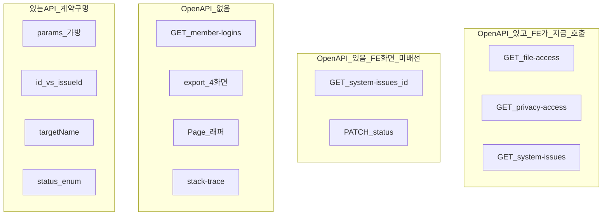

# 보안 설정(로그 관리) — API 전환률 · 미적용 API (백엔드 핸드오프)

> **2026-08-26**: 이 문서는 2026-08-24 스냅샷입니다.  
> 백엔드가 **지금 실행할 작업**은 [**logs-api-backend-cursor-prompt.md**](./logs-api-backend-cursor-prompt.md) 를 따르세요.  
> FE는 `GET /member-logins` mock fallback을 제거했습니다. OpenAPI에 목록 4종 + Page 래퍼 + `targetName`이 이미 있습니다.

**대상 독자**: 백엔드  
**작성일**: 2026-08-24  
**범위**: CMS LNB **보안 설정(로그 관리)** 하위 4화면만. 프로그램 유형·데이터 관리·정산은 제외.  
**OpenAPI 스냅샷**: `apps/cms/openapi/logs.openapi.json` (tag: 로그 관리, spec **v9**)  
**FE 연동 코드**: `apps/cms/src/features/logs/**`, `apps/cms/src/pages/logs/**`  
**관련**: [logs-api-integration.md](./logs-api-integration.md) · [logs-api-backend-gaps.md](./logs-api-backend-gaps.md) (짧은 갭 목록. **전환률·요청 스펙은 본 문서가 SSOT**)

게이트: `VITE_REAL_API_MODULES`에 `logs` + MFA 완료 JWT (`hasRemoteAdminJwt()`).  
권한: FE 403 카피는 **MASTER 전용**. OpenAPI 본문은 “별도 세부 권한 없음”. **RBAC 코드(`LOG_READ` / `LOG_WRITE` 등)를 OpenAPI에 명시해 주세요.**

---

## 0. 한 장 요약 (백엔드 액션)

| ID | 우선 | 요청 | 영향 화면 |
|----|------|------|-----------|
| **L-09** | **P0** | `GET /api/admin/logs/member-logins` **OpenAPI 등재 + 구현**. 지금 FE가 이 경로를 칩니다. 404 등 실패 시 **mock 130건**이 보여 **운영 데이터가 아닙니다** | 회원 로그인 이력 |
| **L-01** | **P2** | 목록 `BugIssueLogFrontendResponse.id`(string)와 상세/PATCH `issueId`(int64) **동일 식별자·동일 타입** | OpenAPI 상세·PATCH는 있으나 **CMS UI 미연결**. 나중에 붙일 때 UUID면 호출 불가 |
| **L-02** | **P0** | `PersonalInfoAccessLogFrontendResponse.targetName` (열람 대상자 명) | 개인정보 조회 이력 「조회 대상」컬럼이 없으면 항상 `-` |
| **L-03** | **P0** | 목록 3종 query `params` 가방 → **키를 스키마 property로 명시**. Axios 중첩 `params[fileName]` vs 플랫 `fileName` **바인딩 확인** | 파일·개인정보·버그 필터가 서버에 안 먹을 수 있음 |
| **L-04** | **P2** | `PATCH .../status`의 `status` **enum + 409 전이 규칙** | OpenAPI 있음, **CMS UI 미연결** |
| **L-05** | **P1** | 목록 **Page** (`page`, `size`, `totalElements`) — 현재 무한 배열 | 로그 적재 시 화면이 배열 전체를 받음 |
| **L-06** | **P1** | 목록 **export** (필터 동일, **감사 fail-closed**). 지금은 클라 테이블 dump | 4화면 엑셀. 개인정보·IP 포함 |
| **L-07** | **P2** | 상세 `stackTrace` 본문 또는 `GET .../stack-trace` | CMS UI가 상세를 열지 않음. `stackTraceAvailable`만 있음 |
| **L-10** | **P1** | 버그 **목록** DTO에 `issueStatus` / `severity` | 행을 안 열면 상태 배지 불가 (Notion: 행 액션 없음) |
| **L-08** | **P2** | `GET /api/admin/logs/mail-sends` (가칭) | Notion 메일 발송 이력 — **기획 보류, LNB 없음** |

**요청하지 않음**

- `POST /logs/file-access` — 파일 다운로드 시 **서버가 적재**. CMS는 조회 전용.
- `POST /logs/privacy-access` — 회원 unmask API가 감사 생성.
- 대시보드 `GET /api/admin/dashboard/log-alerts` — v9 삭제, 이 LNB 아님.
- `/api/files/access-logs` — 파일 도메인. 로그 관리 화면과 무관.

---

## 1. 전환률 (두 축)

가중: LNB 하위 **4화면 균등**.  
숫자는 추정치이며, **백엔드 계약이 화면 기획을 충족하는 비율**과 **FE가 실제로 호출하는 비율**을 나눕니다.

### 1.1 화면별

| LNB 화면 | CMS 경로 | FE 목록 GET | OpenAPI | **백엔드 계약 완료율** | **FE 배선률** | 한 줄 |
|----------|----------|-------------|---------|----------------------:|-------------:|------|
| 회원 로그인 이력 | `/logs/member-login-history` | handwritten + **실패 시 mock 130건** | **미등재** | **~35%** | **~40%** (경로만 추정 호출) | 스펙·DTO 없음. 운영에서 mock이 섞일 수 있음 |
| 파일 다운로드 이력 | `/logs/file-download-history` | 실호출, mock 없음 | 목록 GET 있음 | **~70%** | **~90%** (목록만) | 필터 스키마·Page·export 없음 |
| 개인정보 조회 이력 | `/logs/personal-info-access-history` | 실호출, mock 없음 | 목록 GET 있음 | **~60%** | **~85%** (목록만) | `targetName` 없음. 클라 엑셀이 감사 정책과 충돌 가능 |
| 버그/이슈 이력 | `/logs/bug-issue-history` | 목록만 실호출, mock 없음 | 목록+상세+PATCH 있음 | **~70%** | **~55%** (목록만. 상세·PATCH **화면 미배선**) | id 타입·enum·스택·목록 상태 필드 구멍 |

**LNB 균등 평균**

| 축 | 수치 | 의미 |
|----|------|------|
| **백엔드 계약 완료율** | **≈ 55–65%** | 화면이 기획대로 동작하려면 필요한 API/필드 대비 |
| **FE 목록 배선** | **4 / 4** | 네 화면 모두 목록 GET을 시도 |
| OpenAPI에 있는 logs 엔드포인트 | **5개** | GET 3목록 + GET 상세 + PATCH 상태 |
| 그중 **FE가 지금 호출** | **3 / 5** | `file-access` · `privacy-access` · `system-issues`(목록) |
| OpenAPI **없는** 화면 GET | **1** | `GET /api/admin/logs/member-logins` |
| mock fallback 있는 화면 | **1 / 4** | 회원 로그인만 |

> OpenAPI가 “구현 완료”로 적은 상세 GET·PATCH는 **스펙에 있으나 CMS 버그/이슈 페이지는 행 클릭·모달이 없습니다.**  
> 백엔드는 계약을 확정해 주시면, FE가 이어서 붙입니다. **삭제하지 마세요.**



---

## 2. 화면 × API 인벤토리

공통

- Base: `/api/admin/logs/...`
- Auth: Bearer 관리자 JWT
- 성공: 배열 또는 단건. FE는 `{ success, data }` 래퍼가 있으면 `data`를 한 번 언랩
- 목록 UI: `pagination={false}` — **받은 배열 전부 표시**. `total`이 없으면 화면 건수 = 배열 길이
- 정렬: 서버 결과를 신뢰하고 클라에서는 **일시 내림차순만** (`filterFn`은 정렬)
- 조회: 필터 입력 후 **조회 버튼** → URL 쿼리 → React Query 재호출

### 2.1 회원 로그인 이력 — **BE 미적용 (OpenAPI 없음)**

| 항목 | 값 |
|------|-----|
| CMS | `/logs/member-login-history` |
| FE 호출 | `GET /api/admin/logs/member-logins` (`customInstance`, Orval 없음) |
| 성공 | 배열 또는 `{ items \| content \| rows \| data }` 매핑 + **1개월 보관 필터** |
| 실패 | 404 등 → mock 130건 (`data/mock/member-login-logs.ts`) + 동일 1개월 필터 |
| 모듈/JWT 없음 | 처음부터 mock |
| 권한 403 | 「로그 조회 권한이 없습니다. MASTER…」 — 다만 이 화면은 catch로 mock이 될 수 있음 |

**필터 (플랫 쿼리 — 다른 3목록과 다름)**

| UI 라벨 | CMS URL | 쿼리 키 | 예 |
|---------|---------|---------|----|
| 관리자명 | `mlh_name` | `adminName` **그리고** `name` (동일 값 중복 전송) | 홍길동 |
| 아이디 | `mlh_id` | `loginId` | admin@jakorea.org |
| 로그인 일시 | `mlh_from` / `mlh_to` | `from` / `to` | `YYYY-MM-DD` |

예:

```
GET /api/admin/logs/member-logins?adminName=홍길동&name=홍길동&loginId=a%40b.com&from=2026-08-01&to=2026-08-24
```

**응답 (FE가 받는 형태 — 스펙 확정 요청)**

| FE 필드 | 화면 컬럼 | 허용 키 (앞에서부터 매칭) | 표시 |
|---------|-----------|---------------------------|------|
| `id` | rowKey | `id` string/number | 숨김 |
| `adminName` | 관리자명 | `adminName` → `name` → `userName` | |
| `loginId` | 아이디 | `loginId` → `email` → `loginEmail` → `userId` | |
| `loggedAt` | 로그인 일시 | `loggedAt` → `loginAt` → `accessedAt` → `createdAt` (ISO) | `YYYY.MM.DD HH:mm:ss` |
| `ipAddress` | IP | `ipAddress` → `ip` | **마스킹 없음 (원문)** |

**보관**: 기획 「수집일로부터 **1개월** 후 파기」. FE는 `loggedAt`이 cutoff 이전이면 **화면에서 숨김** (`MEMBER_LOGIN_RETENTION_MONTHS = 1`). 서버가 더 오래 주면 불필요 트래픽 + 정책 리스크. **서버 파기(또는 기본 `from` 1개월)** 를 맞춰 주세요.

**엑셀**: 파일명 `[JA Korea] CMS 어드민_회원 로그인 이력_YYMMDD.xlsx` — **현재 테이블 dump**. export API 권장(§4.2).

**OpenAPI에 넣어 달라는 스키마 (제안)**

```
GET /api/admin/logs/member-logins
query:
  adminName?: string
  loginId?: string
  from?: string   # YYYY-MM-DD
  to?: string
  page?: int
  size?: int
200: Page 또는 array of {
  id: string
  adminName: string
  loginId: string
  loggedAt: date-time
  ipAddress: string
}
```

`adminName` / `name` 중 **하나만** 쓰기로 확정하면 FE는 `logs-filter-params.ts`만 수정합니다.

---

### 2.2 파일 다운로드 이력 — 목록 GET 배선

| 항목 | 값 |
|------|-----|
| CMS | `/logs/file-download-history` |
| API | `GET /api/admin/logs/file-access` (`fileAccessLogs`) |
| mock | **없음** (미로그인/모듈 off면 에러 UI) |
| 엑셀 | 클라 dump (`excelExport`) |

**필터 → 중첩 `params` 객체** (Orval `FileAccessLogsParams`)

| UI 라벨 | CMS URL | `params` 키 |
|---------|---------|-------------|
| 다운로드 파일명 | `fdl_file` | `fileName` |
| 사용자 | `fdl_user` | `userName` |
| 다운로드 기간 | `fdl_from` / `fdl_to` | `from` / `to` (`YYYY-MM-DD`) |

Axios GET body 없음. 쿼리는 대략:

- 중첩: `params[fileName]=…&params[userName]=…&params[from]=…&params[to]=…`
- 또는 구현에 따라 `params.fileName=`

**Spring이 플랫 `fileName`만 바인딩하면 필터가 전부 무시됩니다.** 스테이징에서 한 건 검색 후 쿼리스트링을 확인해 주세요. 권장: OpenAPI를 **플랫 쿼리**로 바꾸고 Orval 재생성.

**200 배열 항목 `DownloadLogFrontendResponse`**

| 필드 | FE | 화면 |
|------|-----|------|
| `id` | rowKey, 없으면 임시 id | (숨김) |
| `fileName` | 그대로 | 다운로드 파일명 |
| `userName` | 그대로 | 사용자 |
| `downloadedAt` | ISO → `YYYY.MM.DD HH:mm` | 다운로드 일시 |
| `ipAddress` | 그대로 | IP |
| `userId` | 매핑만, 컬럼 없음 | — |

**적재 확인**: 이 목록은 CMS가 POST하지 않음. 실제 파일 다운로드 API가 `file-access` 행을 안 남기면 **항상 빈 목록**.

---

### 2.3 개인정보 조회 이력 — 목록 GET 배선, 컬럼 갭

| 항목 | 값 |
|------|-----|
| CMS | `/logs/personal-info-access-history` |
| API | `GET /api/admin/logs/privacy-access` (`privacyAccessLogs`) |
| mock | 없음 |
| 엑셀 | 클라 dump (**조회 대상·조회자·IP 포함** → 감사 fail-closed 대상) |

**필터 `params`**

| UI 라벨 | CMS URL | `params` 키 | 비고 |
|---------|---------|-------------|------|
| 조회 목적 | `pia_purpose` | `accessPurpose` | |
| 조회자명 | `pia_accessor` | `accessorName` | |
| (필터 UI 없음) | `pia_target` | `targetName` | URL에 있으면 전송. 화면 필터 필드는 없음 |
| 조회 일시 | `pia_from` / `pia_to` | `from` / `to` | |

**화면 컬럼 vs DTO**

| 화면 | FE | OpenAPI v9 | 상태 |
|------|-----|------------|------|
| 조회 대상 | `targetName` | **없음** | 없으면 `-`. 허용 키: `targetName` / `accessTarget` / `targetUserName` / `subjectName` / `accessedUserName` |
| 조회 목적 | `accessPurpose` | 있음 | |
| 조회자명 | `accessorName` | 있음 | |
| 조회 일시 | `accessedAt` → `YYYY.MM.DD HH:mm:ss` | 있음 | |
| IP | `ipAddress` | 있음 | |
| (비표시) | `accessItem`, `accessorId` | 있음 | 테이블·엑셀 미표시 |

**감사 생성(로그 LNB 밖, 이력 원천)**

성공한 원문 조회만 남기는지, 마스킹 화면 조회도 남기는지 **확인해 주세요.**

| 용도 | FE 경로 (참고) |
|------|----------------|
| 회원 상세 unmask (handwritten) | `POST /api/users/{memberId}/privacy/unmask` body `{ reason }` (`privacy-unmask-fetcher.ts`) |
| OpenAPI members | `POST /api/admin/users/{memberId}/privacy/unmask` 등 |

경로 prefix(`/api/users` vs `/api/admin/users`)가 어긋나면 감사도 안 쌓일 수 있습니다.

---

### 2.4 버그/이슈 이력 — 목록 GET 배선, 상세·PATCH는 OpenAPI만

| 항목 | 값 |
|------|-----|
| CMS | `/logs/bug-issue-history` |
| 목록 (FE 호출 중) | `GET /api/admin/logs/system-issues` |
| 상세 | `GET /api/admin/logs/system-issues/{issueId}` — **OpenAPI·Orval 있음, CMS 화면 미배선** |
| 상태 저장 | `PATCH /api/admin/logs/system-issues/{issueId}/status` body `{ status }` — **동일** |
| mock | 없음 |
| 엑셀 | 클라 dump |

현재 테이블은 행 클릭이 없습니다. 컬럼: No, 화면명, 에러 메시지, 사용자, 발생 일시.

**필터 `params` (UI에 없는 키도 코드가 URL에 있으면 전송)**

| UI | CMS URL | `params` |
|----|---------|----------|
| 사용자 | `bil_user` | `userName` |
| 기간 | `bil_from` / `bil_to` | `from` / `to` |
| (UI 없음) | `bil_status` | `status` |
| (UI 없음) | `bil_severity` | `severity` |

목록에 `issueStatus`/`severity`가 오면 필터 UI를 붙일 수 있음. 지금은 사용자+기간만.

**목록 `BugIssueLogFrontendResponse` → 화면**

| 필드 | 화면 |
|------|------|
| `id` | rowKey (string). 상세 path와 타입이 다름 → **L-01** |
| `screenName` | 화면명 |
| `errorMessage` | 에러 메시지 |
| `userName` | 사용자 |
| `occurredAt` | 발생 일시 `YYYY.MM.DD HH:mm` |

**상세 `SystemIssueDetailResponse` (FE가 붙일 때 쓸 필드 — 백엔드 유지·계약 확정 요청)**

| 필드 | 라벨 후보 |
|------|-----------|
| `issueId` | 이슈 ID (**int64**. 목록 `id`와 통일 필요) |
| `issueType` | 유형 |
| `severity` | 심각도 |
| `screenKey` | 화면 키 |
| `apiPath` | API 경로 |
| `message` | 메시지 |
| `detailSummary` | 상세 요약 |
| `createdAt` / `resolvedAt` | 발생/해결 시각 |
| `actorType` / `actorId` | 액터 |
| `featureKey` | 기능 키 |
| `traceId` / `requestId` | Trace / Request ID (OpenAPI int64) |
| `issueStatus` | 상태 |
| `stackTraceAvailable` | boolean만. **본문 API 없음 (L-07)** |

**PATCH (계약만 확정하면 됨)**

```json
{ "status": "OPEN" | "IN_PROGRESS" | "RESOLVED" | "CLOSED" }
```

FE 임시 제안 라벨: 열림 / 처리 중 / 해결 / 종료. **서버 enum이 SSOT** — 다르면 알려 주세요.  
응답 `SystemIssueStatusResponse`: `issueId`, `status`, `updated`.  
불법 전이 → **409** + 한국어 `message`.

---

## 3. OpenAPI에 있는 5개 vs FE

| Method | Path | operationId | FE | 상태 |
|--------|------|-------------|----|------|
| GET | `/api/admin/logs/file-access` | `fileAccessLogs` | `getFileDownloadLogsPage` | **배선** |
| GET | `/api/admin/logs/privacy-access` | `privacyAccessLogs` | `getPersonalInfoAccessLogsPage` | **배선** |
| GET | `/api/admin/logs/system-issues` | `systemIssueLogs` | `getBugIssueLogsPage` | **배선** |
| GET | `/api/admin/logs/system-issues/{issueId}` | `systemIssueDetail` | Orval만. 페이지 미호출 | **스펙만** |
| PATCH | `/api/admin/logs/system-issues/{issueId}/status` | `updateSystemIssueStatus` | Orval만. 페이지 미호출 | **스펙만** |

목록 3종의 query `params`는 `{ [key: string]: string }` **required**. 빈 검색이어도 객체는 감.

---

## 4. 미적용 · 계약 수정 요청 (복붙용)

### 4.1 신규 엔드포인트

#### A. `GET /api/admin/logs/member-logins` — P0 (L-09)

§2.1. 지금 FE가 이미 이 경로를 칩니다. 없으면 404 → mock.

#### B. 목록 Page — P1 (L-05)

`file-access` / `privacy-access` / `system-issues` / `member-logins` 공통.

```
query: 기존 필터 + page=0&size=200 (기본 size는 합의)
200: { items: T[], page, size, totalElements, totalPages }
```

FE는 아직 페이지 UI가 없음. 1차는 `size` 상한(예: 500) + `totalElements`만 있어도 화면 건수·다음 페이지 작업이 가능.

#### C. export — P1 (L-06, 감사 **fail-closed**)

OpenAPI 공통 문구: 개인정보/민감 다운로드/export는 감사 실패 시 **요청 차단**.

제안 (필터 쿼리 = 각 목록과 동일):

| 화면 | 제안 path |
|------|-----------|
| 파일 다운로드 | `GET /api/admin/logs/file-access/export` |
| 개인정보 조회 | `GET /api/admin/logs/privacy-access/export` |
| 회원 로그인 | `GET /api/admin/logs/member-logins/export` |
| 버그/이슈 | `GET /api/admin/logs/system-issues/export` |

응답: `application/vnd.openxmlformats-officedocument.spreadsheetml.sheet`  
또는 `{ downloadUrl, expiresAt }` (만료 URL은 짧게).  
감사 실패 → 200 금지, 5xx/전용 코드.  
FE는 개인정보·로그인 화면의 **클라 엑셀을 서버 export로 교체**할 예정.

#### D. 스택 트레이스 — P1 (L-07)

`stackTraceAvailable === true`일 때만.

- `GET /api/admin/logs/system-issues/{issueId}/stack-trace` 텍스트/JSON  
  또는 상세에 `stackTrace: string` (대량이면 별도 GET 권장)

MASTER + 감사 필수.

#### E. 메일 발송 이력 — P2 보류 (L-08)

LNB 없음. Notion 4번. 필터: 사용자, 기간. 컬럼: No, 발생 화면, 에러 메시지, 사용자, 발생일시.  
가칭 `GET /api/admin/logs/mail-sends`. **지금은 구현하지 않아도 됨.**

### 4.2 있는 API 수정

#### F. 필터 키를 property로 — P0 (L-03)

`additionalProperties` 가방 제거. 예 (file-access):

```
fileName?: string
userName?: string
from?: string  # YYYY-MM-DD
to?: string
page?: int
size?: int
```

개인정보: `accessPurpose`, `accessorName`, `targetName`, `from`, `to`  
버그: `userName`, `status`, `severity`, `from`, `to`  
로그인: 플랫 `adminName`, `loginId`, `from`, `to` (다른 목록과 직렬화 통일 권장)

이름이 다르면 알려 주시면 FE 맵만 바꿉니다.

#### G. 버그 id 통일 — P0 (L-01)

권장: 목록에도 `issueId: int64` (또는 `id`를 숫자 문자열만 허용한다고 명시).  
상세 path와 목록 행이 1:1.

#### H. `targetName` — P0 (L-02)

`PersonalInfoAccessLogFrontendResponse.targetName: string`  
필터 `targetName` 지원 시 화면 필터도 추가 가능.

#### I. PATCH status enum — P0 (L-04)

```
OPEN | IN_PROGRESS | RESOLVED | CLOSED
```

전이 표(예: CLOSED → OPEN 금지)를 409와 함께 문서화. FE 임시값과 다르면 **서버 enum이 SSOT**.

#### J. 목록에 `issueStatus`, `severity` — P1 (L-10)

상세에만 있으면 목록 배지·필터 불가.

---

## 5. 백엔드 확인 체크리스트

운영/스테이징에서 답 부탁드립니다.

1. `GET /api/admin/logs/member-logins` 구현 여부 · 예정 경로.
2. 목록 3종이 **전체 dump**인지, 서버 기본 기간/건수 제한이 있는지.
3. file-access가 **어느 다운로드 API**에서 insert 되는지 (빈 목록이면 적재 누락).
4. privacy-access가 **unmask 성공만**인지, 마스킹 GET도 남는지.
5. unmask 실경로가 `/api/users/...`인지 `/api/admin/users/...`인지.
6. 목록 필터 실쿼리: `params[fileName]` vs `fileName`.
7. 버그 목록 `id` 실제 값: `"123"` vs UUID.
8. `issueStatus` 실제 값 (영문 enum vs 한글).
9. 권한 코드: `LOG_READ` / `LOG_WRITE` vs MASTER only vs 관리자 전부.
10. 로그인 이력 보관 1개월을 **DB 파기**할지, 조회 필터만 할지.
11. IP·개인정보 로그의 마스킹 정책 (로그인 화면은 **원문 IP**).

---

## 6. FE 코드 위치 (구현 참고)

| 역할 | 경로 |
|------|------|
| HTTP | `features/logs/api/logs-api-client.ts` |
| 서비스 | `features/logs/api/admin-logs-service.ts` |
| DTO 맵 | `features/logs/api/adapters/logs-adapters.ts` |
| URL → params | `features/logs/api/logs-filter-params.ts` |
| 로그인 보관 | `features/logs/lib/member-login-retention.ts` |
| 로그인 엑셀 파일명 | `features/logs/lib/member-login-excel.ts` |
| 페이지 | `pages/logs/*-history-page.tsx` |
| Orval | `shared/api/generated/logs/` |
| 로그인 mock | `data/mock/member-login-logs.ts` |

필터 키 불일치 시 **`logs-filter-params.ts`만** 수정하면 됩니다.

---

## 7. 에러 계약 (이미 화면이 기대하는 것)

| HTTP | FE |
|------|-----|
| 401 | 로그인/refresh |
| 403 | MASTER 안내 (`getLogsApiErrorMessage`) — 로그인 화면은 catch로 mock 가능 |
| 409 | PATCH 전이 실패 — `error.message` 또는 `message` (상세 배선 후) |
| 4xx/5xx 파일·개인정보·버그 목록 | mock 없음, `LogsQueryError` |
| member-logins 실패 | **mock로 대체** (운영에서 위험 → **L-09 P0**) |

공통 래퍼: `success`, `message`(한국어), `error.code` / `error.message`.

---

## 8. 우선순위만 보면

1. **P0**: `member-logins` 등재(L-09) + id 통일(L-01) + `targetName`(L-02) + 필터 스키마/바인딩(L-03) + status enum(L-04)  
2. **P1**: Page · export · stack-trace · 목록 상태 필드  
3. **P2**: 메일 발송 이력 (보류)

**문서 끝.**
