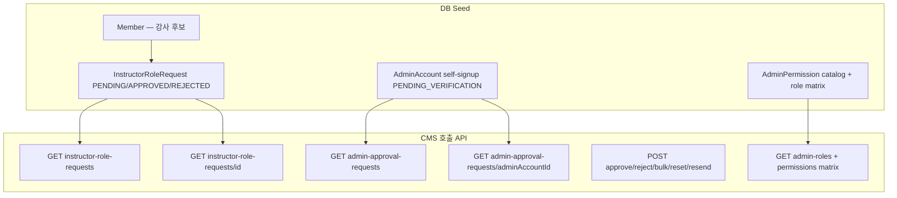

# 회원 권한 관리 — 백엔드 API·DB Seeding 핸드오프

| 항목 | 값 |
|------|-----|
| **작성일** | 2026-08-28 |
| **대상** | 백엔드 (Members / Admin Account / Instructor Role Request / Admin Permission · local·staging seed) |
| **화면** | CMS LNB `회원 권한 관리` → **권한 승인** (`/admin/permission-requests`), **관리자 권한 설정** (`/admin/settings/permissions`) |
| **OpenAPI** | [`apps/cms/openapi/members.openapi.json`](../../openapi/members.openapi.json) |
| **FE mock SSOT** | [`member-permission-applications.ts`](../../src/data/mock/member-permission-applications.ts) ← [`users.ts`](../../src/data/mock/users.ts) |
| **상태 매핑 SSOT** | [`map-permission-approval-status.ts`](../../src/features/user/api/lib/map-permission-approval-status.ts) |
| **목록 매퍼** | [`map-instructor-role-request-row.ts`](../../src/features/user/api/map-instructor-role-request-row.ts), [`map-admin-approval-request-row.ts`](../../src/features/user/api/map-admin-approval-request-row.ts) |
| **상세 매퍼** | [`map-instructor-role-request-detail-to-user.ts`](../../src/features/user/api/map-instructor-role-request-detail-to-user.ts), [`map-admin-account-detail-to-user.ts`](../../src/features/user/api/map-admin-account-detail-to-user.ts) |
| **시드 스펙 JSON** | [`member-permission-management-seed-v1.spec.json`](./member-permission-management-seed-v1.spec.json) |
| **관련 기존 handoff** | [`portal-instructor-role-request-create-structured-handoff-2026-08-13.md`](../portal-instructor-role-request-create-structured-handoff-2026-08-13.md) (Portal CREATE·상세 스냅샷) |
| **Cursor 프롬프트** | 본 문서 §12 (이 파일 하단) |

**모듈 플래그 (FE `.env`):**

```env
VITE_REAL_API_MODULES=...,instructorRoleRequests,adminApprovalRequests,adminPermissions
# 또는 상위 members 모듈로 강사·관리자 승인 목록 일괄 활성화
VITE_REAL_API_MODULES=...,members,adminPermissions
```

---

## 1. 개요

CMS **회원 권한 관리**를 mock → remote로 검증하려면:

1. **DB seed** — FE mock 목록·상세·승인/반려/취소/재발송 시나리오와 **동등한 건수·상태 분포**가 API로 조회되어야 함
2. **API·비즈니스 로직 정합** — 상태 enum, 목록 노출 조건, 승인 2-step(관리자), bulk/reset/resend, 상세 필드가 FE 매퍼·화면 분기와 일치해야 함
3. **(P1) 목록 필터 보강** — 신청기간·관리자 승인현황은 현재 FE가 **클라이언트 필터**로 처리 중. 서버 필터 추가 시 OpenAPI·seed 동시 반영 필요

FE는 이미 아래 API를 호출한다. **시드만 넣으면 목록은 보이지만**, 상태값·상세 필드·알림 재발송 시각·목록 노출 범위가 어긋나면 승인 UX·필터·상세가 깨진다.



---

## 2. FE 화면 계약 (Notion·시안 기준)

### 2.1 권한 승인 — 강사 탭

| UI | 규칙 |
|----|------|
| **목록 노출** | 순수 강사(`instructor_only`) 권한 **신청 건만**. 교사 겸직·학교 교사 전용 프로필은 mock에서 **제외** |
| **컬럼** | No · 회원명 · 연락처 · 이메일 · 회원 유형 · 신청 유형 · 승인 현황 · 신청일시 |
| **필터** | 회원명(`keyword`) · 회원 유형 · 승인 현황 · 신청 기간 |
| **서버 필터 (연동됨)** | `keyword`, `status` (`PENDING`/`APPROVED`/`REJECTED`) |
| **클라이언트 필터 (BE 미지원)** | 회원 유형(`permI_role`), 신청 기간(`permI_from`/`permI_to`) |
| **일괄 승인** | 선택 2건 이상 + **전부 PENDING**일 때만. 비대기 행이 섞이면 FE 팝업 차단 |
| **일괄 반려** | PENDING·APPROVED·REJECTED 모두 반려 가능 (단, bulk 선택 시 규칙은 승인과 동일) |
| **상세** | 풀페이지 모달 — `GET …/instructor-role-requests/{requestId}` |
| **승인 모달** | 강사비 등급(`feeGrade`) + 알림 발송 시점 UI(즉시/직접 설정) — **알림 시점은 API 미전송** |
| **승인 후** | JA평가등급·강사비등급·알림 재발송·승인 취소 버튼 (APPROVED/REJECTED 시) |

### 2.2 권한 승인 — 관리자 탭

| UI | 규칙 |
|----|------|
| **목록 노출** | 관리자 **셀프 가입 승인 대기** 계정. mock은 `ADMIN` + 승급 후보 `INDIVIDUAL` 일부 |
| **컬럼** | 강사 탭과 동일 구조 (회원 유형 필터 없음) |
| **필터** | 회원명 · 승인 현황 · 신청 기간 |
| **서버 필터 (연동됨)** | `keyword` only |
| **클라이언트 필터 (BE 미지원)** | 승인 현황, 신청 기간 |
| **승인 모달** | 권한 유형 — 마스터(`MASTER`) / 중간·PM·파트너(`PARTNER`) / 뷰어(`VIEWER`) |
| **승인 API 순서 (단건)** | `changeAdminAccountRole` → `approveAdminApprovalRequest` |
| **상세** | `GET …/admin-approval-requests/{adminAccountId}` (**`admin-accounts` 상세와 분리**) |
| **약관** | 4종 + MFA — `SERVICE_TERMS`, `PRIVACY_COLLECTION`, `MFA_SETUP_CONSENT`, `MARKETING` |

### 2.3 관리자 권한 설정

| UI | 규칙 |
|----|------|
| **mock** | 로컬 read-only 카탈로그 (`admin-permission-settings-ui-data.ts`) |
| **remote** | `GET admin-permissions` + `GET admin-roles/{roleCode}/permissions` + 저장 mutation |
| **역할 탭** | master → `MASTER`, pm → `PM`, partner → `PARTNER`, viewer → `VIEWER` |

---

## 3. 상태값 매핑 (seed·API 응답 필수)

### 3.1 강사 권한 신청

| API 필드 | 목록 | 상세 | BE 권장 canonical | FE UI |
|----------|------|------|-------------------|-------|
| 상태 | `requestStatus` | `status` | `PENDING` / `APPROVED` / `REJECTED` | 승인 대기 / 승인 완료 / 신청 반려 |
| (alias) | `COMPLETED` | — | → `APPROVED` | |
| (alias) | `REVOKED` | — | → `REJECTED` | |
| 처리 시각 | `reviewedAt` | `decidedAt` | ISO-8601 | 상세·이력 타임스탬프 |
| 신청 유형 | `requestedActivityType` | 동일 | 예: `JA 강사단` | 목록·상세 라벨 |

**목록 query `status`:** FE는 `PENDING`/`APPROVED`/`REJECTED`를 그대로 전송한다 (`mapUiApprovalFilterToApiStatus`). BE 필터 enum이 다르면 OpenAPI·런타임을 맞추거나 alias를 문서화할 것.

### 3.2 관리자 승인 계정

| API `status` | FE UI | 비고 |
|--------------|-------|------|
| `PENDING`, `PENDING_VERIFICATION` | 승인 대기 | 목록·상세 공통 |
| `ACTIVE`, `APPROVED`, `VERIFIED` | 승인 완료 | `verifiedAt` → `permissionApprovalHandledAt` |
| `REJECTED`, `INACTIVE`, `SUSPENDED`, `REVOKED` | 신청 반려 | `updatedAt` fallback |

### 3.3 관리자 승인 — roleCode ↔ UI

| FE 승인 모달 (`feeGrade`) | API `roleCode` |
|---------------------------|----------------|
| `manager` | `MASTER` |
| `partner` | `PARTNER` |
| `viewer` | `VIEWER` |

단건 승인: `changeAdminAccountRole({ roleCode })` 후 `approve({ reason })`.  
일괄 승인: `bulk-approve` body에 `ids[]` + `roleCode` + `reason`.

---

## 4. API 인벤토리 · FE 연동 현황

### 4.1 권한 승인 — 강사

| Method | Path | FE | seed·로직 체크 |
|--------|------|-----|----------------|
| GET | `/api/admin/instructor-role-requests` | ✅ keyword, status, page, size | §5.1 |
| GET | `/api/admin/instructor-role-requests/{requestId}` | ✅ 상세 | §5.1, Portal 스냅샷 |
| POST | `…/{requestId}/approve` | ✅ `feeGrade`, `activityType`, `reason` | 승인 후 `requestStatus=APPROVED` |
| POST | `…/{requestId}/reject` | ✅ `reason`, `rejectReason` | |
| POST | `…/bulk-approve` | ✅ `ids[]`, `feeGrade`, `activityType`, `reason` | PENDING만 |
| POST | `…/bulk-reject` | ✅ `ids[]`, `reason`, `rejectReason` | |
| POST | `…/{requestId}/reset-pending` | ✅ `reason` (required) | APPROVED/REJECTED → PENDING |
| POST | `…/{requestId}/resend-notification` | ✅ body 없음 | §6.1 |
| POST | `…/{requestId}/privacy/unmask` | (상세 PII) | 감사로그 필수 |

### 4.2 권한 승인 — 관리자

| Method | Path | FE | seed·로직 체크 |
|--------|------|-----|----------------|
| GET | `/api/admin/admin-approval-requests` | ✅ keyword, page, size | **셀프 가입만** §5.2 |
| GET | `/api/admin/admin-approval-requests/{adminAccountId}` | ✅ 상세 | 약관 4종+MFA §5.2 |
| PATCH | `/api/admin/admin-accounts/{adminId}/role` | ✅ 승인 전 role 변경 | `changeAdminRole` |
| POST | `…/{adminAccountId}/approve` | ✅ `reason` | |
| POST | `…/{adminAccountId}/reject` | ✅ `reason` | 마스터만 (Swagger) |
| POST | `…/bulk-approve` | ✅ `ids[]`, `roleCode`, `reason` | |
| POST | `…/bulk-reject` | ✅ `ids[]`, `reason` | |
| POST | `…/{adminAccountId}/reset-pending` | ✅ `reason` | |
| POST | `…/{adminAccountId}/resend-notification` | ✅ | §6.1 |

### 4.3 관리자 권한 설정

| Method | Path | FE |
|--------|------|-----|
| GET | `/api/admin/admin-roles` | ✅ `listRoles` — roleCode SSOT 검증 |
| GET | `/api/admin/admin-permissions` | ✅ catalog (`domain` grouping) |
| GET | `/api/admin/admin-roles/{roleCode}/permissions` | ✅ matrix |
| PUT/PATCH | role permissions update | ✅ `permissionCodes[]` |

---

## 5. DB Seeding 요구사항 (mock 정합)

### 5.1 강사 권한 신청 (`InstructorRoleRequest`)

**건수·분포 (mock 기준):**

- mock 강사 탭: `mockUsers` 중 `role=INSTRUCTOR` && `instructorMemberProfile=instructor_only` 전원 (대략 10~20건)
- 승인 현황: `PENDING` / `APPROVED` / `REJECTED` **균등 분포** (user에 `permissionApprovalStatus` 없으면 index % 3 로테이션)
- 신청일: 최근 60일 내 분산 (`appliedAtIso`)

**필수 연결 데이터:**

| 엔티티 | 내용 |
|--------|------|
| `Member` | 강사 후보 회원. `memberId` 필수 |
| `InstructorRoleRequest` | `requestId`, `memberId`, `requestStatus`, `requestedActivityType`, `requestedAt` |
| 신청 스냅샷 | Portal CREATE와 동일 — `profile`, `settlement`, `termsAgreements` 4종 ([portal handoff](../portal-instructor-role-request-create-structured-handoff-2026-08-13.md) §3) |

**목록 응답 (`InstructorRoleRequestListItemResponse`):**

- `maskedName`, `maskedPhone`, `maskedEmail` — 목록 마스킹 (FE `MASKING_POLICY` 적용 전 raw도 일관되게)
- `requestId`, `memberId` — bulk/상세/reset/resend path에 사용

**쇼케이스 케이스 (최소):**

| caseId | 용도 |
|--------|------|
| `IR-PENDING-PORTAL-FULL` | 상세 전 필드 + keyword 검색 |
| `IR-APPROVED-RESEND` | 승인 완료 + 알림 재발송·타임스탬프 |
| `IR-REJECTED-RESET` | 반려 + reset-pending 스모크 |
| `IR-BULK-PENDING-A/B/C` | 일괄 승인 3건 |

**제외 규칙:**

- 학교 교사 전용·겸직 강사 프로필의 role request는 **권한 승인 강사 목록에 넣지 말 것** (FE mock과 동일)

### 5.2 관리자 승인 (`AdminAccount` — 셀프 가입 큐)

**건수·분포:**

- mock 관리자 탭: 기존 `ADMIN` 계정 + `INDIVIDUAL` 승급 후보 일부 (mock: `slice(16,40)` → ~24명)
- 상태: PENDING / APPROVED / REJECTED 혼합

**목록 노출 (중요):**

- `listAdminApprovalRequests`는 **관리자 셀프 가입 승인 대기 큐**만 반환해야 함
- 관리자가 CMS에서 **등록해 준 계정**(`registeredByAdmin=true`, 이미 `ACTIVE`)은 목록에 **나오면 안 됨**
- mock의 `INDIVIDUAL` 승급 후보는 “관리자 권한 신청” 라벨로 표시 — BE에서는 `roleCode` 없거나 pending 상태로 시드

**상세 응답 (`AdminAccountApprovalDetailResponse`):**

| 필드 | FE 사용 |
|------|---------|
| `adminAccountId`, `uuid` | path·userId (`admin-{uuid}`) |
| `status` | 승인 배지 |
| `roleCode`, `roleName` | 권한 유형 표시 |
| `verifiedAt` / `updatedAt` | 승인·반려 처리 시각 |
| `termsAgreements[]` | 약관 4종 + MFA 동의 UI |
| `mfaRequired` | MFA 섹션 |

**쇼케이스 케이스:**

| caseId | 용도 |
|--------|------|
| `AA-PENDING-MFA-TERMS` | 대기 + 약관·MFA 전체 |
| `AA-APPROVED-MASTER` | 승인 완료 + MASTER |
| `AA-REJECTED` | 반려 |
| `AA-BULK-PENDING-A/B` | 일괄 승인 |

### 5.3 관리자 권한 매트릭스

- `GET /api/admin/admin-roles` — `MASTER`, `PM`, `PARTNER`, `VIEWER` code 존재 (FE `ADMIN_PERMISSION_ROLE_TAB_TO_CODE`와 일치 확인)
- `GET /api/admin/admin-permissions` — `domain` + `code` + `name` (remote 패널 카테고리 카드)
- 역할별 `grantedPermissions` — MASTER는 전체 grant, PM/PARTNER/VIEWER는 차등 (mock UI의 unchecked id와 1:1 매핑은 P2 — 우선 code 기반 matrix만)

### 5.4 ID 범위 (충돌 방지)

시드 스펙 [`member-permission-management-seed-v1.spec.json`](./member-permission-management-seed-v1.spec.json) 참고:

| 리소스 | ID 범위 |
|--------|---------|
| `instructorRoleRequestId` | 172001–172040 |
| `instructorMemberId` | 172101–172140 |
| `adminAccountId` (셀프 가입 큐) | 172201–172230 |

---

## 6. ⭐ API·비즈니스 로직 업데이트 필요 (BE 작업)

### 6.1 P0 — seeding과 함께 맞춰야 FE remote가 동작

| # | 항목 | 현상 | 요청 |
|---|------|------|------|
| 1 | **알림 재발송 시각** | FE 상세는 `permissionNotificationResentAt`로 재발송 시각 표시. `InstructorRoleRequestDetailResponse`·`AdminAccountApprovalDetailResponse`에 **필드 없음** | 상세 GET에 `notificationResentAt` (또는 `permissionNotificationResentAt`) 추가. `resend-notification` 성공 시 갱신 |
| 2 | **강사 목록 status enum** | OpenAPI `requestStatus`가 free string | canonical `PENDING`/`APPROVED`/`REJECTED` 문서화 + seed 일치. alias `COMPLETED`→`APPROVED` |
| 3 | **관리자 목록 노출 범위** | 전체 admin 계정이 섞이면 mock과 건수·상태 불일치 | `listAdminApprovalRequests` = 셀프 가입 승인 큐만. `registeredByAdmin=true` & `ACTIVE` 제외 |
| 4 | **reset-pending 전이** | APPROVED/REJECTED → PENDING | 409: 이미 PENDING, 잘못된 전이 시 `error.code` + message |
| 5 | **bulk approve/reject** | non-PENDING id 포함 시 | 409 또는 partial failure 정책 명시 (FE는 전부 PENDING만 전송) |
| 6 | **관리자 단건 승인** | role 변경 + approve 2-step | 중간 실패 시 rollback 또는 명확한 409 (role만 바뀌고 approve 실패 방지) |
| 7 | **상세 약관** | 관리자 상세 4종 | `termsAgreements`에 `termsType`/`consentType`, `version`, `required`, `agreed`, `agreedAt` |

### 6.2 P1 — OpenAPI·필터 (FE는 클라이언트 fallback 유지)

| # | API | 요청 | FE 영향 |
|---|-----|------|---------|
| 1 | `GET instructor-role-requests` | `requestedAtFrom` / `requestedAtTo` (또는 `from`/`to`) | 서버 필터 전환 시 클라이언트 date 필터 제거 |
| 2 | `GET instructor-role-requests` | `memberType` 또는 activity type 필터 | `permI_role` 서버 이관 |
| 3 | `GET admin-approval-requests` | `status` query (`PENDING`/`APPROVED`/`REJECTED`) | `permA_approval` 서버 이관 |
| 4 | `GET admin-approval-requests` | 신청일 range | `permA_from`/`permA_to` |
| 5 | `POST …/approve` | `scheduledNotificationAt` 또는 `notifyTiming` | 승인 모달 “직접 설정” 연동 |

### 6.3 Out of scope / 금지

- path 변경 금지 (Orval·FE client 고정)
- `notifyTiming`을 BE가 무시하는 것은 **현재 FE 의도** (즉시 발송이 기본). 스케줄 필드 추가 전까지 UI “직접 설정”은 표시만
- 권한 승인 mutation 후 **전체 회원 목록** invalidate 하지 않음 (FE 이미 제거) — BE도 불필요한 cascade 없이 해당 request/admin scope만 갱신

---

## 7. 비즈니스 규칙 (BE 검증 체크리스트)

### 7.1 공통

- [ ] 승인·반려·reset 성공 후 목록·상세 재조회 시 상태·시각 일치
- [ ] 동일 건에 대한 동시 승인 409 (`상태 충돌` 메시지 FE 노출 가능)
- [ ] `ApprovalResetRequest.reason` — 빈 문자열 허용 시 FE 기본값 `CMS 권한 승인 취소` 전송

### 7.2 강사

- [ ] approve 시 `feeGrade` 저장 → 강사 activity type / fee policy와 연계
- [ ] `jaGrade` — OpenAPI에 있으나 FE 미전송. null 허용
- [ ] reject 시 `rejectReason` 목록/상세 반영
- [ ] resend는 **APPROVED**(및 FE상 REJECTED도 버튼 없음 — APPROVED만)에서 의미 있음

### 7.3 관리자

- [ ] 목록 API: **마스터 관리자** JWT만 (Swagger `ADMIN_READ`, master scope)
- [ ] approve/reject: `ADMIN_WRITE`
- [ ] bulk approve 시 모든 id에 동일 `roleCode` 적용
- [ ] 상세는 `admin-accounts/{id}`가 아닌 **`admin-approval-requests/{adminAccountId}`** 사용

### 7.4 관리자 권한 설정

- [ ] `listRoles` 응답 `roleCode`가 FE 탭 매핑과 일치 (`MASTER`, `PM`, `PARTNER`, `VIEWER`)
- [ ] permission `code` stable — FE 저장 시 code 배열 전송

---

## 8. 수동 스모크 (local/staging + seed 후)

**전제:** 마스터 관리자 JWT, `VITE_REAL_API_MODULES`에 해당 모듈 활성화

### 강사 탭

1. `GET instructor-role-requests?status=PENDING` — 대기 건 ≥ 3, bulk 케이스 포함
2. `keyword` — 쇼케이스 회원명 검색 1건 이상
3. 상세 `GET …/{requestId}` — profile/settlement/terms 존재
4. `POST bulk-approve` (3건 PENDING) → 목록에서 APPROVED
5. `POST reset-pending` (APPROVED 1건) → PENDING, 상세 버튼 “신청 승인/반려”
6. `POST resend-notification` (APPROVED) → 상세 타임스탬프 갱신 (**§6.1 #1**)

### 관리자 탭

1. `GET admin-approval-requests` — provisioned ACTIVE 관리자 **미포함**
2. 상세 — 약관 4종 + MFA
3. 단건 승인 `changeRole` + `approve` → `roleCode` 반영
4. `reset-pending` / `resend-notification`

### 관리자 권한 설정

1. `GET admin-roles` + role matrix 4탭
2. permission 저장 후 재조회 일치

---

## 9. FE mock ↔ API 필드 대조표

| FE mock (`MemberPermissionApplicationRow`) | 강사 API | 관리자 API |
|------------------------------------------|----------|------------|
| `requestId` | `requestId` | `adminAccountId` |
| `userId` | `member-{memberId}` | `admin-{uuid}` |
| `name` | `maskedName` | `name` (비마스킹) |
| `phone` / `email` | masked* | `phone` / `email` |
| `memberCategory` | 항상 `INSTRUCTOR` | 항상 `ADMIN` |
| `applicationTypeLabel` | `requestedActivityType` | `roleName` 또는 roleCode→라벨 |
| `approvalStatus` | `requestStatus` → §3.1 | `status` → §3.2 |
| `appliedAt` | `requestedAt` | `createdAt` |

---

## 10. 관련 FE 파일 (참고용 — BE 레포 없음)

| 용도 | 경로 |
|------|------|
| 권한 승인 페이지 | `apps/cms/src/pages/admin/permission-request-list-page.tsx` |
| 목록·필터 | `apps/cms/src/features/user/permission-management/members-permission-list.tsx` |
| API client | `apps/cms/src/features/user/api/members-api-client.ts` |
| Mutation hooks | `use-instructor-role-request-mutations.ts`, `use-admin-approval-request-mutations.ts` |
| 관리자 권한 설정 | `permission-customization-page.tsx`, `admin-permissions-remote-panel.tsx` |

---

## 11. 산출물 체크리스트 (BE PR)

- [ ] Flyway/seed: `member-permission-management-v1-2026-08` 라벨
- [ ] 시드 스펙 JSON 케이스 전부 커버
- [ ] OpenAPI: §6.1 P0 반영 (또는 이슈 링크 + 임시 workaround 문서)
- [ ] Swagger description에 목록 노출 조건·status enum 명시
- [ ] MEMBER_PERMISSION_RESET_SMOKE / MEMBER_HANDOFF_E2E 시나리오 통과

---

## 12. Cursor prompt — 백엔드에 붙여넣기

**이 섹션(§12) 전체를 백엔드(JABACK) Cursor에 붙여넣어 실행하라.**  
질문은 엔티티·테이블 관계를 찾아도 판단이 안 될 때만 하라. 프론트 레포는 없다.

프론트 CMS **회원 권한 관리**(권한 승인 + 관리자 권한 설정) P0 remote 연동이 끝났다. **OpenAPI·런타임·local/staging DB seed를 아래 계약에 맞춰라.**  
기존 local에 강사/관리자 계정만 있고 **권한 신청 큐·상태 분포·상세 스냅샷**이 없으면 FE mock과 화면이 깨진다.

| 항목 | 값 |
|------|-----|
| **작성일** | 2026-08-28 |
| **화면** | CMS `/admin/permission-requests`, `/admin/settings/permissions` |
| **시드 라벨** | `member-permission-management-v1-2026-08` |
| **기계 스펙** | `member-permission-management-seed-v1.spec.json` (FE repo `apps/cms/docs/api/members/`) |
| **OpenAPI SSOT** | members 모듈 `/v3/api-docs` — path 유지 |

### Goal

1. **DB seed** — 강사 `InstructorRoleRequest` 12건+, 관리자 셀프 가입 승인 큐 10건+, PENDING/APPROVED/REJECTED 분포, bulk PENDING 3건+(강사)·2건+(관리자)
2. **목록 API**가 mock 노출 범위와 같다: 강사=순수 강사 신청만, 관리자=셀프 가입 승인 큐만(provisioned ACTIVE 제외)
3. **상태 enum** §3 매핑과 seed·런타임 일치
4. **상세 API** — 강사: Portal 스냅샷(profile/settlement/terms). 관리자: 약관 4종+MFA
5. **P0 API 갭** §6.1 — 특히 상세 `notificationResentAt` after resend
6. **스모크** §8 전 항목 통과 (마스터 JWT)

### Out of scope / 금지

- API path 변경 금지
- `listAdminApprovalRequests`에 이미 운영 중인 provisioned 관리자 전부 넣지 마라
- 강사 목록에 학교 교사 전용 role request 넣지 마라
- approve 시 `notifyTiming` body 요구하지 마라 (FE 미전송). 기본 즉시 알림으로 처리
- seed ID는 1720xx 대역 사용 — 정산·지급조서 seed(169xxx/170xxx)와 충돌 금지

### Paths (유지)

| Method | Path |
|--------|------|
| GET | `/api/admin/instructor-role-requests` |
| GET | `/api/admin/instructor-role-requests/{requestId}` |
| POST | `/api/admin/instructor-role-requests/{requestId}/approve` |
| POST | `/api/admin/instructor-role-requests/{requestId}/reject` |
| POST | `/api/admin/instructor-role-requests/bulk-approve` |
| POST | `/api/admin/instructor-role-requests/bulk-reject` |
| POST | `/api/admin/instructor-role-requests/{requestId}/reset-pending` |
| POST | `/api/admin/instructor-role-requests/{requestId}/resend-notification` |
| GET | `/api/admin/admin-approval-requests` |
| GET | `/api/admin/admin-approval-requests/{adminAccountId}` |
| PATCH | `/api/admin/admin-accounts/{adminId}/role` |
| POST | `/api/admin/admin-approval-requests/{adminAccountId}/approve` |
| POST | `/api/admin/admin-approval-requests/{adminAccountId}/reject` |
| POST | `/api/admin/admin-approval-requests/bulk-approve` |
| POST | `/api/admin/admin-approval-requests/bulk-reject` |
| POST | `/api/admin/admin-approval-requests/{adminAccountId}/reset-pending` |
| POST | `/api/admin/admin-approval-requests/{adminAccountId}/resend-notification` |
| GET | `/api/admin/admin-roles` |
| GET | `/api/admin/admin-permissions` |
| GET/PUT | `/api/admin/admin-roles/{roleCode}/permissions` |

### 상태 계약 (요약)

**강사 `requestStatus` / detail `status`:** `PENDING` | `APPROVED` | `REJECTED` (alias: `COMPLETED`→APPROVED, `REVOKED`→REJECTED)

**관리자 `status`:** `PENDING_VERIFICATION`→PENDING, `ACTIVE`→APPROVED, `REJECTED`→REJECTED (§3.2 전체)

**관리자 승인 roleCode:** `MASTER` | `PARTNER` | `VIEWER` (FE `manager`/`partner`/`viewer` 매핑)

### Seed 쇼케이스 (필수)

- `IR-PENDING-PORTAL-FULL` — 상세 전 필드, keyword `최지원`
- `IR-APPROVED-RESEND` — resend 후 `notificationResentAt` 상세 반환
- `IR-REJECTED-RESET` — reset-pending 스모크
- `IR-BULK-PENDING` ×3 — bulk-approve
- `AA-PENDING-MFA-TERMS` — 약관 4종 + MFA
- `AA-APPROVED-MASTER`, `AA-REJECTED`, `AA-BULK-PENDING` ×2

### P0 API 수정

1. `InstructorRoleRequestDetailResponse` + `AdminAccountApprovalDetailResponse`에 `notificationResentAt` (ISO-8601) 추가
2. `listAdminApprovalRequests` 비즈니스 필터: 셀프 가입 승인 큐만
3. bulk/reset/approve 상태 전이 409 메시지 명확화
4. 관리자 단건 승인: changeRole 실패 시 approve 호출 안 함 (또는 트랜잭션 rollback)

### 완료 조건

- `GET instructor-role-requests?status=PENDING` — ≥3건, 상세 스냅샷 존재
- `POST bulk-approve` 3건 → 목록 APPROVED
- `POST reset-pending` → PENDING 복귀
- `POST resend-notification` → 상세 `notificationResentAt` 갱신
- `GET admin-approval-requests` — provisioned admin 미포함
- 관리자 상세 `termsAgreements` 4건
- `GET admin-roles` — MASTER/PM/PARTNER/VIEWER

스펙 JSON의 `showcaseCases`·`idRanges`·`requiredLinkedFields`를 seed 구현의 SSOT로 사용하라.

---

**Last updated:** 2026-08-28
