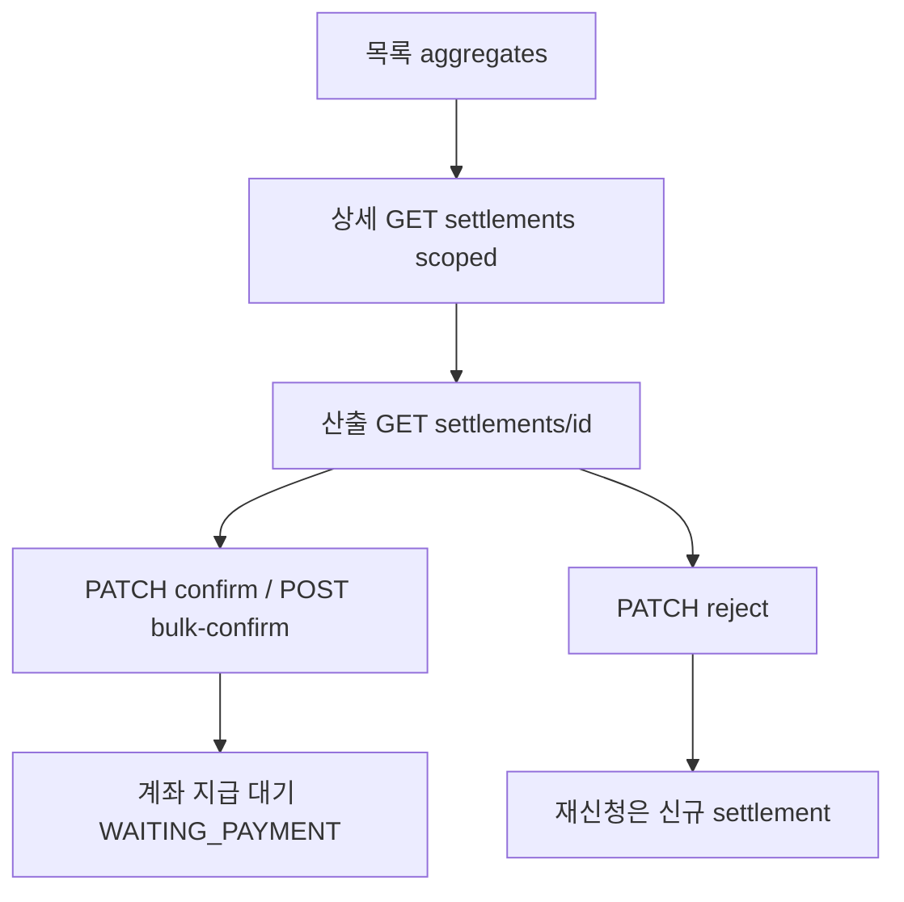

# 지급조서 확인 — 백엔드 API·DB Seeding 핸드오프

| 항목 | 값 |
|------|-----|
| **작성일** | 2026-08-27 |
| **대상** | 백엔드 (Settlement / PaymentStatement / Member / Program · local·staging seed) |
| **화면** | CMS LNB `정산 관리` → `지급조서 확인` (`/settlement-management/payment-orders`) |
| **OpenAPI** | [`apps/cms/openapi/settlement.openapi.json`](../../openapi/settlement.openapi.json) |
| **FE mock SSOT** | [`payment-order-admin-list.ts`](../../src/data/mock/payment-order-admin-list.ts) |
| **상태 매핑** | [`settlement-status-mappers.ts`](../../src/features/settlement-management/api/shared/settlement-status-mappers.ts) |
| **목록 매퍼** | [`map-settlement-aggregates.ts`](../../src/features/settlement-management/api/payment-orders/map-settlement-aggregates.ts) |
| **시드 스펙 JSON** | [`payment-orders-seed-v1.spec.json`](./payment-orders-seed-v1.spec.json) |
| **갭 잔여** | [`settlement-api-backend-gaps.md`](./settlement-api-backend-gaps.md) 「P0 — 지급조서 확인」 |
| **상세 UI 필드 SSOT** | [`settlement-payment-order-detail-ui-fields-backend-handoff.md`](./settlement-payment-order-detail-ui-fields-backend-handoff.md) |
| **상세 연동** | [`settlement-payment-order-detail-backend-handoff.md`](./settlement-payment-order-detail-backend-handoff.md) (`statementId` embed는 **본 P0**) |
| **OpenAPI P0 Cursor 프롬프트 (백엔드 복붙 SSOT · API+시드)** | [`payment-orders-openapi-p0-backend-cursor-prompt.md`](./payment-orders-openapi-p0-backend-cursor-prompt.md) |
| **원장 연동 BE 프롬프트** | [`settlement-ledger-link-p0-backend-cursor-prompt.md`](./settlement-ledger-link-p0-backend-cursor-prompt.md) |
| **원장 DB Seed 업데이트** | [`settlement-ledger-link-db-seed-update-2026-08-27.md`](./settlement-ledger-link-db-seed-update-2026-08-27.md) |
| **계좌 지급(후속 화면)** | [`account-payments-backend-seed-handoff-2026-08-27.md`](./account-payments-backend-seed-handoff-2026-08-27.md) |

**모듈 플래그:** `VITE_REAL_API_MODULES=...,paymentOrders`

**백엔드에 전달할 때:** [`payment-orders-openapi-p0-backend-cursor-prompt.md`](./payment-orders-openapi-p0-backend-cursor-prompt.md) **파일 전체**를 Cursor에 붙여넣는다. API 계약과 DB seed 갱신이 한 문서에 있다. 본 파일은 FE 교차 링크용이다.

---

## 1. 개요

CMS 지급조서 확인을 **mock → remote**로 안정 검증하려면:

1. **DB seed** — FE mock과 같은 프로그램/인물/금액/상태 분포 (제미나이 0, PAID/NONE 0, 버킷 0/3/5/8/12, 재신청·반려·혼재)
2. **API 보완** — 리스트 버킷 vs 캘린더 현황, 집계 `PARTIAL`, 총액 제외 규칙, `statementId` embed, reject 알림 스케줄

---

## 2. FE 화면 계약 (시안·Notion 2026-08)

| UI | 규칙 |
|----|------|
| **노출** | 확인 대기 ~ 확인 완료(+ 재신청·정정·반려). **계좌 지급 완료(`PAID`)·해당 없음·제미나이 제외** |
| **리스트 필터** | **지급 대기 정산 항목** 버킷: 없음 / 1~5 / 6~10 / 11+ (`pendingItemBucket`) |
| **캘린더 필터** | **지급조서 처리 현황** (`statementStatus`) |
| **날짜** | 목록·캘린더 모두 **강의 출강일**. 기본 기간 = 당월 1일 ~ 익월 1일 |
| **검색** | 프로그램별: 프로그램명 / 신청자별: **신청자명** (마스킹 금지) |
| **총액** | 신청 반려·지급 정정 요청 **제외** |
| **집계 헤더** | 확인완료 + 타상태 혼재 → **확인 진행 중 (`PARTIAL`)** |
| **상세 금액** | 신청 반려는 **취소선**, 합산 제외 |
| **일괄확인 기본일** | **다음달 셋째 화요일** (FE 계산, BE는 저장) |
| **지급조서 발급** | **확인 완료만** |
| **캘린더 숏** | 재신청 / 확인 대기 / 확인 완료 / 정정 요청 / 신청 반려 / 일부 확인. 시안 파란 `지급 완료`는 계좌 지급 잔여 — **이 화면 시드에 PAID 넣지 말 것** |

### 2.1 API `statementStatus` → FE UI

| API | FE key | 라벨 | 총액 | 지급 대기 건 |
|-----|--------|------|------|----------------|
| `REQUESTED` | `pending` | 확인 대기 중 | 포함 | 포함 |
| `REAPPLICATION` / `RESUBMITTED` | `reapplication` | 지급조서 재신청 | 포함 | 포함 |
| `PARTIAL` | `partial` | 확인 진행 중 | (집계) | — |
| `CONFIRMED` | `confirmed` | 지급조서 확인 완료 | 포함 | 제외 |
| `CORRECTION_REQUESTED` | `correction` | 지급 정정 요청 | **제외** | 제외 |
| `REJECTED` | `application_rejected` | 신청 반려 | **제외** | 제외 |

---

## 3. API 인벤토리

path 유지. 계약 상세는 Cursor 프롬프트 §1~§8.

| Method | Path | FE | 이번 P0 |
|--------|------|----|---------|
| GET | `/api/admin/settlements/aggregates` | 연동 | 버킷 vs 현황 query, `aggregateStatus=PARTIAL` |
| GET | `/api/admin/settlements` | 상세 라인 | `statementId` embed, 스코프 필터 |
| GET | `/api/admin/settlements/{id}` | 산출 | 유지. 강의비+교통+숙박+원천 시드 |
| PATCH | `…/statements/{id}/confirm` | 연동 | 이체 예정일 body |
| POST | `…/statements/bulk-confirm` | 연동 | 동일 |
| PATCH | `…/statements/{id}/reject` | 연동 | `reason` + 알림 스케줄 |
| GET | `/api/admin/settlements/calendar` | 연동 | 출강일, PAID 제외 |
| GET | `…/{id}/payment-statement/download` | 연동 | CONFIRMED만 |

---

## 4. 시드 필수 케이스 (mock과 동일)

BE local 라벨: `payment-orders-catalog-v1-2026-08`. **한글명으로 계좌 지급 행과 merge하지 말 것** — ID가 다르다.

대표 프로그램 / ID:

| 케이스 | programId | 이름 | 기대 |
|--------|----------|------|------|
| PARTIAL | **170302** | `2026년 JA Korea 초등 경제교육` | 대기 5, 총액 2,000,000 |
| 1_5 | **170301** | HSBC/HKU … | 대기 3, 915,000 |
| NONE | **170303** | 확인완료 카탈로그 | 대기 0, 625,000 |
| 재신청 8 | **170304** | — | REAPPLICATION 8, 1,200,000 |
| 11+ | **170305** | — | 대기 12 |

| 인물 | 지급조서 memberId | 계좌 지급 memberId |
|------|-------------------|--------------------|
| 박틴토 | **170201** | **169202** (다름) |
| 김틴토 | **170202** | **169201** (다름) |

| 산출 | settlementId | 기대 |
|------|--------------|------|
| 박틴토 | **170601** | REQUESTED, 특강 915,000 + 교통 31,500 + 숙박 80,000, 원천 8.8%, 식사/활동 없음 |

confirm `170601` → 계좌 지급에 같은 `settlementId=170601`, `WAITING_PAYMENT`.  
이 화면 시드에 **PAID 없음.** 출강일 기본 필터: **2026-08-01 ~ 2026-09-01**.

상세 라인·재신청·개인 프로그램 규칙은 [payment-orders-openapi-p0-backend-cursor-prompt.md](./payment-orders-openapi-p0-backend-cursor-prompt.md) §12 참고.

---

## 5. 409

`code` = `PAYMENT_STATEMENT_STATUS_CONFLICT` 유지. `message`는 운영자가 다음에 할 일을 포함. FE는 message를 그대로 alert/모달에 표시.

---

## 6. Acceptance (JWT + seed)

- [ ] aggregates program/instructor 목록에 시안 프로그램·김틴토/박틴토 존재
- [ ] Gemini 0, PAID/NONE 0
- [ ] `pendingItemBucket` 4종이 건수를 가른다
- [ ] 캘린더 `statementStatus` 필터
- [ ] 상세 1스코프 + 라인 `statementId`
- [ ] 박틴토 산출 금액·조건부 행 없음
- [ ] confirm / reject 스모크. 재신청은 신규 행
- [ ] 신청자명 마스킹 없음

---

## 7. 잔여 (이 문서 범위 밖)

강사 프로필·계좌 원문 embed, unmask, 산출 `calculationDetail` 세부는 **상세 UI SSOT**를 따른다. 본 P0는 목록 가시성·필터·집계·confirm/reject·`statementId`.
