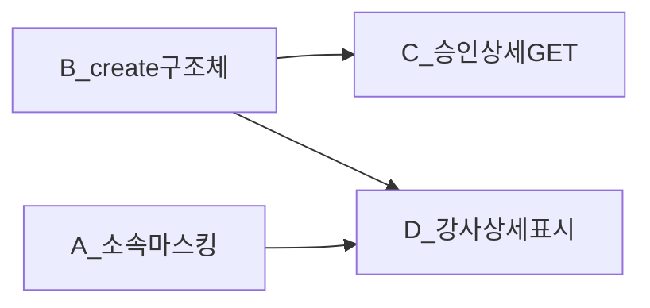

# 강사 권한 신청·상세·마스킹 — 서버 수정 요청

**작성일:** 2026-08-13  
**우선순위:** P0  
**요청 대상:** Portal Members API · Admin Instructor / Instructor-role-request API  
**관련 FE (Platform):**  
`apps/platform/src/features/mypage/instructor-apply/api/map-create-request.ts`  
`POST /api/portal/me/instructor-role-requests`  
**관련 FE (CMS):**  
권한 승인 상세 · 강사 회원 상세 (`use-user-detail-controller` mode=`permission` / instructor detail)  
**OpenAPI (FE 목표):** `InstructorRoleRequestCreateRequest` — `apps/cms/openapi/members.openapi.json`

---

## 1. 요청 목록 (체크리스트)

| # | 화면 | 요청 |
|---|------|------|
| **A** | CMS 어드민 > 강사 상세 조회 | **소속·학력 마스킹** — 대학·대학원일 때 접미사 보존 (아래 §2) |
| **B** | Platform > 권한 승인 요청(강사 신청) | 강사 등록과 **동일 양식 구조체**로 create 수용 (아래 §3) |
| **C** | CMS 어드민 > 권한 승인 상세 | 신청 시 입력한 정보 전체 조회 API **신규** (아래 §4) — **현재 없음** |
| **D** | CMS 어드민 > 강사 상세 조회 | Platform에서 제출한 양식 정보를 **그대로** 강사 상세에 표시 가능하도록 응답 (아래 §5) |

---

## 2. [A] 강사 상세 — 소속·학력(대학·대학원) 마스킹 수정

### 2.1 현상

대학·대학원 **소속·학력** 학교명이 과도하게 마스킹되어 **기관 구분 접미사·캠퍼스 표기가 깨짐**.

| | 예시 |
|--|------|
| 원문 | `경기대학교 (제1캠퍼스)` |
| 현재 (오동작) | `경***********)` |
| 기대 | `**대학교 (제1캠퍼스)` |

### 2.2 요청 규칙 (FE 합의안)

- **대상:** 강사 상세 기본 조회(마스킹) 응답의 **소속 + 학력** — 대학·대학원에 해당하는 명칭  
  - **소속:** `affiliation.organizationNames[]` / 교사 `schoolName` 등  
  - **학력:** `profile.education` 의 `college23[].schoolName` · `college4[].schoolName` · `graduate[].schoolName` (및 동등 필드)  
- **보존:** 접미사 `대학교` · `대학` · `대학원` 및 이어지는 괄호 캠퍼스 표기 `(…)`  
- **마스킹:** 그 **앞쪽 고유명**만 `*` 처리  
- 고등학교(`highSchool` 등) 및 비대학 명칭은 기존 정책 유지(본 건 범위: 대학·대학원)

### 2.3 수용 기준

- [ ] 소속·학력 모두 `경기대학교 (제1캠퍼스)` → `**대학교 (제1캠퍼스)` 형태로 내려옴 (접미사·캠퍼스 가독)
- [ ] unmask(원문 조회) 시에는 원문 그대로

---

## 3. [B] Platform 강사 권한 신청 CREATE — 구조체 수용

### 3.1 현상

Platform이 강사 등록과 같은 양식(구조체)으로 제출하면 BE가 **400** · **「공백일 수 없습니다」**.  
원인: BE가 여전히 `nameSnapshot` / `*SnapshotJson` `@NotBlank` 계약.

### 3.2 FE 기준 (SSOT)

- 매퍼: `mapInstructorApplyFormToCreateRequest`
- Snapshot 필드는 **전송하지 않음**
- CMS `AdminPreRegisterInstructorRequest`의 `profile` / `settlement` / `termsAgreements` 와 **동일 스키마**

#### Top-level

| 필드 | 타입 | 필수 |
|------|------|------|
| `requestedActivityType` | string | Y (예: `"JA 강사단"`) |
| `name` | string | Y |
| `gender` | string | Y (`M`\|`F`) |
| `birthDate` | string | Y (`YYYY-MM-DD`) |
| `phone` | string | Y |
| `email` | string | Y |
| `profile` | `InstructorCmsProfile` | Y |
| `settlement` | `InstructorCmsSettlement` | Y |
| `termsAgreements` | `TermsAgreementRequest[]` | Y |

#### 제거 필드

`nameSnapshot`, `genderSnapshot`, `birthDateSnapshot`, `phoneSnapshot`, `emailSnapshot`, `homeAddressSnapshot`, `bankAccountSnapshotJson`, `educationLevelSnapshot`, `careerTextSnapshot`, `businessIncomeYn`, `selfIntroductionSnapshot`, `youthEconomyEducationOpinionSnapshot`, `youthCommunicationOpinionSnapshot`, `unexpectedSituationResponseSnapshot`, `oneLineIntroSnapshot`, `agreementSnapshotJson`

#### `termsAgreements` (포털 신청 4건)

`version: "1.0"`, `required: false`

- `PAYMENT_STATEMENT_PRE_CONSENT`
- `FACILITATOR_PLEDGE`
- `ADMINISTRATIVE_INFO_CONSENT`
- `CRIMINAL_HISTORY_CHECK_CONSENT`

#### 샘플 payload (실측)

```json
{
  "requestedActivityType": "JA 강사단",
  "name": "최지원",
  "gender": "F",
  "birthDate": "1994-04-04",
  "phone": "01033275124",
  "email": "ilban@test.com",
  "profile": {
    "memberType": "GENERAL",
    "affiliation": { "organizationNames": [] },
    "instructorCareerSummary": "12",
    "oneLineIntro": "22",
    "homeAddress": {
      "line": "서울특별시 마포구 독막로 65-1 (상수동)",
      "detail": "123"
    },
    "education": {
      "highestSchoolType": "high",
      "highestStatus": "graduated",
      "detailKeys": ["high"],
      "highSchool": {
        "schoolName": "고양고등학교",
        "admitYear": "2020-01",
        "gradYear": "2023-01"
      },
      "college23": [],
      "college4": [],
      "graduate": []
    },
    "career": { "level": "new", "rows": [], "summaryYears": "12" },
    "jaKoreaActivities": [],
    "licenses": [],
    "awards": [],
    "essays": {
      "freeWrite1": "12",
      "freeWrite2": "34",
      "freeWrite3": "56",
      "freeWrite4": "78"
    }
  },
  "settlement": {
    "businessIncome": true,
    "bankName": "222",
    "accountNumber": "22",
    "accountHolder": "222",
    "bankAccounts": [
      {
        "bankName": "222",
        "accountNumber": "22",
        "accountHolder": "222",
        "current": true
      }
    ]
  },
  "termsAgreements": [
    {
      "termsType": "PAYMENT_STATEMENT_PRE_CONSENT",
      "version": "1.0",
      "required": false,
      "agreed": true
    },
    {
      "termsType": "FACILITATOR_PLEDGE",
      "version": "1.0",
      "required": false,
      "agreed": true
    },
    {
      "termsType": "ADMINISTRATIVE_INFO_CONSENT",
      "version": "1.0",
      "required": false,
      "agreed": true
    },
    {
      "termsType": "CRIMINAL_HISTORY_CHECK_CONSENT",
      "version": "1.0",
      "required": false,
      "agreed": true
    }
  ]
}
```

`affiliation.organizationNames: []` = **소속 없음** — blank 거절 금지.  
빈 `career.rows` / `college*[]` 허용.

### 3.3 BE 요청

1. Create DTO를 §3.2 구조로 교체·검증·저장  
2. OpenAPI `InstructorRoleRequestCreateRequest` 동기화  
3. CMS 강사 등록과 동일 profile/settlement/terms 매핑 권장  

### 3.4 수용 기준

- [ ] 위 샘플로 `POST /api/portal/me/instructor-role-requests` **200/201**
- [ ] Snapshot 미전송으로 「공백일 수 없습니다」 발생하지 않음  

---

## 4. [C] CMS 권한 승인 상세 — 신청 정보 조회 API 신규

### 4.1 현상

권한 승인(강사) **상세**에서 신청자가 Platform에 입력한 양식 정보를 내려주는 API가 **없음**.  
(목록·승인/반려만 존재. CMS FE도 `mode === 'permission'` 일 때 이력서/신청 본문 매핑을 보류 중.)

### 4.2 요청 (신규)

| Method | Path (제안) | 비고 |
|--------|-------------|------|
| `GET` | `/api/admin/instructor-role-requests/{requestId}` | 신청 **단건 상세** |

**응답 본문 (권장):** create 시 저장된 스냅샷과 동일 구조 + 메타

```ts
{
  requestId: number
  memberId?: number
  status: string              // PENDING | APPROVED | REJECTED …
  requestedActivityType: string
  requestedAt?: string
  decidedAt?: string
  rejectedReason?: string
  // create와 동일 — 화면 표시용
  name: string
  gender: string
  birthDate: string
  phone: string
  email: string
  profile: InstructorCmsProfile
  settlement: InstructorCmsSettlement
  termsAgreements: TermsAgreementRequest[]  // 또는 동의 상태 DTO
}
```

개인정보 필드는 기존 회원 상세와 같은 **마스킹 / unmask** 정책을 따르면 됨.

### 4.3 수용 기준

- [x] `requestId`로 상세 GET → Platform 제출 양식 필드 표시 (CMS FE 연동 완료 · BE 스모크 확인)  
- [x] CMS 권한 승인 상세 화면이 회원 상세 재조회 없이도 신청 본문을 렌더 가능  
- [x] privacy unmask: `POST …/instructor-role-requests/{requestId}/privacy/unmask`  


---

## 5. [D] CMS 강사 상세 — Platform 제출 양식 그대로 표시

### 5.1 현상·목표

Platform 강사 권한 요청으로 승인된(또는 연동된) 강사 회원 상세에서, 신청 시 제출한 **학력·경력·JA·자격·수상·자유작성·소속·정산·동의** 등이  
CMS 강사 등록 양식과 **같은 필드로 그대로** 보여야 함.  
(현재는 create가 Snapshot/부분 저장이라 상세에 양식 전체가 안 내려오거나 비어 있음.)

### 5.2 BE 요청

1. **[B] create** 시 `profile` / `settlement` / `termsAgreements` 를 **유실 없이 저장**  
2. **승인 시** 해당 스냅샷을 강사 회원 `InstructorCmsProfile` / settlement / 동의 원장으로 **이관**(또는 동일 스키마로 참조)  
3. **강사 상세 GET** (`GET …/instructors/{memberId}` 등) 응답에 위 필드를 **등록 강사와 동일 스키마**로 포함  
4. 마스킹은 §2 규칙 적용(소속·학력의 대학·대학원)

### 5.3 수용 기준

- [ ] Platform 신청 → (승인) → CMS 강사 상세에서 제출 양식과 **동일 내용** 확인  
- [ ] CMS 어드민이 직접 등록한 강사 상세와 **필드 구조 호환**  

---

## 6. 의존 관계



- **B** 미반영 시 C·D 불가(저장할 구조체 없음).  
- **A**는 기존 강사 상세에도 독립 적용 가능.  

---

## 7. FE 상태

| 영역 | 상태 |
|------|------|
| Platform create | 구조체 매퍼 유지. OpenAPI create는 구조체 계약과 일치 ([B]) |
| CMS 권한 승인 상세 | **[C] FE 연결 완료** — `GET …/instructor-role-requests/{requestId}` · privacy unmask · `map-instructor-role-request-detail-to-user` |
| CMS 강사 상세 | [D] 응답 필드 확보 후 표시. 소속 마스킹은 [A] BE 수정 필요 |
| OpenAPI | members subset에 detail/unmask/create 구조체 반영 (2026-08-13) |
