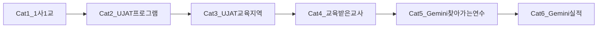

# 프로그램 관리 API 전환 — 카테고리 순차 로드맵

**작성일**: 2026-07-16  
**범위**: CMS 프로그램 관리 LNB 중 **미전환·미활성** 카테고리 (일반 프로그램 제외)  
**원칙**: 한 번에 **하나의 카테고리**만 구현·스테이징 검증 → DoD 충족 후 다음으로 이동

> 일반 프로그램(`/programs/general`)은 별도 SSOT: [programs-detail-api-conversion-status.md](./programs-detail-api-conversion-status.md)

---

## 현재 진행 중 카테고리

| 필드 | 값 |
|------|-----|
| **현재** | **잔여 트랙 — Cat4 Phase 5** (performance-summary FE · managers BE 갭) |
| **다음** | Cat4 managers(BE) · Cat5 mutation · Cat6 스테이징 · 기타 잔여 |
| **직전** | Cat1–6 순차 코어 FE 완료 |

착수·완료 시 이 표를 갱신한다.

---

## 진행 원칙

1. **순차 전용** — Cat N 코어 DoD 전 Cat N+1 코드 착수 금지. 잔여 Phase는 해당 카테고리 문서 백로그로만 남긴다.
2. **유형 격리** — [program-type-isolation](../../.cursor/rules/process/program-type-isolation.mdc). 해당 feature 폴더만 수정. `shared/`·`general/` 공통 수정 시 영향 유형을 PR·문서에 명시.
3. **게이트 기본 OFF** — 스테이징 round-trip 통과 후에만 opt-in / 모듈 키 ON. 롤백은 해당 키·env 제거.
4. **조기 핸드오프** — 코어(목록·CRUD·핵심 신청/진행) 운영 가능하면 다음 Cat으로 넘기고, 중첩·정산·managers 등은 **잔여 백로그**.

---

## 카테고리 순서 · DoD · 문서 링크

| 순서 | 카테고리 | 경로 | 상태 (2026-07-16) | 코어 DoD (다음 Cat 진입 조건) | conversion-status | backend-handoff |
|------|----------|------|-------------------|------------------------------|-------------------|-----------------|
| **1** | 1사1교 | `/programs/company-school` | FE 하이브리드 · gate OFF | Phase 0–6 스테이징 + opt-in ON + 타 유형 회귀 없음 | [detail](./programs-company-school-detail-api-conversion-status.md) | [handoff](./programs-company-school-api-backend-handoff.md) |
| **2** | UJAT 프로그램 | `/programs/ujat` | FE CRUD · `ujatPrograms` OFF | Phase 0–2 CRUD+등록 스테이징 + gate ON | [detail](./programs-ujat-detail-api-conversion-status.md) | [handoff](./programs-ujat-api-backend-handoff.md) |
| **3** | UJAT 교육 지역 | `/programs/ujat/regions` | FE Option A · gate ON | GET+PATCH+reorder+create/delete FE · 소비처 snapshot · BE POST/DELETE OpenAPI 잔여 | [detail](./programs-ujat-education-regions-api-conversion-status.md) | [handoff](./programs-ujat-education-regions-api-backend-handoff.md) |
| **4** | 교육받은 교사 | `/programs/trained-teachers` | FE CRUD · opt-in ON | `TRAINED_TEACHER` CRUD 스테이징 + 기관 신청·교육일지 핵심 | [detail](./programs-trained-teachers-api-conversion-status.md) | [handoff](./programs-trained-teachers-api-backend-handoff.md) |
| **5** | Gemini 찾아가는 연수 | `/programs/gemini/visiting-training` | FE GET · 잔여 | GET 골격 + mutation UX 가드 · enum/mutation BE 잔여 | [detail](./programs-gemini-visiting-training-api-conversion-status.md) | [handoff](./programs-gemini-visiting-training-api-backend-handoff.md) |
| **6** | Gemini 실적 관리 | `/programs/gemini/performance` | FE 코어 · gate OFF | 목록 GET · import preview/POST · delete Option B | [detail](./programs-gemini-performance-api-conversion-status.md) | [handoff](./programs-gemini-performance-api-backend-handoff.md) |

### 완료율 스냅샷

| 카테고리 | 로드맵 상태 | 비고 |
|----------|-------------|------|
| Cat 1 1사1교 | **코어완료(잔여)** | opt-in ON · Phase 7–10 백로그 |
| Cat 2 UJAT 프로그램 | **코어완료(잔여)** | gate ON · 상세 LNB mock 백로그 |
| Cat 3 UJAT 교육 지역 | **코어완료(잔여)** | Option A FE · BE POST/DELETE OpenAPI · 스테이징 QA |
| Cat 4 교육받은 교사 | **코어완료(잔여)** | Phase 0–4 + performance-summary · Phase 5 managers/설문 answers 잔여 · opt-in ON |
| Cat 5 Gemini 찾아가는 연수 | **코어완료(잔여)** | GET FE · gate OFF · mutation/enum/강사신청 백로그 · Cat6 조기 핸드오프 |
| Cat 6 Gemini 실적 | **코어완료(잔여)** | list+import FE · delete Option B · gate OFF · BE SSOT/스키마/스테이징 잔여 |

### 순차 카테고리 진행률

| 구분 | 개수 |
|------|------|
| 로드맵 카테고리 총 | **6** |
| 코어 FE 완료 | **6** (Cat1–6) |
| 순차 “다음 Cat” 미착수 | **0** |
| 잔여 백로그만 남은 Cat | **6** (전부 스테이징·BE·중첩 Phase 잔여) |

> 순차 구현 트랙은 **여기까지**. 이후 작업은 카테고리별 conversion-status **잔여** 또는 스테이징 gate ON QA입니다.

상태 값: `미착수` | `진행` | `코어완료` | `잔여` | `완료`

---

## Remote 게이트 · env 일람

공통 전제: `VITE_API_SERVER` + `isRemoteApiConfigured()` + `hasRemoteAdminJwt()` (API 로그인 MFA).

| 키 | 용도 | 카테고리 |
|----|------|----------|
| `programs` | 공통 programs HTTP | Cat1–2, Cat4 (공유) |
| `applications` | 신청 목록·승인 | Cat1 (표면 gate와 AND) |
| `programProgress` | 진행 참여자 목록 | Cat1 |
| `formsSurveys` | 등록 draft 원격 | Cat1–2, Cat4–5 등록 시 |
| `VITE_COMPANY_SCHOOL_PROGRAMS_REMOTE_ENABLED=true` | 1사1교 opt-in (정확히 `"true"`) | Cat1 |
| `ujatPrograms` | UJAT programs CRUD opt-in | Cat2 |
| `ujatEducationRegions` | 교육 지역 전용 | Cat3 |
| `VITE_TRAINED_TEACHER_PROGRAMS_REMOTE_ENABLED=true` 또는 `trainedTeacherPrograms` | 교육받은 교사 opt-in | Cat4 |
| `geminiVisitingTraining` | 찾아가는 연수 (GET · gate 기본 OFF) | Cat5 |
| `geminiPerformance` | 실적 관리 (list/import · gate 기본 OFF) | Cat6 |

롤백: 해당 모듈 키·opt-in env 제거 후 Vite 재시작.

---

## 카테고리별 Phase 요약

상세 DoD·매트릭스는 각 conversion-status 문서를 SSOT로 한다.

### Cat 1 — 1사1교

- **코어 (→ Cat2 허용):** Phase 0–6 (BE round-trip · CRUD · info · 목록 · 기관/강사 신청 · 진행 목록·nav)
- **잔여 백로그:** Phase 7–10 (학교/강사 중첩 · 정산 · 설문 answers · managers)

### Cat 2 — UJAT 프로그램

| Phase | 내용 |
|-------|------|
| 0 | 스테이징 `UJAT` round-trip · template seeds |
| 1 | 코어 CRUD gate ON (`programs`+`ujatPrograms`) |
| 2 | 등록 draft + POST 1회 |
| 3 | navigation / info hybrid |
| 4+ | 신청·선발·진행·partner-assignments (**잔여**) |

### Cat 3 — UJAT 교육 지역

| Phase | 내용 |
|-------|------|
| 0 | FE↔DTO 필드 매핑 확정 |
| 1 | GET list + adapter + Query · module key |
| 2 | PATCH · PUT reorder |
| 3 | create/delete BE 추가 또는 FE UX 축소 |
| 4 | localStorage migration · 소비처 서버 id |

### Cat 4 — 교육받은 교사

| Phase | 내용 |
|-------|------|
| 0 | `TRAINED_TEACHER` 스테이징 · opt-in |
| 1 | programs CRUD |
| 2 | info + `trained-teacher/detail` |
| 3 | organization-applications |
| 4 | progress 기관 + education-journals |
| 5 | survey · performance-summary · managers(잔여 가능) |

### Cat 5 — Gemini 찾아가는 연수

| Phase | 내용 |
|-------|------|
| 0 | `GEMINI` vs `GEMINI_TRAINING` · mutation 계약 |
| 1–2 | recruitment list/detail · 등록 |
| 3 | organization-applications |
| 4–5 | approved · instructor applications |
| 6 | managers · forms (**잔여 가능**) |

### Cat 6 — Gemini 실적 관리

| Phase | 내용 |
|-------|------|
| 0 | list endpoint SSOT — FE 가설 `training-reports` |
| 1–2 | list GET · import preview/POST (**FE** · gate OFF) |
| 3 | delete **Option B** (remote 시 삭제 UI 숨김) |
| 4 | Excel export · polish (**잔여**) |

---

## 문서 유지 규칙

- Phase 완료·gate ON·스테이징 결과 → **해당 conversion-status §0** 및 본 로드맵 **현재 진행 / 스냅샷** 동시 갱신
- OpenAPI 갭 해소 → 해당 backend-handoff 체크리스트 갱신
- **백엔드 전달용 통합본:** [programs-api-backend-gaps-consolidated.md](./programs-api-backend-gaps-consolidated.md)
- 인덱스: [docs/README.md](../README.md) §5 API

---

## 변경 이력

| 날짜 | 내용 |
|------|------|
| 2026-07-16 | 초안 — Cat1–6 순서·DoD·문서 세트 |
| 2026-07-16 | Cat1 FE: remote 이중 필터 제거 · programId deep-link · list title/year · env UJAT 주석 |
| 2026-07-16 | Cat1 opt-in + Cat2 `ujatPrograms` ON · UJAT list/detail error·year filter FE |
| 2026-07-16 | Cat3 `ujatEducationRegions` FE · Option B · env ON |
| 2026-07-16 | 백엔드 통합 갭 문서 링크 (`programs-api-backend-gaps-consolidated.md`) |
