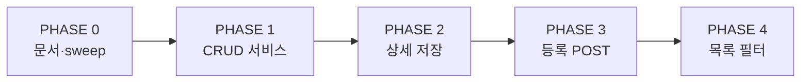

# 일반 프로그램 API 전환 마이그레이션 가이드

**작성 기준**: 2026-07-09  
**대상 화면**: CMS `/programs/general` (목록 · 상세 · 등록)  
**연동 명세**: [programs-api-integration.md](./programs-api-integration.md)  
**백엔드 갭**: [programs-api-backend-gaps.md](./programs-api-backend-gaps.md)  
**남은 작업 (프롬프트용)**: [programs-api-remaining-work.md](./programs-api-remaining-work.md)  
**상세 LNB 완료율 · Phase 5–10**: [programs-detail-api-conversion-status.md](./programs-detail-api-conversion-status.md)

---

## PHASE 개요

---

## PHASE 0 — 사전 정리

- [x] `programs-api-integration.md` · 본 가이드 · `programs-api-backend-gaps.md`
- [x] `programs-api-client` mutation 래핑 (POST/PATCH/DELETE)
- [x] `participantView` sweep 키 통일 (`general-program-detail-route.ts`)

**검증**: `general-program-detail-route.test.ts` 통과

---

## PHASE 1 — 코어 CRUD 서비스

- [x] `mapGeneralProgramToCreateRequest` / `mapGeneralProgramToUpdateRequest`
- [x] `createGeneralProgram` / `updateGeneralProgram` / `deleteGeneralProgram`
- [x] `useCreateGeneralProgram` / `useUpdateGeneralProgram` / `useDeleteGeneralPrograms`
- [x] adapter·filter params 단위 테스트

**DoD**: remote ON 시 POST/PATCH/DELETE 호출, OFF 시 mock fallback

---

## PHASE 2 — 상세 저장

- [x] `detail-fullpage-modal` — remote ON 시 `useUpdateGeneralProgram`
- [x] remote ON + detail 로드 시 session merge 비활성화
- [x] 저장 후 `edit` 제거, `lnb`/`tab`/`subTab` 유지

**DoD**: 상세 공통·모집 저장 후 새로고침해도 API 데이터 유지

---

## PHASE 3 — 등록 플로우

- [x] `persistGeneralProgramRegistration` — remote ON 시 POST
- [x] 등록 완료 → `programId` + `lnb=info` + `tab=info` URL 전환
- [x] `new` / `generalStep` / `userPreview` sweep

**DoD**: 등록 완료 후 상세 모달 오픈, 목록 필터 유지

---

## PHASE 4 — 목록 필터 서버 연동

- [x] `general-program-list-filter-params.ts` — keyword·periodStatus API 전달
- [x] 미지원 필터 클라이언트 보조
- [x] bulk delete remote 연동 (`page.tsx`)

**DoD**: 위젯 `status` → URL → remote list 일치 (지원 필터 범위 내)

---

## 2차 트랙 — 신청·진행현황 (진행 중)

상세 LNB별 완료율·잔여 Phase(5–10) SSOT: [programs-detail-api-conversion-status.md](./programs-detail-api-conversion-status.md)

- [x] `applications` · `programProgress` 모듈 키
- [x] 기관/강사/개인 신청 목록 GET + 승인/반려 POST
- [x] 진행현황 참여자 `GET .../participants`
- [x] `serviceDetailJson` v1 nested 필드
- [x] 봉사자 신청·면접 → **Phase 5** (목록·서류/최종 결과 remote; 면접 배정 mock)
- [x] 참여 기관/강사/봉사 진행 목록 → **Phase 6**
- [x] `GET .../navigation` LNB 서버화 → **Phase 7**
- [ ] 출석·과제·중첩 상세 / 게시글·설문 고도화 → Phase 8–9 잔여
- [ ] 담당자·신청경로·backend gaps → Phase 10 잔여

---

## 롤백

`VITE_REAL_API_MODULES`에서 `programs` 제거 → 즉시 mock 복귀.

---

## 수동 검증 체크리스트

**쿼리**
- [ ] 위젯 status → 목록 필터 URL → 테이블
- [ ] 행 클릭 시 목록 필터 + `programId`/`lnb`/`tab`
- [ ] breadcrumb 목록 복귀 시 상세 params sweep
- [x] `subTab` · `participantRecruitmentPreview` URL 동기화
- [ ] `edit=1` → 저장 → `edit` 제거
- [x] `new=1` → 완료 → `programId` 전환 (등록 완료만 POST; 중간 저장은 draft)
- [ ] 상세 닫기 시 테이블 URL flush

**API**
- [ ] remote ON: 저장 후 새로고침 유지
- [x] create → list 반영 (등록 완료 경로)
- [x] delete → 목록·URL 정리 (목록 bulk + 상세 단건)
- [ ] remote OFF: mock 회귀

**신청 (applications)**
- [x] 권한 모달 confirmBulk* remote
- [x] 빠른 승인/반려·행 드롭다운 remote (`remoteEnabled` 시)
- [x] `applicationsLoading` 테이블/캘린더 스피너
- [ ] 봉사자 신청 remote (클라이언트만 — 백엔드 연동 잔여)
