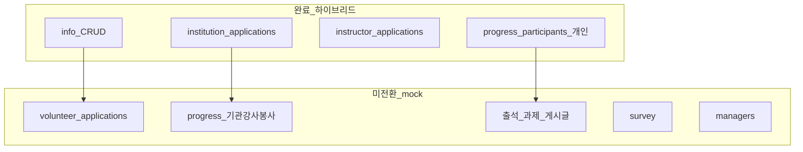
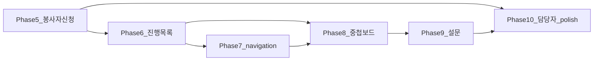

# 일반 프로그램 상세 — API 전환 완료율 · Phase 계획

**작성일**: 2026-07-13  
**갱신**: 2026-07-13 (Phase 5–10 FE 1차 연동)  
**대상**: CMS `/programs/general?programId=…` 풀페이지 상세 모달 (일반 프로그램만)  
**범위**: `apps/cms/src/features/program/general/**` — UJAT · 1사1교 · Gemini 간섭 금지  
**관련 문서**: [programs-api-integration.md](./programs-api-integration.md) · [programs-api-migration-guide.md](./programs-api-migration-guide.md) · [programs-api-remaining-work.md](./programs-api-remaining-work.md) · [programs-api-backend-gaps.md](./programs-api-backend-gaps.md)

> 이 문서는 **상세 LNB·탭 기준** 완료율 SSOT이자 **PHASE 0–4 이후** 실행 로드맵(Phase 5–10)이다.  
> 목록·등록 CRUD(PHASE 0–4)는 [migration-guide](./programs-api-migration-guide.md)에서 **완료**로 관리한다.

---

## 0. Phase 5–10 FE 진행 스냅샷 (2026-07-13)

| Phase | 상태 | 구현 요약 |
|-------|------|-----------|
| **5** 봉사자 신청 | **완료(하이브리드)** | list GET + document-result / final-result · 면접 배정·슬롯은 mock 유지 |
| **6** 진행 목록 | **완료(하이브리드)** | `participants?participantType=` ORGANIZATION/INSTRUCTOR/VOLUNTEER |
| **7** navigation | **완료(하이브리드)** | `GET …/navigation` → disabled LNB 필터, 실패 시 meta fallback |
| **8** 게시글 | **부분** | posts 목록 GET → `postsOverride` 주입. 출석/과제·중첩 상세는 mock |
| **9** 설문 | **부분** | surveys GET → 등록 설문 목록 병합. 만족도/강의평가·응답은 mock |
| **10** polish | **부분** | lifecycle PATCH remote · detail error UI. 담당자·신청경로·서버 필터 gaps 잔여 |

**추정 상세 완료율(갱신) ≈ 55–60%** (LNB 균등 — 출석/과제/담당자·면접 슬롯 미완 반영)

---

## 1. 완료율 요약

### 가중 규칙

- LNB 7개 **균등 가중**
- 카테고리 내부는 핵심 기능(목록 GET / 승인·저장 mutation / 중첩 상세)을 세분한 뒤 평균

| LNB | 라벨 | 완료율 | 상태 |
|-----|------|--------|------|
| `info` | 프로그램 정보 | **~75%** | Remote CRUD (`programs`). nested·lifecycle·신청경로 잔여 |
| `institution_applications` | 기관·참여자 신청 | **~80%** | GET + approve/reject remote. 면접 일정 TODO |
| `instructor_applications` | 강사 신청 | **~85%** | GET + approve/reject remote |
| `volunteer_applications` | 봉사자 신청 | **~5%** | `fetchVolunteerApplicationsRemote` client만 — UI·service 미연결 |
| `progress` | 프로그램 진행 현황 | **~15%** | 개인 참여자 `GET …/participants`만. 나머지 mock |
| `survey` | 설문 관리 | **0%** | `survey-mock` |
| `managers` | 담당자 정보 | **0%** | `getMockProgramManagers` |

**상세 전체(LNB 균등) ≈ 37%**

| 구분 | 완료율 | 비고 |
|------|--------|------|
| 1차 CRUD (목록·상세·등록) PHASE 0–4 | **100%** (범위 내) | 상세 LNB 완료율과 **분리** |
| 상세 LNB 표면 | **≈ 37%** | 본 문서 기준 |
| 2차 트랙(신청·진행) | **진행 중** | 기관/강사/개인 신청·개인 참여자 완료, 봉사자·기관/강사/봉사 진행 잔여 |

### Remote 게이트

```env
VITE_REAL_API_MODULES=...,programs,applications,programProgress
```

| 모듈 키 | 판별 | 커버 |
|---------|------|------|
| `programs` | `shouldUseGeneralProgramsRemoteApi()` | 목록/상세/CRUD |
| `applications` (+ `programs`) | `shouldUseGeneralApplicationsRemoteApi()` | 기관·강사·개인 신청 |
| `programProgress` (+ `programs`) | `shouldUseGeneralProgramProgressRemoteApi()` | 진행 개인 참여자 |

추가 조건: `isRemoteApiConfigured()` + `hasRemoteAdminJwt()` (API 로그인 MFA).



---

## 2. 진입점 · LNB 맵

| 항목 | 경로 |
|------|------|
| URL | `/programs/general?programId=…&lnb=…&tab=…` (+ nested) |
| 활성 상세 | `ui/detail-modal/detail-fullpage-modal.tsx` |
| LNB | `ui/detail-modal/detail-sidebar.tsx` |
| 메뉴 메타 | `lib/detail-meta.ts` (`getGeneralProgressMenuItems` 등) |
| URL SSOT | `lib/detail-url.ts`, `lib/general-program-detail-route.ts` |

| LNB (`lnb`) | 라벨 | 본문 |
|-------------|------|------|
| `info` | 프로그램 정보 | `info/common-info-view`, `recruitment-view`, `application-view` |
| `institution_applications` | 기관·참여자 신청 목록 | `GeneralParticipantApplicationsScreeningView` |
| `instructor_applications` | 강사 신청 목록 | `GeneralInstructorApplicationsView` |
| `volunteer_applications` | 봉사자 신청 목록 | `GeneralVolunteerApplicationsView` |
| `progress` | 프로그램 진행 현황 | `program-status/*` |
| `survey` | 설문 관리 | `survey-management/survey-management-view.tsx` |
| `managers` | 담당자 정보 | `managers/program-managers-tab.tsx` |

노출은 `generalParticipantTypes` 등에 따라 `detail-meta.ts`에서 분기한다.

---

## 3. 카테고리별 상세 매트릭스

상태 값: `hybrid` = remote ON 시 API / OFF 시 mock · `client-only` = client 함수만 · `mock` = UI가 mock만 사용 · `partial` = 일부 탭만 hybrid

### 3.1 `lnb=info` — 프로그램 정보 (~75%)

| tab | UI | 훅·서비스 | mock fallback | OpenAPI | FE 상태 | 비고 |
|-----|-----|-----------|---------------|---------|---------|------|
| `info` 공통 | `info/common-info-view.tsx` | `use-general-program-detail`, `use-update-general-program` → `admin-general-programs-service` | session / `resolveGeneralProgramForDetail` | `GET/PATCH /api/admin/programs/{id}` | **hybrid** | remote ON 시 session merge 비활성 |
| `recruitment` 모집 | `info/recruitment-view.tsx` | 동일 PATCH | 동일 | 동일 | **hybrid** | `subTab`: 참여자/강사/봉사자 |
| `application` 신청 양식 | `info/application-view.tsx` | 프로그램 본체는 위 CRUD; 양식은 forms-surveys | — | `form-bindings` 등 | **partial** | 템플릿 편집 모달 |
| lifecycle 변경 | `use-program-status-manager` | mock `updateProgram` | program-store | PATCH lifecycle | **mock** | Phase 10 |
| 신청경로 | `use-application-path-management` | mock | — | — | **mock** | Phase 10 |

**잔여**: `serviceDetailJson` nested 일부 omit — [backend-gaps](./programs-api-backend-gaps.md). 상세 remote `error` UI 미연동.

### 3.2 `lnb=institution_applications` — 기관·참여자 신청 (~80%)

| 화면 | UI·훅 | mock | OpenAPI | FE 상태 | 비고 |
|------|-------|------|---------|---------|------|
| 기관 목록 | `use-general-program-applications-remote-sync` + `ApplicantList` | `institution-applications-mock` | `GET …/organization-applications` · `POST …/organization-applications/{id}/approve\|reject` | **hybrid** | 권한 모달·빠른 승인/반려·loading 완료 |
| 개인 서류/면접 단계 | `part_doc1` 등 | `general-individual-applications-mock` | `GET …/individual-applications` · approve/reject | **hybrid** (목록·결정) | 면접 일정: `general-interview-assign-schedule-utils.ts` `TODO(api)` |

### 3.3 `lnb=instructor_applications` — 강사 신청 (~85%)

| 화면 | 훅·서비스 | mock | OpenAPI | FE 상태 |
|------|-----------|------|---------|---------|
| 목록·승인/반려 | remote-sync + `fetchGeneralInstructorApplications` | `@/data/mock/applicant-instructors` | `GET …/instructor-applications` · approve/reject | **hybrid** |

### 3.4 `lnb=volunteer_applications` — 봉사자 신청 (~5%)

| 화면 | 현재 | mock | OpenAPI | FE 상태 |
|------|------|------|---------|---------|
| `vol_doc1` / `vol_doc_passed` / `vol_interview2` / `vol_all` | UI → mock queries only | `general-volunteer-applicants-mock` | `GET …/volunteer-applications` | **client-only** |
| 서류/최종 결과 | 미연결 | mock 모달 | `POST /api/admin/volunteer-applications/{id}/document-result` · `final-result` | **미연동** |

- Client: `fetchVolunteerApplicationsRemote` in `applications-api-client.ts`
- Query key 예약: `generalApplicationsQueryKeys.volunteerList` — **service/sync/UI 미사용**
- approve/reject 래퍼 **없음** (기관/강사/개인과 경로 패턴이 다름 — `document-result` / `final-result`)

### 3.5 `lnb=progress` — 진행 현황 (~15%)

메뉴: `getGeneralProgressMenuItems` (`detail-meta.ts`)

| tab | UI | 훅 | mock | OpenAPI | FE 상태 |
|-----|-----|-----|------|---------|---------|
| `progress_participants` (개인) | `participating-participants-section.tsx` | `use-progress-individual-participant-list` → `admin-program-progress-service` | `participating-individual-participants` | `GET …/participants` | **hybrid** |
| `progress_participants` (기관) | `participating-institutions-section.tsx` | `use-progress-school-list` | `participating-schools` | (매핑 확정 필요) | **mock** |
| `progress_instructors` | `participating-instructors-section.tsx` | `use-progress-instructor-list` | participating-instructors + localStorage | `…/instructor-assignments` 후보 | **mock** |
| `progress_volunteers` | `participating-volunteers-section.tsx` | `use-progress-volunteer-list` | `MOCK_PARTICIPATING_VOLUNTEERS` | — | **mock** |
| `progress_attendance` | `participating-individual-progress-attendance-section.tsx` | attendance hooks | `*-attendance-mock` | — | **mock** |
| `progress_assignments` | `participating-individual-progress-assignment-section.tsx` | assignment hooks | assignment mock | — | **mock** |
| `progress_posts` | `program-progress-posts-section.tsx` | posts helpers | `getProgramPostsByProgramId` | `GET/POST …/posts` | **mock** |

**중첩 풀페이지 상세 (전부 mock 데이터 층)**

| 대상 | URL params | 탭 예 |
|------|------------|-------|
| 기관 | `schoolId`, `schoolTab` | application / students / instructors / attendance / posts |
| 강사 | instructor detail | application / institutionAssignment / lectureReports / settlement |
| 봉사자 | volunteer detail | application / assignment |
| 참여자 | participant detail | application / attendance / assignments — 목록만 remote 가능 |

### 3.6 `lnb=survey` — 설문 (0%)

| 탭 | UI | mock | OpenAPI | FE 상태 |
|----|-----|------|---------|---------|
| `survey` / `satisfaction` / `lecture_evaluation` | `survey-management-view.tsx` | `survey-mock.ts` → `general-survey-poll-responses-mock` | `GET …/surveys`, `…/responses`, `…/summary` | **mock** |

### 3.7 `lnb=managers` — 담당자 (0%)

| 화면 | UI | mock | 설계 | FE 상태 |
|------|-----|------|------|---------|
| 목록·등록·삭제·권한 | `program-managers-tab.tsx` | `getMockProgramManagers` (`@/data/mock/program-managers`) | [program-managers-tab-spec.md](../design/program-managers-tab-spec.md) | **mock** |

---

## 4. Wired vs OpenAPI 갭

### 4.1 FE wired (모듈 ON + JWT)

| Method | Path | 용도 |
|--------|------|------|
| GET/POST | `/api/admin/programs` | 목록·등록 |
| GET/PATCH/DELETE | `/api/admin/programs/{id}` | 상세·저장·삭제 |
| GET | `…/organization-applications` | 기관 신청 |
| GET | `…/instructor-applications` | 강사 신청 |
| GET | `…/individual-applications` | 개인 신청 |
| POST | `/api/admin/organization-applications/{id}/approve\|reject` | |
| POST | `/api/admin/instructor-applications/{id}/approve\|reject` | |
| POST | `/api/admin/individual-applications/{id}/approve\|reject` | |
| GET | `…/participants` | 진행·개인 참여자 |

### 4.2 OpenAPI 존재 · FE 미연동 (일반 상세 관련)

| Path / 영역 | 비고 | 목표 Phase |
|-------------|------|------------|
| `GET …/volunteer-applications` | client만 | 5 |
| `POST …/volunteer-applications/{id}/document-result` · `final-result` | 승인 패턴 상이 | 5 |
| `GET …/navigation` | LNB 서버화 | 7 |
| `…/instructor-assignments` | 진행 강사 후보 | 6 |
| `…/interview-slots` | 면접 일정 | 5 후속 / 10 |
| `…/posts` (+ comments / reactions / reads) | `program-board`, STAGING_VERIFY | 8 |
| `…/surveys` (+ responses / summary) | 설문 | 9 |
| `…/lecture-reports` | 강사 상세 | 8 |
| `…/schedules` · `schedule-change-histories` | 일정 | 10 |
| `…/form-bindings` · `recruitments` · `kpi-target` | 정보/운영 | 10 |
| `…/complete` · `completion-readiness` | 완료 처리 | 10 |

(교육받은 교사 `trained-teacher/*` 경로는 **일반 상세 비범위**.)

---

## 5. Phase 5–10 상세 실행 계획

기존 **PHASE 0–4** (CRUD·목록·등록)는 [migration-guide](./programs-api-migration-guide.md)에서 완료.  
이하는 **상세 잔여**를 번호 연속으로 정의한다.



공통 규칙 (모든 Phase):

1. `features/program/general/**`만 수정 — [program-type-isolation](../../.cursor/rules/process/program-type-isolation.mdc)
2. shared 수정 시 `variant` / 분기로 타 유형 기본값 유지
3. hand-wrap `customInstance` 패턴 유지 (Orval 생성 클라이언트 전면 교체 금지)
4. remote OFF 시 mock 회귀 필수
5. 상세 로딩: empty-flash 금지 ([detail-loading-before-empty](../../.cursor/rules/design/detail-loading-before-empty.mdc))
6. 롤백: 해당 모듈 키만 `VITE_REAL_API_MODULES`에서 제거

---

### Phase 5 — 봉사자 신청 remote

| 항목 | 내용 |
|------|------|
| **우선순위** | P1 (최우선) — list client·query key 이미 존재 |
| **모듈** | `applications` (+ `programs`) |
| **목표** | 봉사자 신청 목록 GET + 서류/최종 결과 mutation을 UI에 연결 |

**작업**

1. `applications-api-client.ts` — `document-result` / `final-result` POST 래퍼 추가 (기관 approve와 경로 다름에 주의)
2. `adapters/general-applications-adapters.ts` — `VolunteerApplicationListItemResponse` → `GeneralVolunteerApplicantRow`
3. `admin-applications-service.ts` — `fetchGeneralVolunteerApplications` + decide 함수, remote/mock 분기
4. `use-general-program-applications-remote-sync.ts` (또는 봉사자 전용 sync) — `volunteerList` query + invalidate
5. `GeneralVolunteerApplicationsView` / screening hooks — remoteEnabled 시 service 사용
6. 면접 슬롯·배정 UI는 `interview-slots` 준비 전까지 **mock 유지** 명시 (`TODO(api)` 유지)

**터치 파일**

- `api/applications-api-client.ts`
- `api/adapters/general-applications-adapters.ts` (+ test)
- `api/admin-applications-service.ts`
- `api/general-applications-query-keys.ts` (이미 `volunteerList` 있음)
- `hooks/use-general-program-applications-remote-sync.ts` 또는 신규 volunteer sync
- `ui/detail-modal/applications/general-volunteer-applications-view.tsx`
- `ui/detail-modal/applications/volunteer-screening/*`

**Query 키**: `generalApplicationsQueryKeys.volunteerList(programId)` — 결정/반려 후 `generalApplicationsQueryKeys.all` invalidate

**DoD**

- [ ] remote ON: 서류 단계 목록 API 반영, 승인/반려 후 재조회
- [ ] remote OFF: mock 회귀
- [ ] `applicationsLoading` 스피너
- [ ] UJAT 봉사자 재사용 컴포넌트 기본 동작 불변

**수동 QA**

- [ ] `vol_doc1` / `vol_doc_passed` / `vol_all` remote 목록
- [ ] 일괄·행 단위 서류 결과
- [ ] 면접 탭은 mock 스케줄로 동작 (회귀)

**BE 의존**: `VolunteerApplicationListItemResponse` 필드 ↔ CMS row 매핑표; document/final-result body 스키마

---

### Phase 6 — 진행 목록 확장 (기관·강사·봉사)

| 항목 | 내용 |
|------|------|
| **모듈** | `programProgress` (+ `programs`) |
| **목표** | 참여 기관 / 강사 / 봉사자 **목록** remote |

**작업**

1. BE와 목록 소스 확정: `GET …/participants?participantType=` 확장 vs `instructor-assignments` 등 전용 path
2. `program-progress-api-client.ts` 확장 + adapters
3. `admin-program-progress-service.ts` 분기
4. `use-progress-school-list` / `use-progress-instructor-list` / `use-progress-volunteer-list` remote 분기
5. `generalProgramProgressQueryKeys`에 institutions / instructors / volunteers 키 추가

**터치 파일**

- `api/program-progress-api-client.ts`
- `api/admin-program-progress-service.ts`
- `api/adapters/*` (progress adapters 신규 가능)
- `hooks/use-progress-school-list.ts`, `use-progress-instructor-list.ts`, `use-progress-volunteer-list.ts`
- `ui/detail-modal/program-status/participating-{institutions,instructors,volunteers}-section.tsx`

**DoD**

- [ ] 3목록 remote ON/OFF
- [ ] URL deep link (`schoolId` 등) lookup은 목록 데이터 기준 유지
- [ ] adapter 단위 테스트

**수동 QA**

- [ ] 기관/강사/봉사 탭 테이블·캘린더 loading
- [ ] remote OFF mock 행 수 회귀

**BE 의존**: participantType enum · 기관/강사 row 필드 · 페이지네이션 `size:500` 정책

---

### Phase 7 — LNB `navigation` 서버화

| 항목 | 내용 |
|------|------|
| **모듈** | `programs` |
| **목표** | `GET …/navigation`으로 LNB·탭 가용성 제어 |

**작업**

1. `programs-api-client.ts` — `fetchProgramNavigationRemote`
2. detail 셸에서 navigation query → sidebar/meta에 반영
3. 실패·timeout·모듈 OFF 시 **현재 `detail-meta.ts` fallback**

**터치 파일**

- `api/programs-api-client.ts`
- `api/admin-general-programs-service.ts` (또는 navigation 전용)
- `lib/detail-meta.ts` / `ui/detail-modal/detail-sidebar.tsx` / `detail-fullpage-modal.tsx`
- `general-program-query-keys.ts`

**DoD**

- [ ] remote ON: 서버 메뉴 반영
- [ ] remote OFF / 에러: 기존 meta와 동일 UX
- [ ] 존재하지 않는 `lnb`/`tab` URL → 안전한 기본 탭

**수동 QA**

- [ ] 참여자 유형별 LNB 노출 일치
- [ ] deep link 후 새로고침

---

### Phase 8 — 진행 중첩·게시글 (보드)

| 항목 | 내용 |
|------|------|
| **모듈** | `programProgress` + 필요 시 `program-board` 신규 env 키 |
| **목표** | 출석·과제·게시글 + 기관/강사/봉사 풀페이지 상세의 우선 탭 remote |

**우선순위 (탭)**

1. application (신청서 조회)
2. assignment / institutionAssignment
3. attendance
4. posts / lectureReports / settlement (후순위)

**작업**

1. OpenAPI `…/posts` 클라이언트 + query 키 (`program-board` 모듈 게이트 검토)
2. 출석·과제 세션 API 계약 확정 후 mock 교체
3. 풀페이지 뷰 loading 가드 (empty-flash 금지)
4. STAGING_VERIFY_REQUIRED posts 계열은 스테이징 스모크 후  flip

**터치 파일**

- `ui/detail-modal/program-status/*fullpage*`, `*attendance*`, `*assignment*`, `program-progress-posts-section.tsx`
- 신규 `api/program-board-api-client.ts` (또는 progress client 확장)
- mock: `participating-individual-progress-*-mock.ts` 등

**DoD**

- [ ] 목록 → 상세 deep link 유지
- [ ] posts 목록 GET hybrid
- [ ] remote OFF mock

**수동 QA**

- [ ] 개인 출석/과제 세션 패널
- [ ] 게시글 작성·목록 (스테이징)
- [ ] 기관/강사 상세 탭 전환

**BE 의존**: posts STAGING · attendance/assignment path 확정 · lecture-reports

---

### Phase 9 — 설문 관리

| 항목 | 내용 |
|------|------|
| **모듈** | `formsSurveys` 또는 programs `…/surveys` (계약 확정 후 택일) |
| **목표** | 설문 / 만족도 / 강의평가 탭 remote |

**작업**

1. `GET …/surveys`, `…/summary`, `…/responses` client + adapter
2. `survey-management-view.tsx` — `buildGeneralSurveyMockState` 분기
3. 만족도 모달 `TODO(api)` 해소

**터치 파일**

- `ui/detail-modal/survey-management/*`
- `lib/survey-audience.ts`
- 신규 survey API client/service under `general/api/` 또는 forms-surveys 공유

**DoD**

- [ ] 3탭 remote 데이터
- [ ] UJAT 설문 재사용 UI 기본값 불변

**수동 QA**

- [ ] summary 수치 · responses 테이블
- [ ] remote OFF mock

**BE 의존**: templateVersionId · audience 매핑 (`survey-audience`)

---

### Phase 10 — 담당자 · 운영 polish · backend gaps

| 항목 | 내용 |
|------|------|
| **모듈** | `programs` (+ managers API 확정 시 키) |
| **목표** | 담당자 CRUD, lifecycle/신청경로 remote, gaps 해소 |

**작업**

1. 담당자 API 계약 확정 후 `program-managers-tab` mock 제거 — [spec](../design/program-managers-tab-spec.md)
2. `use-program-status-manager` → lifecycle PATCH
3. `use-application-path-management` → API
4. [backend-gaps](./programs-api-backend-gaps.md): 목록 서버 필터, `serviceDetailJson` nested, create `programType`, detail error UI, `size:500` 정책 정리
5. `interview-slots` (Phase 5에서 남긴 면접) 연결
6. remaining-work 수동 QA 미체크 항목 해소

**DoD**

- [ ] 담당자 remote CRUD
- [ ] lifecycle·신청경로 remote
- [ ] detail error UI
- [ ] [remaining-work](./programs-api-remaining-work.md) QA 체크리스트 잔여 해소 또는 이슈화

**수동 QA**

- [ ] 저장 후 새로고침 유지 (전 LNB 스모크)
- [ ] remote OFF 전면 mock 회귀
- [ ] 위젯 status → 목록 필터 → 상세 round-trip

---

## 6. Phase ↔ remaining-work 매핑

| remaining-work | 본 문서 Phase |
|----------------|---------------|
| P1 봉사자 신청 | **Phase 5** |
| P2 참여 기관/강사/봉사 목록 | **Phase 6** |
| P2 `GET …/navigation` | **Phase 7** |
| P2 출석·게시글 | **Phase 8** |
| P2 설문 | **Phase 9** |
| P2 lifecycle·신청경로·담당자 + API 계약 gaps | **Phase 10** |

프롬프트 예:

```
apps/cms/docs/api/programs-detail-api-conversion-status.md Phase 5 봉사자 신청 remote 연동해줘.
일반 프로그램만 수정하고 UJAT/1사1교/Gemini는 건드리지 마.
```

---

## 7. 주요 파일 맵

| 영역 | 경로 |
|------|------|
| Remote 판별 | `api/general-programs-remote-capabilities.ts`, `applications-remote-capabilities.ts`, `program-progress-remote-capabilities.ts` |
| CRUD | `api/programs-api-client.ts`, `admin-general-programs-service.ts` |
| 신청 | `api/applications-api-client.ts`, `admin-applications-service.ts`, `hooks/use-general-program-applications-remote-sync.ts` |
| 진행 | `api/program-progress-api-client.ts`, `admin-program-progress-service.ts`, `hooks/use-progress-individual-participant-list.ts` |
| Query keys | `api/general-program-query-keys.ts`, `general-applications-query-keys.ts` |
| Adapters | `api/adapters/general-program-adapters.ts`, `general-applications-adapters.ts` |
| 상세 셸 | `ui/detail-modal/detail-fullpage-modal.tsx` |
| 테스트 | `api/adapters/*.test.ts`, `lib/general-program-detail-route.test.ts` |

---

## 8. 비범위

- UJAT / Gemini / 1사1교 / trained-teachers API 전환
- Orval 생성 programs 클라이언트 전면 교체
- 본 문서만으로의 코드 구현 (구현은 Phase별 별도 작업)

---

## 9. 변경 이력

| 날짜 | 내용 |
|------|------|
| 2026-07-13 | 초안 — LNB 완료율 매트릭스 · OpenAPI 갭 · Phase 5–10 |
