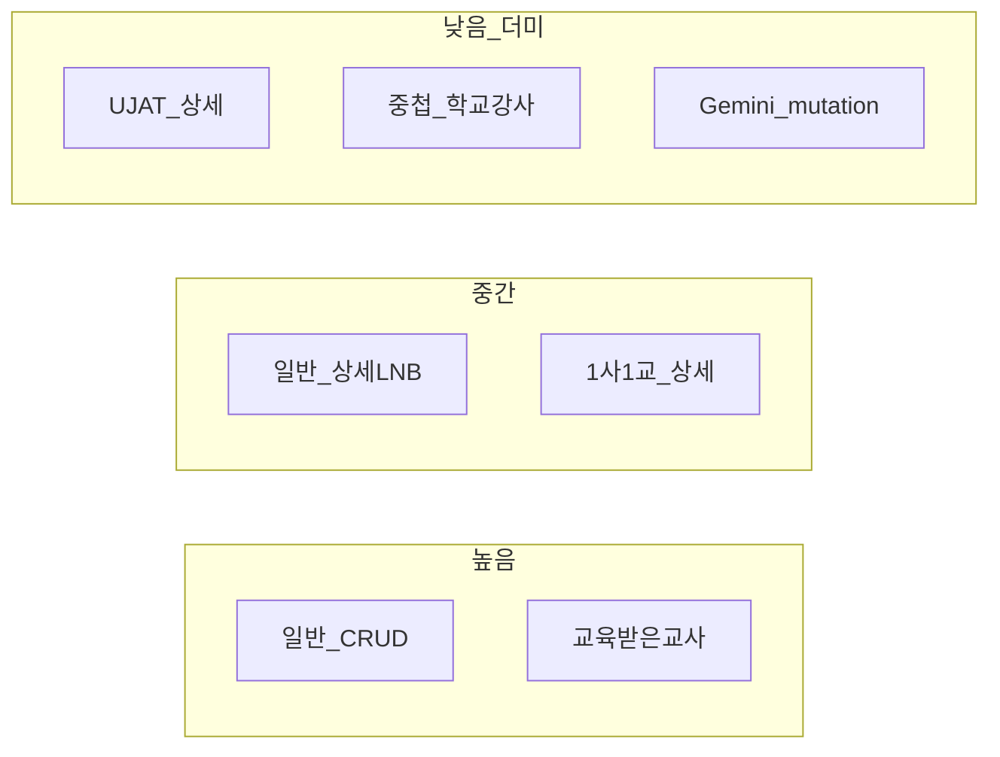

# 프로그램 관리 — 시드 CASE 기준 API 적용률 · 더미 잔존 (BE 핸드오프)

| 항목 | 값 |
|------|-----|
| **작성일** | 2026-07-30 |
| **대상** | 백엔드 / OpenAPI · 스테이징 시드 · 잔여 API 계약 |
| **FE 범위** | CMS 프로그램 관리 (`apps/cms/src/features/program/**`) |
| **시드 기준** | BE local demo `프로그램유형.md` (GENERAL 28 CASE · COMPANY_SCHOOL 8 · Gemini 5 · 메뉴 전용 등) |
| **목적** | 시드 CASE별로 **실 API vs 더미** 적용률을 한눈에 보고, **아직 더미로 도는 갭**을 BE 액션으로 전달 |

> **BE에 mock 기준 더미 시드까지 요청할 때:**  
> 이 파일만 보내지 말고 [`be-handoff-program-dummy-seeds/`](./be-handoff-program-dummy-seeds/README-BE.md) **폴더 전체(zip)** 를 전달하세요.  
> (유형별 시드 레시피 · FE mock ID 맵 · 하위 행 시드가 포함됨)

> **읽는 법:** §1 카테고리 요약 → §2 CASE 매트릭스 → §3 더미 잔존(BE 요청) → §4 우선순위.  
> 유형별 계약 상세는 기존 handoff를 SSOT로 유지한다 (§5 링크).

---

## 0. 판정 기준 · Remote 게이트

### 0.1 상태 라벨

| 라벨 | 의미 |
|------|------|
| **API-wired** | 게이트 ON + JWT 시 실 HTTP만 사용 |
| **hybrid** | 게이트 ON이면 실 API, OFF·실패 시 mock/localStorage 폴백 |
| **mock-only** | 게이트와 무관하게 FE mock / 로컬 store |

### 0.2 현재 로컬 `.env` 게이트 (2026-07-30 기준)

```env
VITE_API_SERVER=https://…/
VITE_REAL_API_MODULES=…,programs,applications,programProgress,ujatPrograms,ujatEducationRegions,geminiPerformance,geminiVisitingTraining,…
VITE_COMPANY_SCHOOL_PROGRAMS_REMOTE_ENABLED=true
VITE_TRAINED_TEACHER_PROGRAMS_REMOTE_ENABLED=true
```

| 모듈 / env | 커버 |
|------------|------|
| `programs` | 일반 CRUD · posts/surveys/navigation/managers HTTP · 공통 programs 경로 |
| `applications` | 기관·강사·개인·봉사자 신청 목록·승인/반려·봉사 서류/최종 |
| `programProgress` | 진행 참여자 목록 · 출석 GET/PUT |
| `ujatPrograms` (+ `programs`) | UJAT **목록·CRUD만** |
| `ujatEducationRegions` | UJAT 교육 지역 CRUD |
| `VITE_COMPANY_SCHOOL_PROGRAMS_REMOTE_ENABLED` (+ `programs`) | 1사1교 CRUD·신청·진행 표면 |
| `VITE_TRAINED_TEACHER_PROGRAMS_REMOTE_ENABLED` 또는 `trainedTeacherPrograms` | 교육받은 교사 CRUD·detail·기관·일지 |
| `geminiVisitingTraining` | Gemini 모집/승인 **GET** |
| `geminiPerformance` | Gemini 실적 list + import |

추가 조건: `isRemoteApiConfigured()` + `hasRemoteAdminJwt()`.

### 0.3 시드 ID vs FE mock ID

| 축 | 예 |
|----|-----|
| **BE 시드** | `166401` … `166428`, `167001` … `167008`, `165001` … |
| **FE mock** | `general-prog-*`, `economy-*`, `ujat-*`, `trained-teachers-prog-*` |

스테이징에서 BE 시드 ID로 상세를 열면 **게이트 ON 시 remote**, OFF면 FE mock 문자열 id 경로.  
CASE별 FE mock 레시피는 [general-program-dummy-seed-backend-request.md](./general-program-dummy-seed-backend-request.md) · [company-school-program-dummy-seed-backend-request.md](./company-school-program-dummy-seed-backend-request.md) 참고.

---

## 1. 카테고리(LNB 메뉴)별 적용률 요약

게이트 ON + JWT 가정. 수치는 **상세 LNB 균등 추정**(기존 conversion-status와 정합).

| 카테고리 | 라우트 | 목록/CRUD | 상세 신청 | 상세 진행·중첩 | 설문 / 담당자 | **추정 적용률** |
|----------|--------|-----------|-----------|----------------|---------------|-----------------|
| **일반** | `/programs/general` | hybrid | hybrid (승인 wired) | 목록 hybrid / **중첩 mock-only** | surveys hybrid / managers hybrid | **상세 ≈ 70–75%** · CRUD 100% |
| **1사1교** | `/programs/company-school` | hybrid | hybrid | 목록 hybrid / **중첩·정산 mock** · 봉사자 N/A | surveys partial / managers 갭 가능 | **상세 ≈ 55–60%** |
| **UJAT** | `/programs/ujat` | hybrid | **mock-only** | **mock-only** | mock-only | **CRUD ≈ 95%** · **상세 LNB ≈ 0–10%** |
| **UJAT 교육지역** | `/programs/ujat/regions` | hybrid | — | — | — | 목록/reorder hybrid · POST/DELETE OpenAPI 공식화 잔여 |
| **교육받은 교사** | `/programs/trained-teachers` | hybrid | hybrid (전용 GET + 공통 approve) | journals hybrid | surveys partial / managers 갭 | **≈ 85%** |
| **Gemini 모집·승인** | `/programs/gemini/visiting-training` | GET hybrid · **mutation mock/가드** | GET hybrid · approve **갭** | — | managers mock | **GET 골격 · mutation ≈ 0%** |
| **Gemini 실적** | `/programs/gemini/performance` | list+import hybrid | DELETE Option B(숨김) | — | — | **list/import ≈ 충족** · DELETE 정책 확정 필요 |



---

## 2. 시드 CASE별 매트릭스

### 2.1 일반 프로그램 CASE-01 ~ 28 (`166401` ~ `166428`)

**공통으로 시드에 들어가는 데이터**(기본정보·운영·모집·일정·PM/파트너·config·폼 바인딩 등)는 게이트 ON 시:

| 영역 | FE 상태 | 비고 |
|------|---------|------|
| 프로그램 GET/PATCH | **hybrid** | `GET/PATCH /api/admin/programs/{id}` |
| navigation / LNB 가용성 | **hybrid** | `GET …/navigation` · 실패 시 meta fallback |
| 기관·개인·강사 신청 목록 + 승인/반려 | **hybrid** | `applications` 모듈 |
| 봉사자 서류/최종 | **hybrid** | document-result / final-result |
| 진행 참여자 목록 | **hybrid** | `GET …/participants?participantType=` |
| 설문 목록·응답·요약 | **hybrid** | surveys + form-bindings |
| 담당자 CRUD | **hybrid** | `…/managers` |
| **학교/강사/봉사/개인 중첩 상세 mutation** | **mock-only** | §3.1 |
| 과제 관리 | **mock-only** | P2-5 admin API 없음 |
| 신청경로 path CRUD | **mock-only** | applicationPathId PATCH만 가능 |
| 면접 슬롯 GET | **hybrid(hand-wrap)** | POST create/assign는 wired · GET OpenAPI 등재 잔여 |
| 만족도 제출 모달 | **mock-only** | `TODO: API 연동` |

#### 상태별 하위 데이터 ↔ FE 검증면

| 시드 상태 | 시드에 포함 | FE에서 실API로 볼 수 있는 것 | **여전히 더미인 것** |
|-----------|-------------|------------------------------|----------------------|
| `ACTIVE` / `COMPLETED` | 승인 신청·참여자·배정·출석·강의보고·게시글 | 신청 목록·승인상태 · 진행 목록 · posts GET/POST · lecture-reports **목록** · 출석 partial | 중첩 배정/명단/출석 저장 · 강의보고 CRUD · 정산 탭 |
| `SCHEDULED` / `RECRUITING` | 미승인 신청만 | 신청 WAITING/PENDING 목록 · 승인 mutation | 중첩(데이터 없음이 정상) · 면접 일정 GET 폴백 |

#### CASE 목록 × LNB·갭

| CASE | ID | 시나리오 요약 | FE가 주로 검증 | 실API | **더미 잔존 / BE 요청** |
|------|-----|---------------|----------------|-------|------------------------|
| 01 | 166401 | 기관·커리큘럼·단일·강사·봉사면접·전체설문 | FULL LNB | info·신청·진행목록·설문 | 중첩·봉사면접 슬롯 GET |
| 02 | 166402 | 기관·커리큘럼·복수·일최대8·설문 | 회차·과제 UI | 동일 | **과제 API** · 중첩 |
| 03 | 166403 | 개인·커리큘럼·단일·개인/봉사면접 | 개인 LNB·면접 | 개인신청 hybrid | 면접 일정·중첩 |
| 04 | 166404 | 개인·커리큘럼·복수·면접 | 동일+복수 | 동일 | 과제·중첩 |
| 05 | 166405 | 기관·일정형·단일 | 일정형 공통정보 | info hybrid | 중첩 |
| 06 | 166406 | 기관·일정형·복수·교육형태 상이 | 희망일정 숨김 등 | info | 중첩 |
| 07 | 166407 | 개인·일정형·단일 | 개인+일정형 | 동일 | 중첩 |
| 08 | 166408 | 개인·일정형·복수 | 동일 | 동일 | 중첩 |
| 09 | 166409 | 기관·교육/IPS 일정별 상이 | 회차별 설정 | info PATCH | `serviceDetailJson` 영속 확인 |
| 10 | 166410 | 강사+봉사면접2depth+설문 | FULL | 신청·설문 | 면접 GET · 중첩 |
| 11 | 166411 | 강사+봉사(면접없음)+설문 | 봉사 1depth | 동일 | 중첩 |
| 12 | 166412 | 강사없음·봉사면접·설문 | 강사 LNB 숨김 | navigation | 중첩 |
| 13 | 166413 | 강사없음·봉사·면접/설문없음 | 최소 LNB | navigation | — |
| 14 | 166414 | 강사없음·봉사·설문만·완료 | 설문 single · completed | 설문·lifecycle | 중첩(완료 데이터) |
| 15 | 166415 | 강사있음·봉사없음·설문없음·모집 | 강사만 | 신청 | — |
| 16 | 166416 | 강사없음·봉사면접·설문없음·모집 | 봉사만 | 봉사신청 | 면접 GET |
| 17 | 166417 | 강사+봉사면접·설문없음 | FULL 신청 | 신청 | 면접·중첩 |
| 18 | 166418 | 강사없음·봉사면접·설문만·완료 | 봉사+설문 | 설문 | 중첩 |
| 19 | 166419 | 개인·일정·복수 ·명 `UJAT 36기` ·예정 | 개인 면접·만족도 | 신청·설문 | **화면명≠period_status** 정합(시드 MD 불일치 참고) |
| 20 | 166420 | 개인·봉사·면접 ·`특별한 JOB탐` | 참여자+봉사 면접 | 동일 | 면접 GET |
| 21 | 166421 | 개인·봉사·설문 ·`Global Career Discovery` | 면접 1depth | 동일 | — |
| 22 | 166422 | 기관·강사·봉사·면접·설문/만족도 | 기관+봉사면접 | 신청·설문 | 만족도 **제출** mock |
| 23 | 166423 | 기관·면접/설문없음 ·완료 | 최소+완료 | lifecycle | 중첩 완료 데이터 |
| 24 | 166424 | 기관·복수·설문/만족도 | 만족도 교사/학생 | 설문 | 만족도 제출 |
| 25 | 166425 | 기관·일정형·최대 일정 수 | 공통정보 한도 | info | — |
| 26 | 166426 | 기관·교육형태 참여자선택·HYBRID | 신청폼 옵션 | info | — |
| 27 | 166427 | 기관·사전교육 안내 불필요 | 안내 단락 숨김 | info | — |
| 28 | 166428 | 기관·학교신청만 ·모집 | types=school만 | navigation·신청 | — |

**시드 공통 ACTIVE/COMPLETED 하위(출석·강의보고·학생명단·강사배정)** → 목록/일부 GET은 hybrid 가능하나 **저장·배정 mutation은 전부 mock** (§3.1).

---

### 2.2 1사1교 CASE CS-01 ~ 08 (`167001` ~ `167008`)

**시드에 없는 것(도메인):** 개인 신청 · 봉사자 · 출석 · 강의보고서 · 과제 → FE도 해당 UI 비노출이 정상.

**시드에 있는 것:** 기관신청 3(검토대기/승인/반려) · 강사신청 3(대기/승인/반려) · 일정 2 · KPI·교재·1사1교 상세 설정 · 폼 바인딩.

| CASE | ID | 상태/용도 | 실API로 검증 | **더미 잔존 / BE 요청** |
|------|-----|-----------|--------------|-------------------------|
| CS-01 | 167001 | 기획/대기 · KPI 0 fallback | CRUD · overview | 중첩 없음(대기) |
| CS-02 | 167002 | 학생 모집 · 설문 | 기관/강사 신청 · 설문 | 중첩 |
| CS-03 | 167003 | 강사 모집 · 전체 설문 | 강사 신청 · 설문 | 중첩 |
| CS-04 | 167004 | 매칭 완료 · 참여자 다수 | 진행 목록 | **학교 배정·명단 mock** |
| CS-05 | 167005 | 교재 발송 전/진행 | 진행 · 교재 상태 UI | 교재 상태 mutation · 중첩 |
| CS-06 | 167006 | 교재 발송 후 · **장거리 125.5km** | 진행 목록 | **강사 정산(100km·교통·숙박) mutation** |
| CS-07 | 167007 | 교육 완료 | lifecycle · 목록 | 중첩·정산 |
| CS-08 | 167008 | 서류 처리 완료 | 신청 상태 | 중첩 |

고정 정책(2회차·희망일정 max 2·합반 불가·강사 1일 1학교·장거리 100km 등)은 info/`serviceDetailJson` **hybrid 읽기** — 중첩·정산 쓰기는 mock.

---

### 2.3 Gemini 전용 5 CASE (`165001` ~ `165005`)

| ID | 상태 | 시드 범위 | FE 실API | **더미 / BE 요청** |
|----|------|-----------|----------|---------------------|
| 165001 | 예정 | 미래 모집·연수 일정 | 모집 GET | **POST/PATCH/DELETE 모집** |
| 165002 | 진행 | 기관 신청 대기/승인/반려 · 강사 배정 · 연수보고서 2 | 기관신청 GET · 실적 list | **approve/reject** · 강사신청 API · 승인 상세 |
| 165003 | 완료 | 승인·배정·보고서 3 | GET | 동일 mutation 갭 |
| 165004 | 초안 | 비활성 모집 | GET | 초안 CRUD |
| 165005 | 미진행 | 기관 승인·강사 미매칭 | GET | 상태 전이 · 강사 매칭 API |

공통 설정(최소인원·수료증·수업규칙·강사필수·기간·PM) — **읽기 GET hybrid / 쓰기 mock(원격 ON 시 UX 가드)**.

---

### 2.4 메뉴 전용 더미 (`1640xx`) · Rich demo · 기타

프로그램 관리 **목록이 비지 않게** 넣는 시드. 상세 깊이는 CASE 28/8보다 얕음.

| ID | 유형 | FE 메뉴 | 목록/CRUD | 상세 |
|----|------|---------|-----------|------|
| 164001 | 일반 기관 | `/programs/general` | hybrid | §2.1과 동일 패턴 |
| 164002 | 일반 개인 | `/programs/general` | hybrid | 동일 |
| 164003 | 수정 전용 | 일반 수정 화면 | hybrid PATCH | 참여자/배정/정산 **의도적 미시드** |
| 164011–012 | 1사1교 | company-school | hybrid | §2.2 |
| 164021–022 | UJAT | `/programs/ujat` | CRUD hybrid | **상세 LNB 전부 mock** |
| 164031–032 | Gemini | visiting / performance | GET hybrid | mutation 갭 |
| 164041–042 | 교육받은 교사 | trained-teachers | hybrid | journals hybrid · 교육일지 PDF 시드 |

| 구간 | ID | 프로그램 관리 상세와의 관계 |
|------|-----|---------------------------|
| Rich demo | 162301, 162311…162371 | Happy path·정산·면접 등 — **목록/연관 도메인** 검증용. 상세 중첩은 여전히 mock 경로 많음 |
| 정산 집계 | 165300–165304 | **정산 메뉴** 주목적 — 본 문서 범위 밖(목록 연결만) |
| 후원 이력 | 163401–163408 | **후원사 화면** 지원 — 프로그램 신청·진행 전체 플로우 비구성 |

| 레거시·캐논 병존 (시드 MD §1) | FE 주의 |
|------------------------------|---------|
| `UJAT` + `UJAT_DGBONG` | 목록 `programType` 필터 시 **양쪽** 또는 매핑 문서화 필요 |
| `COMPANY_SCHOOL` + `ONE_COMPANY_ONE_SCHOOL` | FE 1사1교는 `COMPANY_SCHOOL` 중심 · legacy enum 응답 시 어댑터 확인 |

---

## 3. 더미 잔존 상세 — BE 액션 리스트

### 3.1 P0 — 화면 차단 · mutation 없음 (없으면 FE mock/가드 유지)

| ID | 유형 | FE 동작 | 필요 API (제안) | 시드 연결 |
|----|------|---------|-----------------|----------|
| G-01 | Gemini | 모집 등록 | `POST …/gemini/trainings/recruitments` 또는 `POST /programs` + type 확정 | 165001–005 |
| G-02 | Gemini | 모집 수정/삭제 | `PATCH/DELETE …/recruitments/{id}` | 동일 |
| G-03 | Gemini | 기관 신청 승인/반려 | 공통 org approve/reject가 Gemini applicationId에 **동작하는지 계약** 또는 전용 path | 165002 |
| G-04 | Gemini | 모집→승인 전이 | 상태 PATCH / `POST …/approved` | 165002–003 |
| G-05 | Gemini | 강사 신청 목록·승인 | `GET …/instructor-applications` + approve/reject | 165002–005 |
| G-06 | Gemini | 승인 상세 GET · approved list DTO | `GET …/approved/{id}` · list 전용 스키마 | 165002+ |
| G-07 | Gemini | `GEMINI` vs `GEMINI_TRAINING` enum | OpenAPI·시드 단일 SSOT | 시드 §1·§8 |
| G-08 | Gemini 실적 | 행 삭제 | `DELETE …/training-reports/{id}` **또는** “미지원” 문서 확정 | 실적 화면 |
| U-01 | UJAT 지역 | POST/DELETE 교육지역 | OpenAPI 공식화 · 사용중 409/`hasUsageHistory` | 지역 마스터 |

### 3.2 P1 — 일반·1사1교 중첩 · UJAT 상세 (시드 ACTIVE 데이터와 직결)

| ID | FE 화면 | 현재 | 필요 API | 시드 |
|----|---------|------|----------|------|
| N-01 | 학교 중첩 · 신청 편집 | mock | `PATCH` organization-application / institution detail | 일반 ACTIVE · CS-04+ |
| N-02 | 학교 · 학생명단 | mock | roster GET/PUT | 일반 기관 학생명단 2명 |
| N-03 | 학교 · 강사 배정/해제 | mock | assignment assign/unassign · **requiredCount** 서버값(현재 FE `MOCK_REQUIRED_INSTRUCTORS=4`) | 강사 배정 시드 |
| N-04 | 학교 · 출석 저장 | mock (progress 탭은 partial hybrid) | institution schedule attendances | 출석 시드 |
| N-05 | 강사 중첩 · 기관배정 | mock | institutionAssignment API | 동일 |
| N-06 | 강사 · 강의보고 CRUD | 목록 hybrid · 저장 mock | lecture-reports POST/PATCH | 강의보고 SUBMITTED |
| N-07 | 강사 · 정산 | mock | settlement/wage · **1사1교 100km·교통·숙박** | **CS-06 125.5km** |
| N-08 | 봉사/개인 · 배정·출석·과제 | mock | assignment · attendance · **과제 admin(P2-5)** | 봉사/개인 CASE |
| N-09 | 면접 슬롯 GET | hand-wrap | OpenAPI에 `GET …/interview-slots` 등재 (POST는 FE wired) | 봉사/개인 면접 CASE |
| N-10 | UJAT 기관신청·임시배정·확정 | mock-only | UJAT scope applications · partner-assignments · `schedules[]` | 164021–022 · UJAT_DGBONG |
| N-11 | UJAT H1/H2 봉사 선발 | mock-only | 서류/면접/최종 · 평가 | 동일 |
| N-12 | UJAT 교육진행(지역·출석·1365·과제) | mock-only | execution · 출석 · 수료 | 동일 |
| N-13 | UJAT 설문 응답 수 | `UJAT_SURVEY_POLL_MOCK_RESPONSE_COUNT` | surveys summary와 동일 계약 | 설문 on 시드 |

코드 근거:  
`school-detail-fullpage-view.tsx` `TODO(api): 학교 중첩 상세 mutation 잔여`  
`participating-instructor-fullpage-view.tsx` `TODO(api): institutionAssignment·settlement`  
`ujat-program-detail-fullpage-modal.tsx` 상세 LNB mock · `TODO(api): 서버 status`

### 3.3 P2 — 메타·옵션 · polish

| ID | 항목 | 현재 | BE 요청 |
|----|------|------|---------|
| P-01 | 신청경로 CRUD | `application-path-store` mock · `applicationPathId`만 PATCH | path 리소스 CRUD OpenAPI |
| P-02 | 공휴일(면접 캘린더) | `MOCK_HOLIDAY_DATE_KEYS_2026` | 공휴일 API 또는 정적 계약 |
| P-03 | 면접 가능 일정 | TODO(api) | 프로그램별 가능일 GET |
| P-04 | 만족도 제출 모달 | console/mock | form-responses/submit 또는 전용 |
| P-05 | 임금 정보 옵션 | `getProgramWageInfoMock` | wagePolicies 연결 |
| P-06 | UJAT 공지 노출 설정 | `noticeExposureSetting = undefined` | info PATCH 필드 |
| P-07 | posts comments/reactions | 일부 path 존재 · FE 부분 | 계약·스테이징 스모크 |
| P-08 | `serviceDetailJson` 버전 키 | Cat별 `schemaVersion`/`version` 혼재 | 단일화 또는 양쪽 수용 |
| P-09 | managers (UJAT/Gemini·문서상 1사1교 잔여) | 일반은 hybrid · 타유형 mock 잔여 | 전 유형 `…/managers` 동일 동작 확인 |
| P-10 | TT 설문 answers · managers | partial | answers 완성도 · managers |

### 3.4 OpenAPI에 있으나 FE 미배선 (참고)

`programDraft*` · `programCodePreview*` · `programCompletionReadiness*` · `programMaterial*` · `programDefaultFormBinding*` · `programComplete*` 등 — **features/program에서 HTTP 미호출**. 시드 “기본 폼 자동 바인딩”은 create 시 `autoApplyDefaultFormBindings` / form-bindings 경로로 일부 대체.

---

## 4. 우선순위 체크리스트 (BE)

### P0 (mutation/계약 없으면 화면 가드·mock 고정)

- [ ] Gemini enum SSOT (`GEMINI` / `GEMINI_TRAINING`)
- [ ] Gemini 모집 POST/PATCH/DELETE
- [ ] Gemini 기관 approve/reject · 승인 전이 · 강사 신청
- [ ] Gemini approved list/detail DTO
- [ ] Gemini 실적 DELETE 지원 여부 문서화
- [ ] UJAT 교육지역 POST/DELETE OpenAPI 공식화

### P1 (시드 ACTIVE/COMPLETED · 1사1교 매칭 검증에 필수)

- [ ] 학교 중첩: application PATCH · roster · instructor assign · attendance
- [ ] 강사 중첩: institutionAssignment · lectureReports write · settlement (**CS-06 장거리**)
- [ ] 봉사/개인 중첩 · 과제 admin API
- [ ] 면접 슬롯 GET OpenAPI
- [ ] UJAT applications / screening / partner-assignments / execution

### P2

- [ ] 신청경로 CRUD · 공휴일 · 만족도 제출 · wage · UJAT noticeExposure
- [ ] `serviceDetailJson` round-trip · managers 전 유형
- [ ] 시드 CASE-19~21 화면명 vs `period_status=SCHEDULED` 불일치 — 문서/데이터 정합

### 스테이징 스모크 (시드 ID로)

1. `166401` 상세: info · 기관/강사/봉사 신청 승인 · 진행 목록 · 설문 GET  
2. 같은 프로그램 **학교 중첩 저장** → 현재 mock임을 인지 · N-01~04 제공 후 재검증  
3. `167006` 강사 정산 장거리 필드  
4. `164021` UJAT 상세 신청 탭 → 아직 mock  
5. `165002` Gemini 기관 승인 → mutation 가드/갭  

---

## 5. 관련 문서 · FE 파일 맵

### 5.1 기존 handoff / conversion-status

| 문서 | 역할 |
|------|------|
| [programs-api-backend-gaps-consolidated.md](./programs-api-backend-gaps-consolidated.md) | Cat1–6 통합 갭 (2026-07-16; managers 등은 **본 문서로 갱신**) |
| [programs-detail-api-conversion-status.md](./programs-detail-api-conversion-status.md) | 일반 상세 LNB 완료율 SSOT |
| [programs-company-school-detail-api-conversion-status.md](./programs-company-school-detail-api-conversion-status.md) | 1사1교 |
| [programs-ujat-detail-api-conversion-status.md](./programs-ujat-detail-api-conversion-status.md) | UJAT |
| [programs-trained-teachers-api-conversion-status.md](./programs-trained-teachers-api-conversion-status.md) | 교육받은 교사 |
| [programs-gemini-visiting-training-api-conversion-status.md](./programs-gemini-visiting-training-api-conversion-status.md) | Gemini 모집/승인 |
| [programs-gemini-performance-api-conversion-status.md](./programs-gemini-performance-api-conversion-status.md) | Gemini 실적 |
| [general-program-dummy-seed-backend-request.md](./general-program-dummy-seed-backend-request.md) | 일반 CASE 시드 레시피 |
| [company-school-program-dummy-seed-backend-request.md](./company-school-program-dummy-seed-backend-request.md) | 1사1교 시드 |
| [programs-gemini-dummy-seed-backend-request.md](./programs-gemini-dummy-seed-backend-request.md) | Gemini 시드 |
| [programs-api-conversion-roadmap.md](./programs-api-conversion-roadmap.md) | Cat 로드맵 |

### 5.2 FE API · mock 루트 (요약)

| 역할 | 경로 |
|------|------|
| 게이트 | `shared/config/real-api-modules.ts` |
| 일반 HTTP | `features/program/general/api/programs-api-client.ts` · `applications-api-client.ts` · `program-progress-api-client.ts` |
| 1사1교 | `features/program/1c-1s/api/*` |
| UJAT | `features/program/ujat/api/*` · `education-regions/*` |
| TT | `features/program/trained-teachers/api/*` |
| Gemini | `features/program/gemini/api/visiting-training/*` · `performance-remote/*` · `recruitment-service.ts`(mock) |
| 목록 mock | `data/mock/general-programs.ts` · `economy-programs.ts` · `trained-teachers-programs.ts` · UJAT schedule mocks |
| 중첩 mock | `general/lib/school-detail-mock.ts` · `data/mock/participating-*.ts` · `ujat/.../*mock*` |

---

## 6. 한 줄 결론 (BE용)

| 이미 스테이징에서 볼 수 있는 것 (게이트 ON) | **아직 FE 더미라 BE 계약/구현이 필요한 것** |
|--------------------------------------------|---------------------------------------------|
| 일반·1사1교·TT·UJAT **목록/코어 CRUD** | **모든 유형의 학교·강사·봉사 중첩 mutation** |
| 일반·1사1교 **신청 승인/반려** · 진행 **목록** | **UJAT 상세 신청·선발·진행 전 구간** |
| 일반 **설문·담당자·게시글(부분)** · TT 일지 | **Gemini 쓰기(모집 CRUD·승인·강사)** |
| Gemini **GET** · 실적 **list/import** | 과제 · 신청경로 · 면접 슬롯 GET · 정산(특히 CS-06) |

시드 CASE `166401~166428` / `167001~167008` / `165001~165005` 는 **데이터는 준비**되어 있어도, 위 오른쪽 열 UI는 **API 없이 mock으로만** 동작한다.
