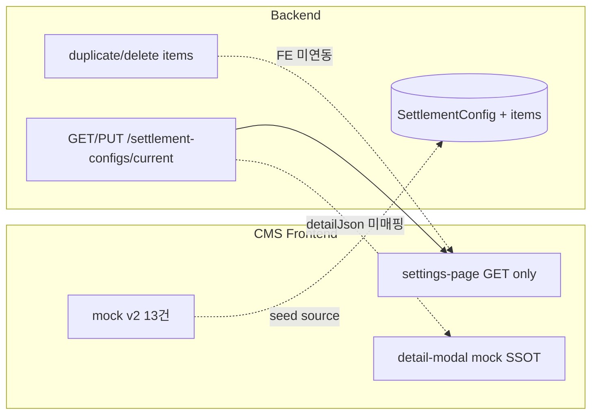

# 정산 항목 설정 — 백엔드 API·DB Seeding 핸드오프

| 항목 | 값 |
|------|-----|
| **작성일** | 2026-08-27 |
| **대상** | 백엔드 (SettlementConfig / 산출 엔진 / local seed) |
| **화면** | CMS LNB `정산 관리` → `정산 항목 설정` (`/settlement-management/item-settings`) |
| **OpenAPI** | [`apps/cms/openapi/settlement.openapi.json`](../../openapi/settlement.openapi.json) — localhost:8080 v9 스냅샷 |
| **FE mock SSOT** | [`settlement-item-settings.ts`](../../src/data/mock/settlement-item-settings.ts) · [`settlement-item-setting-detail.mock.ts`](../../src/data/mock/settlement-item-setting-detail.mock.ts) |
| **산출·enum SSOT** | [`settlement-item-settings-category-backend-cursor-prompt.md`](./settlement-item-settings-category-backend-cursor-prompt.md) |
| **PUT 시드 예시** | [`settlement-item-settings-seed-v2.payload.json`](./settlement-item-settings-seed-v2.payload.json) |

**구버전 (사용 금지)**

- [`settlement-item-settings-dummy-seed-backend-request.md`](./settlement-item-settings-dummy-seed-backend-request.md) — CASE-01~15 · 15건
- [`settlement-item-settings-seed.payload.json`](./settlement-item-settings-seed.payload.json) — v1 payload

---

## 1. 개요

CMS 정산 항목 설정 화면을 **remote API**로 전환하려면 백엔드가 FE mock v2 카탈로그(**13건**)와 동일한 데이터를 `GET/PUT /api/admin/settlement-configs/current`로 제공해야 한다. 현재 프론트는 remote 모드에서 **목록 GET만** 연동하고, 상세 모달·저장·복제·삭제는 mock SSOT + readOnly로 동작한다.

### 1.1 FE SSOT (2026-08-27)

| 구분 | 건수 | mock id |
|------|------|---------|
| 임금 | 6 | w-1, w-2, w-3, w-4, w-5, w-gemini |
| 지급 | 6 | p-1, p-2, p-4, p-3, p-7, p-6 (목록 표시 순서) |
| 공제 | 1 | d-1 |
| **합계** | **13** | |

### 1.2 Notion (CMS 기능정의서)

| 페이지 | Notion ID |
|--------|-----------|
| 목록 개요 | `33af3e2a-77d0-80ea-8313-e6df4aa2e538` |
| 지급 항목 | `33af3e2a-77d0-80fb-a08-cc349ab4b8b5f` |
| 공제 항목 | `33af3e2a-77d0-80f8-9c02-da51f89e0a62` |
| 상세 (교통·숙박·식사·활동 등) | 2-1 ~ 2-4 하위 페이지 |

### 1.3 연동 현황



| FE 파일 | 역할 |
|---------|------|
| [`settlement-item-settings-page.tsx`](../../src/pages/settlement-management/settlement-item-settings-page.tsx) | remote 시 `readOnly`, duplicate/delete는 payment만 UI 노출 |
| [`map-settlement-config-sections.ts`](../../src/features/settlement-management/api/settlement-configs/map-settlement-config-sections.ts) | GET 응답 → 목록 카드만 매핑 |
| [`settlement-item-setting-detail-modal.tsx`](../../src/pages/settlement-management/settlement-item-setting-detail-modal.tsx) | 상세는 `getSettlementItemSettingDetail(feMockId)` — API 미사용 |

---

## 2. 현재 API 인벤토리

### 2.1 엔드포인트

| Method | Path | OpenAPI | FE 연동 |
|--------|------|---------|---------|
| GET | `/api/admin/settlement-configs/current` | 구현 완료 | **연동됨** (목록) |
| PUT | `/api/admin/settlement-configs/current` | 구현 완료 | **미연동** |
| DELETE | `/api/admin/settlement-configs/current` | 구현 완료 | 미사용 |
| POST | `.../items/{itemKind}/{itemId}/duplicate` | 구현 완료 | **미연동** |
| DELETE | `.../items/{itemKind}/{itemId}` | 구현 완료 | **미연동** |
| POST | `.../current/duplicate` | 구현 완료 | 미사용 |

### 2.2 DTO (settlement.openapi.json)

**SettlementConfigResponse / UpdateRequest**

- envelope: `configName`, `effectiveFrom`, `effectiveTo`, `dailyIncomeThreshold`, `earnedIncomeDeduction`, `smallTaxExemptionThreshold`, `useYn`
- `wageItems[]`, `paymentItems[]`, `deductionItems[]`

**WageItemResponse** (GET)

- `wageItemType`, **`name`**, `amount`, `calculationUnit`, `editableYn`
- `layout`, `basisHours`, `maxLimitWon`, `qualificationLines[]`, `remarkLines[]`
- `iconKey`, `emojiOverride`, `detailJson` (string), `rateItems[]`

**WageItemUpsertRequest** (PUT) — **필드명 주의**

- Response는 `name`, Upsert는 **`itemName`** 사용 (OpenAPI v9 기준)

**PaymentItemResponse / UpsertRequest**

- `itemName`, `maxAmount`, `maxLimitWon`, `taxableYn`, `useYn`
- `layout`, `iconKey`, `emojiOverride`, `detailJson` (string)
- **`paymentItemType` 없음** (추가 필요)
- **`qualificationLines` / `remarkLines` flat 필드 없음**

**DeductionItemResponse / UpsertRequest**

- `itemName`, `deductionRate`, `deductionAmount`, `useYn`
- `layout`, `iconKey`, `description`, `detailJson` (string)
- withholding 전용 flat 필드 없음 → `detailJson`에 저장

---

## 3. 갭 분석 및 수정 필요 사항

### 3.1 P0 — 시드·산출·프론트 연동 blocker

| # | 갭 | 현재 | FE mock v2 요구 |
|---|-----|------|----------------|
| 1 | 카탈로그 건수 | 구 v1 seed 15건 (보조·다수인출강·단순인건비·회의참석비 등) | **13건 고정**. 폐기 항목 `useYn=false` 또는 삭제 |
| 2 | `paymentItemType` | OpenAPI·Response 없음 | enum 6종 — 산출·아이콘·layout 분기 SSOT |
| 3 | `detailJson` 스키마 | `string` only, 검증 없음 | layout별 JSON 구조 정의 + BE validation (§4) |
| 4 | 지급·공제 조건/비고 | Payment/Deduction flat 없음 | `qualificationLines`, `remarkLines`를 **detailJson 내부** 저장 (또는 flat 추가 후 OpenAPI 갱신) |
| 5 | GET ↔ 상세 모달 | FE mock id 고정 lookup | API `layout` + flat + `detailJson` parse → `SettlementItemSettingDetail` (BE seed 정확도 선행) |
| 6 | Config envelope | 불일치 가능 | `dailyIncomeThreshold=125000`, `earnedIncomeDeduction=150000`, `smallTaxExemptionThreshold=1000` |

### 3.2 P1 — CRUD·운영

| # | 갭 | 요구 |
|---|-----|------|
| 7 | duplicate/delete 가드 | `itemKind=payment`만 성공. wage/deduction → **409** + 한국어 메시지 |
| 8 | PUT semantics | FE는 full body PUT 예정. 항목 `id` 유지 upsert |
| 9 | `maxAmount` vs `maxLimitWon` | PaymentItem 두 필드 공존 — **시드·산출 SSOT는 `maxLimitWon`**. `maxAmount`는 동기화 alias 또는 deprecated 명시 |
| 10 | Gemini rate | `rateItems[{unitCount, amount}]` 또는 detailJson `session1Won`~`session4Won` — **0 / 170000 / 220000 / 270000** |

### 3.3 문서·시드 불일치 (v2가 정답)

| 항목 | 구 v1 seed | **FE mock v2 (2026-08-27)** |
|------|------------|----------------------------|
| p-2 카드명 | 1사1교 교통비 / 학생 교통비 혼재 | **`교통비(학생)`** |
| p-2 transport | `user_choice` | **`public_transit` only** |
| p-6 활동비 한도 | 50,000 | **1,000,000** |
| p-6 layout | `meal` | **`volunteerActivity`** |
| p-4 UI | 산정 기준 단위 행 | UI는 **최대 한도 + 증빙** 2행만 (내부 `basisUnit=시간`, `basisHours=1`) |
| d-1 조건 | 구 문구 | **`지급액이 125,000원 초과인 경우`** |
| d-1 UI 라벨 | 수익 제외 범위 | **소액 부징수 범위** (`withholdingExclusionMaxWon=1000`) |

### 3.4 폐기 카탈로그 (seed 금지)

| 구 항목 | wageItemType / 비고 |
|---------|---------------------|
| 보조 강사비 | `ASSISTANT` |
| 다수인출강비 | `MULTI_INSTRUCTOR` |
| 단순인건비 | `SIMPLE_LABOR` |
| 회의참석비 | payment — `MEETING` 등 |
| 교통비 (1사1교) 카드 | 강사/학생 **재분리** 후 별도 카드 없음 |

---

## 4. `detailJson` 스키마

API 저장: `detailJson = JSON.stringify(object)`. GET 시 동일 구조 parse.

### 4.1 layout별 키

| layout | 대상 | detailJson (stringify 전) | flat 필드 (Wage만) |
|--------|------|---------------------------|-------------------|
| `tier1` | w-1~w-3 | `{ compareKind, basicFeeWon?, longDistanceFeeWon? }` | `qualificationLines`, `remarkLines`, `basisHours`, `maxLimitWon` |
| `specialLecture` | w-4, w-5 | `{ compareKind, unitChoice?: ["hour","day"] }` | qualification/remark flat |
| `gemini` | w-gemini | `{ session1Won, session2Won, session3Won, session4Won }` + optional `rateItems` | qualification/remark flat |
| `transport` | p-1, p-2 | `{ transportCommuteMode, evidenceSubmission, minDistanceKm: 30, qualificationLines[], remarkLines[] }` | — |
| `lodging` | p-3, p-7 | `{ evidenceSubmission, qualificationLines[], remarkLines[] }` | `maxLimitWon`, `taxableYn` |
| `meal` | p-4 | `{ evidenceSubmission, qualificationLines[], remarkLines[] }` | `maxLimitWon` |
| `volunteerActivity` | p-6 | `{ evidenceSubmission, qualificationLines[], remarkLines[] }` | `maxLimitWon` |
| `withholdingDailyWorker` | d-1 | withholding 4세율 + exclusion + earnedIncome + `qualificationLines[]` | envelope thresholds |

### 4.2 transportCommuteMode

- **`private_car`** — 강사 교통비 (p-1)
- **`public_transit`** — 교통비(학생) (p-2)
- **`user_choice`** — **v2 seed 금지** (FE UI 제거됨)

### 4.2 evidenceSubmission

- `required` | `not_required`

---

## 5. DB Seeding 방향

### 5.1 전략

| 항목 | 값 |
|------|-----|
| seedLabel | `settlement-config-catalog-v2-2026-08` |
| 대상 | SettlementConfig current 1건 + wage 6 + payment 6 + deduction 1 |
| profile | `local`, `dev` only — **prod migration 금지** |
| idempotent | 동일 seedLabel이면 skip; label bump 시 upsert replace |

### 5.2 실행 단계

1. current config 조회
2. 구 카탈로그 항목 → `useYn=false` 또는 hard delete (운영 정책 선택)
3. v2 13건 upsert (`wageItemType` / `paymentItemType` stable code)
4. envelope 필드 설정
5. integration test: GET 13건 · layout · detailJson parse

### 5.3 envelope

```json
{
  "configName": "JA Korea 기본 정산 설정",
  "effectiveFrom": "2026-01-01",
  "effectiveTo": "2099-12-31",
  "dailyIncomeThreshold": 125000,
  "earnedIncomeDeduction": 150000,
  "smallTaxExemptionThreshold": 1000,
  "useYn": true
}
```

### 5.4 항목별 시드 (전체 13건)

#### 임금 (wageItems)

| feMockId | wageItemType | itemName (PUT) | layout | maxLimitWon | iconKey |
|----------|--------------|----------------|--------|-------------|---------|
| w-1 | TIER1 | 1급 강사비 | tier1 | 500000 | wage_tier1 |
| w-2 | TIER2 | 2급 강사비 | tier1 | 400000 | wage_tier2 |
| w-3 | TIER3 | 3급 강사비 | tier1 | 300000 | wage_tier3 |
| w-4 | SPECIAL_LECTURE | 특강 강사비 | specialLecture | null | wage_special_lecture |
| w-5 | OTHER_LABOR | 기타 인건비 | specialLecture | null | wage_other_labor |
| w-gemini | GEMINI | 제미나이 강사비 | gemini | null | wage_gemini |

**w-1 qualificationLines** (5줄):

1. 해당분야 최고의 전문가
2. 전·현직 장관(급) 및 대학총장(급)
3. 전·현직 국회의원, 대기업 총수, 국영기업체
4. 정부 출연 연구기관장, 기업·기관, 단체의 장
5. 사회 통념상 상기 자격에 준하는 자로서 교육운영본부 사무총장이 인정하는 자

**w-1 remarkLines** (2줄):

1. 유급의 내부직원에게는 지급 불가
2. 강의에 필요한 교재의 원고료, 강사 교통비(실비)는 필요사유에 따라 별도 지급 가능

(w-2, w-3 qualification/remark — FE mock [`settlement-item-setting-detail.mock.ts`](../../src/data/mock/settlement-item-setting-detail.mock.ts) W2_DETAIL, W3_DETAIL 참조)

**w-gemini detailJson**:

```json
{
  "session1Won": 0,
  "session2Won": 170000,
  "session3Won": 220000,
  "session4Won": 270000
}
```

**w-gemini rateItems** (병행 가능):

| unitCount | amount |
|-----------|--------|
| 1 | 0 |
| 2 | 170000 |
| 3 | 220000 |
| 4 | 270000 |

#### 지급 (paymentItems) — 목록 표시 순서

| feMockId | paymentItemType | itemName | layout | maxLimitWon | taxableYn | evidence |
|----------|-----------------|----------|--------|-------------|-----------|----------|
| p-1 | TRANSPORT_INSTRUCTOR | 강사 교통비 | transport | null | true | not_required |
| p-2 | TRANSPORT_STUDENT | **교통비(학생)** | transport | null | false | required |
| p-4 | MEAL | 식사비 | meal | 30000 | false | required |
| p-3 | LODGING_GENERAL | 숙박비 | lodging | 150000 | false | required |
| p-7 | LODGING_1C1S | 숙박비 (1사1교) | lodging | 80000 | true | not_required |
| p-6 | ACTIVITY | 활동비 | **volunteerActivity** | **1000000** | false | required |

**p-1 detailJson** (qualification/remark 포함):

- transportCommuteMode: `private_car`
- minDistanceKm: 30
- qualificationLines: `["네이버 지도를 기준으로, 입력된 강사 자택 주소 및 강의 장소 기준으로 거리 및 유류와 톨비가 고려된 금액 자동 산출"]`
- remarkLines: `["실비 영수증이 없을 경우 강사 교통비를 지급하지 않는 것이 원칙이나, 팀별 판단에 따라 편도 교통비 영수증만으로도 왕복 교통비를 지급"]`

**p-2 detailJson**:

- transportCommuteMode: `public_transit`
- evidenceSubmission: `required`
- qualificationLines: 대중교통 이용비 / 톨비 영수증 2줄 (mock P2_DETAIL)
- remarkLines: `["실비 영수증 필수 제출"]`

**p-4 qualificationLines**: `["1인 1식 기준"]`

**p-3 qualificationLines**: `["1인 1실 기준"]`

**p-7 qualificationLines**: `["숙박비 고정 지급"]`  
**p-7 remarkLines**: `["영수증 제출 없음. 세금 징수."]`

**p-6 qualificationLines**: `["참여자에게 지급되는 지원비"]`

#### 공제 (deductionItems)

| feMockId | itemName | layout | iconKey |
|----------|----------|--------|---------|
| d-1 | 일용근로자 원천징수세액 | withholdingDailyWorker | deduct_business_33 |

**d-1 detailJson**:

```json
{
  "withholdingExclusionMaxWon": 1000,
  "withholdingEarnedIncomeDeductionWon": 150000,
  "withholdingTaxRateBusiness": 3.3,
  "withholdingTaxRateOther": 8.8,
  "withholdingTaxRatePrize": 4.4,
  "withholdingTaxRateInterview": 22,
  "qualificationLines": ["지급액이 125,000원 초과인 경우"]
}
```

### 5.5 검증 체크리스트 (REST)

- [ ] GET current → wage 6 / payment 6 (`useYn !== false`) / deduction 1
- [ ] 목록 이름·순서가 FE mock과 일치 (p-2 = `교통비(학생)`)
- [ ] p-6 `maxLimitWon` = 1000000, layout = `volunteerActivity`
- [ ] envelope thresholds = 125000 / 150000 / 1000
- [ ] 모든 item `detailJson` JSON parse 가능
- [ ] p-1/p-2 `transportCommuteMode` ∈ {`private_car`, `public_transit`} — `user_choice` 없음
- [ ] POST duplicate payment → 200 + new id
- [ ] POST duplicate wage → 409
- [ ] DELETE deduction → 409

---

## 6. 백엔드 Cursor 프롬프트 (복붙용)

아래 블록을 백엔드 레포 Cursor에 붙여넣고, 이어서 [`settlement-item-settings-category-backend-cursor-prompt.md`](./settlement-item-settings-category-backend-cursor-prompt.md) 전체를 붙인다.

```markdown
## FE mock v2 delta (2026-08-27) — 이 diff가 구 seed·category prompt §1.2·§5보다 우선

- 카탈로그 13건 고정. CASE-01~15 / 보조·다수인출강·단순인건비·회의참석비 seed 금지.
- p-1 강사 교통비: layout=transport, transportCommuteMode=private_car, evidenceSubmission=not_required, minDistanceKm=30, taxableYn=true
- p-2 **교통비(학생)** (itemName 정확히 이 문자열): paymentItemType=TRANSPORT_STUDENT, public_transit, evidence required, taxableYn=false
- p-4 식사비: maxLimitWon=30000, qualification "1인 1식 기준", layout=meal
- p-6 활동비: maxLimitWon=**1000000**, layout=**volunteerActivity** (meal 아님), qualification "참여자에게 지급되는 지원비"
- p-7 숙박비(1사1교): maxLimitWon=80000, evidenceSubmission=not_required, taxableYn=true
- d-1: layout=withholdingDailyWorker, qualification "지급액이 125,000원 초과인 경우", UI 라벨 "소액 부징수 범위"=withholdingExclusionMaxWon 1000
- transportCommuteMode: user_choice 금지 (FE UI 제거)
- OpenAPI: PaymentItemResponse/UpsertRequest에 paymentItemType enum 6종 추가
- Payment/Deduction qualificationLines/remarkLines → detailJson JSON array (또는 flat 추가 후 OpenAPI 갱신)
- seedLabel=settlement-config-catalog-v2-2026-08, idempotent upsert
- PUT payload 예시: apps/cms/docs/api/settlement-item-settings-seed-v2.payload.json
- 산출 규칙·CRUD 가드·수용 기준 8건은 category prompt §3~4 유지 (활동비 한도만 1000000으로 override)
```

**작업 순서**

1. OpenAPI `paymentItemType` enum + detailJson validation
2. Flyway/Liquibase 또는 dev seed — v2 13건
3. GET/PUT round-trip test
4. duplicate/delete guard test
5. Swagger 재배포 → FE `pnpm --filter cms fetch:openapi && pnpm --filter cms generate:api`

---

## 7. FE 후속 연동 (BE 완료 후)

백엔드 scope 아님 — 참고용.

- [ ] `mapApiItemToDetail(item)` — layout + detailJson → `SettlementItemSettingDetail`
- [ ] remote PUT 저장 mutation
- [ ] payment duplicate/delete API 연동
- [ ] `settlementConfigsRemote` readOnly 해제
- [ ] Orval `PaymentItemType` enum 반영

---

## 8. 수용 기준 (BE PR)

[`settlement-item-settings-category-backend-cursor-prompt.md`](./settlement-item-settings-category-backend-cursor-prompt.md) §4 8건 + 추가:

| # | 기준 |
|---|------|
| 9 | Seed 후 GET 13건 이름·순서 = [`settlement-item-settings.ts`](../../src/data/mock/settlement-item-settings.ts) |
| 10 | p-6 maxLimitWon=1000000, p-2 itemName=`교통비(학생)` |
| 11 | detailJson parse 결과 = [`getBaseSettlementItemSettingDetail`](../../src/data/mock/settlement-item-setting-detail.mock.ts) 필드 동치 |
| 12 | OpenAPI에 `paymentItemType` enum 문서화 |

---

## 9. 관련 문서

| 문서 | 용도 |
|------|------|
| [settlement-item-settings-category-backend-cursor-prompt.md](./settlement-item-settings-category-backend-cursor-prompt.md) | 산출 엔진·enum·CRUD 가드 SSOT |
| [settlement-item-settings-seed-v2.payload.json](./settlement-item-settings-seed-v2.payload.json) | PUT body 예시 (detailJson escaped) |
| [settlement-api-backend-gaps.md](./settlement-api-backend-gaps.md) §9 | FE↔API 갭 추적 |
| [settlement-api-integration.md](./settlement-api-integration.md) | 조회 연동 |
