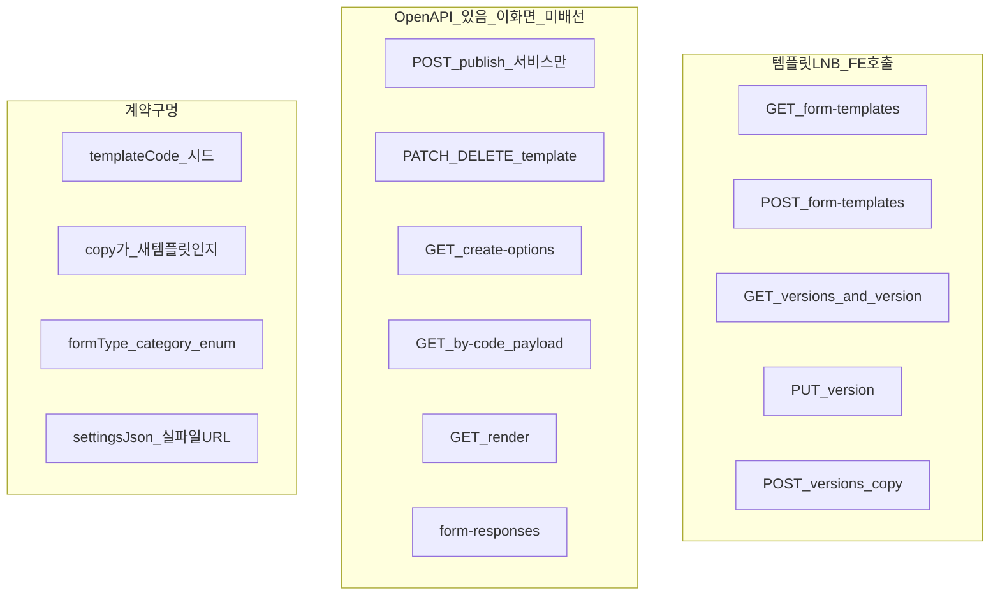

# 템플릿 관리 — API 전환률 · 미적용 API (백엔드 핸드오프)

**대상 독자**: 백엔드  
**작성일**: 2026-08-24  
**범위**: CMS LNB **템플릿 관리** (`/templates/form-management`) 화면 탭 3개만.  
알림톡 `notification-templates`, 프로그램 상세 `form-bindings` / 강의평가 `form-responses/submit`는 **이 LNB가 아님** (아래 §0·§4).  
**OpenAPI 스냅샷**: `apps/cms/openapi/forms-surveys.openapi.json` (spec **v9**)  
**FE 연동 코드**: `apps/cms/src/features/template/**`, `apps/cms/src/pages/templates/**`  
**카탈로그 SSOT**: `packages/form-schema/src/catalog/form-template-catalog.ts` (CMS는 `@jakorea/form-schema/catalog` re-export)

**관련 (본 문서가 전환률·미적용 API SSOT)**

- 연동 명세: [forms-surveys-api-integration.md](./forms-surveys-api-integration.md)
- JSON 계약: [form-template-json-contract.md](./form-template-json-contract.md)
- 갭 목록(2026-07, 일부 구식): [forms-surveys-api-backend-gaps.md](./forms-surveys-api-backend-gaps.md)
- 신규 생성만: [template-create-api-backend-handoff.md](./template-create-api-backend-handoff.md)
- 발급 후속: [issuance-form-api-follow-up.md](./issuance-form-api-follow-up.md)
- 인증서 이미지: [certificate-image-storage-handoff.md](./certificate-image-storage-handoff.md)
- 시드 JSON: [form-template-seeds/](./form-template-seeds/)

게이트: `VITE_REAL_API_MODULES`에 `formsSurveys` + MFA 완료 JWT (`hasRemoteAdminJwt()`).  
로컬 `.env`에는 **이미 `formsSurveys` 포함**. 목록·draft는 실패 시 **mock/localStorage로 조용히 대체**됩니다. 빈 DB여도 화면이 가득 찬 것처럼 보입니다.

---

## 0. 한 장 요약 (백엔드 액션)

LNB는 자식 메뉴가 없고, 화면 **탭 3개**가 하위 카테고리입니다.

| 탭 | CMS 쿼리 | 역할 |
|----|----------|------|
| 작성 양식 | `?tab=template-form` (기본) | 등록·모집·신청·설문·동의 **32종** + 신규/복제 |
| 발급 양식 | `?tab=issuance-form` | 보고·서류 **14종** + 인증서 이미지 |
| 양식 테스트 | `?tab=form-test` | 로컬 플레이그라운드. **API 전환 대상 아님** |

| ID | 우선 | 요청 | 영향 |
|----|------|------|------|
| **T-01** | **P0** | 작성 **32종** + 발급 **14종** `templateCode`를 **FE 카탈로그와 동일 문자열**로 DB 시드. 각 템플릿 **version 1** (`schemaJson` 또는 Payload D는 `settingsJson`) | 목록이 비면 FE가 **mock 카탈로그를 merge**해 운영처럼 보임 |
| **T-02** | **P0** | `POST .../versions/copy`가 **(B) 신규 template + DRAFT version**인지 명시. 응답 `templateId` · `templateVersionId` · `templateCode` **필수** | 「+ 신규 템플릿」복제. `templateCode` 없으면 FE가 **원본 코드로 편집** |
| **T-03** | **P0** | `POST /api/admin/form-templates` 필수 필드·`templateCode` 자동발급·**version 1 DRAFT 자동 생성**·응답 `versions[0].templateVersionId` | 설문/동의 **직접 등록** |
| **T-04** | **P0** | `formType` / `category` / `versionStatus` **OpenAPI enum** | 목록 필터·섹션 그룹·DRAFT 선택 |
| **T-05** | **P0** | 인증서 이미지 **실제 업로드** + `settingsJson`에 브라우저가 열 수 있는 `url` (fileId만 있으면 FE 복원 실패) | 수료증 등 Payload D 5종 |
| **T-06** | **P1** | 스테이징 smoke: 목록 GET → version GET → PUT `schemaJson`/`settingsJson`/`extensionJson` | hybrid fallback 숨김 |
| **T-07** | **P1** | `GET /form-templates/create-options` 계약 확정 (category·creatable) | 신규 모달 옵션 (FE 미배선) |
| **T-08** | **P1** | `GET .../by-code/{templateCode}/payload` 를 목록 캐시 대체용으로 쓸 수 있게 문서화 | `latestVersionId` 없어도 draft 로드 |
| **T-09** | **P2** | 템플릿 이름 변경·삭제 (`PATCH`/`DELETE /form-templates/{templateId}`) CMS 정책 | 있으면 FE가 붙임. 지금은 Orval만 |
| **T-10** | **P2** | 양식 테스트용 응답 목록/제출 — **기획 준비 중** | `form-responses`는 프로그램 설문에서 일부 사용 |

**요청하지 않음 (이 문서 범위 밖)**

- `GET /api/admin/notification-templates` — 알림 관리. 이미 다른 모듈.
- 프로그램 상세 `GET/POST/PATCH/DELETE .../programs/{programId}/form-bindings` — 프로그램 LNB.
- `POST /api/admin/form-responses/submit` — 프로그램 강의평가 등. 템플릿 관리 탭이 아님.
- `POST /form-templates/{id}/versions` (새 version만 추가) — FE는 create/copy/PUT만 씀.
- 양식 테스트 탭용 신규 API — UI가 「준비 중」.

---

## 1. 전환률

가중: **작성 양식 50% + 발급 양식 40% + 양식 테스트 10%**.  
양식 테스트는 로컬 UI라 점수가 낮아도 **운영 탭(작성+발급)이 본체**입니다.

점수는 **백엔드 계약이 화면 기획을 충족하는 비율**(시드·필드·의미)과 **FE가 실제로 호출하는 비율**을 나눕니다.

| 탭 | FE 배선 | OpenAPI | **백엔드 계약** | **FE 배선** | 한 줄 |
|----|---------|---------|----------------:|------------:|------|
| 작성 양식 | 목록 GET + draft GET/PUT + create + copy (hybrid) | 있음 | **~65%** | **~75%** | 라우트는 됨. 시드·copy 의미·create 계약이 구멍. 실패 시 mock |
| 발급 양식 | 목록 GET + 11종 load/save + settingsJson | 있음 | **~55%** | **~70%** | 시드·이미지 업로드 실저장이 없으면 재진입 시 로고 유실 |
| 양식 테스트 | API 없음 (로컬 모달) | 응답 API는 있음 | **~5%** | **~5%** | 의도적 미연동 |

**운영 탭만 균등 (작성+발급) ≈ 60%**  
**탭 3개 가중 평균 ≈ 55%** (테스트 탭이 깎음)

| 구분 | 수치 | 의미 |
|------|------|------|
| 작성 `templateCode` | **32** | 구 문서 27종에서 증가 (1사1교·교사·Gemini 모집/신청 등) |
| 발급 `templateCode` | **14** | 보고 6 + 서류 8 |
| forms-surveys OpenAPI path | **18** | 아래 §3 |
| 그중 **템플릿 LNB가 지금 호출** | **7** | 목록 GET/POST, versions GET, copy, version GET/PUT, publish(서비스만) |
| mock/local fallback | **목록·draft 전부** | 로그인 이력처럼 조용히 대체 — 운영 오인 위험 |



---

## 2. 화면 × API 인벤토리

공통

- Base: `/api/admin/form-templates`, `/api/admin/form-template-versions`
- Auth: Bearer 관리자 JWT
- 성공: FE는 `{ success, data }` 래퍼가 있으면 `data` 언랩 (`unwrapApiBody`)
- 화면 키 SSOT는 **`templateCode` 문자열**. `templateId` / `templateVersionId`는 `form-template-version-cache.ts`에 캐시
- 목록 어댑터: API 행이 비면 **mock 카탈로그 행으로 merge** (`form-template-adapters.ts`)

### 2.1 작성 양식 (`?tab=template-form`)

| 항목 | 값 |
|------|-----|
| CMS | `/templates/form-management` |
| 목록 | `GET /api/admin/form-templates?formType=WRITING&useYn=true&page=0&size=200` |
| 실패 | mock `writingSections` |
| 신규 | 「+ 신규 템플릿」→ 복제 또는 직접 등록 |
| 에디터 | 행 클릭 → 풀페이지 모달. draft = version GET/PUT + localStorage 안전망 |

**섹션 ↔ `category` (제안 enum)**

| UI 섹션 | `formType` | `category` |
|---------|------------|------------|
| 등록 양식 | `WRITING` | `REGISTRATION` |
| 모집 양식 | `WRITING` | `RECRUITMENT` |
| 신청 양식 | `WRITING` | `APPLICATION` |
| 설문 양식 | `WRITING` | `SURVEY` |
| 동의 양식 | `WRITING` | `AGREEMENT` |

**작성 32종 `templateCode` (시드 필수 · T-01)**

| templateCode | templateName | category |
|--------------|--------------|----------|
| `registration-general` | 일반 프로그램 등록 폼 | REGISTRATION |
| `registration-economy` | 1사1교 프로그램 등록 폼 | REGISTRATION |
| `registration-ujat` | UJAT 프로그램 등록 폼 | REGISTRATION |
| `registration-trained-teachers` | 교육받은 교사 프로그램 등록 폼 | REGISTRATION |
| `recruitment-participant-school` | 일반_참여 기관 모집 폼 | RECRUITMENT |
| `recruitment-economy` | 1사1교_참여 기관 모집 폼 | RECRUITMENT |
| `recruitment-participant-individual` | 일반_참여자 모집 폼 | RECRUITMENT |
| `recruitment-instructor` | 공통_강사 모집 폼 | RECRUITMENT |
| `recruitment-volunteer` | 공통_봉사자 모집 폼 | RECRUITMENT |
| `recruitment-ujat-school` | UJAT_참여 기관 모집 폼 | RECRUITMENT |
| `recruitment-ujat-volunteer` | UJAT_봉사자 모집 폼 | RECRUITMENT |
| `recruitment-gemini-visiting-training` | Gemini_찾아가는 연수 모집 폼 | RECRUITMENT |
| `recruitment-trained-teachers` | 교육받은 교사_참여 기관 모집 폼 | RECRUITMENT |
| `application-participant-school` | 일반_참여 기관 신청 폼 | APPLICATION |
| `application-participant-individual` | 일반_참여자 신청 폼 | APPLICATION |
| `application-instructor` | 공통_강사 신청 폼 | APPLICATION |
| `application-volunteer` | 공통_봉사자 신청 폼 | APPLICATION |
| `application-economy` | 1사1교_참여 기관 신청 폼 | APPLICATION |
| `application-trained-teachers` | 교육받은 교사_참여 기관 신청 폼 | APPLICATION |
| `application-gemini-visiting-training-instructor` | Gemini_찾아가는 연수 강사 신청 폼 | APPLICATION |
| `application-gemini-visiting-training-school` | Gemini_찾아가는 연수 참여 기관 신청 폼 | APPLICATION |
| `application-ujat-school` | UJAT_참여 기관 신청 폼 | APPLICATION |
| `application-ujat-volunteer` | UJAT_봉사자 신청 폼 | APPLICATION |
| `survey-default` | 설문조사 | SURVEY |
| `survey-student` | 만족도조사 (학생용) | SURVEY |
| `survey-teacher` | 만족도조사 (교사용) | SURVEY |
| `survey-admin` | 강의평가 (관리자용) | SURVEY |
| `agreement-third-party` | 지급조서 사전 동의서 | AGREEMENT |
| `agreement-crime` | 성범죄 경력조회 동의서 | AGREEMENT |
| `agreement-notice` | 행정정보 공동이용 사전 동의서 | AGREEMENT |
| `agreement-expense` | 교육진행자 동의 서약서 | AGREEMENT |
| `agreement-portrait` | 초상권 수집/이용 동의 | AGREEMENT |

시드 JSON: `apps/cms/docs/api/form-template-seeds/{templateCode}.json` (파일명과 코드가 같음).

**목록 DTO `FormTemplateListItemResponse` — FE가 쓰는 필드**

| 필드 | 용도 |
|------|------|
| `templateCode` | 행 id · 캐시 키. **없으면 행 drop** |
| `templateName` | 목록 표시 |
| `category` | 섹션 그룹 (코드 카탈로그로 폴백) |
| `latestVersionId` | draft GET path. 없으면 `GET .../{templateId}/versions` 추가 호출 후 DRAFT 우선 |
| `templateId` | copy/create 캐시 |
| `updatedAt` | 생성/수정일 표시 |
| `latestVersionNo` / `latestVersionStatus` | 캐시 |

**draft 로드/저장**

| 동작 | API |
|------|-----|
| 로드 | `GET /api/admin/form-template-versions/{versionId}` |
| 저장 | `PUT /api/admin/form-template-versions/{versionId}` |

PUT body (FE):

```json
{
  "schemaJson": "<WritingFormDraft JSON 문자열>",
  "extensionJson": "<optional overlay/editorState/uiState>",
  "settingsJson": "<optional>"
}
```

`schemaJson` 계약 (작성):

```json
{
  "schemaVersion": 1,
  "formSettings": { "titleNumbering": "numeric" },
  "paragraphs": []
}
```

실패 시 `localStorage` (`cms.jakorea.writingFormTemplateSaves.v1`) 유지. **원격 실패가 사용자에게 잘 안 보입니다.**

**신규 템플릿**

| 사용자 동작 | FE 호출 | 기대 |
|-------------|---------|------|
| 신청/설문/동의에서 **기존 양식 선택** | `POST /api/admin/form-templates/{templateId}/versions/copy` body `{ sourceVersionId?, versionLabel? }` | **새** `templateCode`로 에디터 진입 (**T-02 B안**) |
| 설문/동의 **직접 등록** | `POST /api/admin/form-templates` `{ templateName, formType: "WRITING", category: "SURVEY"\|"AGREEMENT", useYn: true, versionLabel: "v1", schemaJson }` | 응답 `templateCode` + `versions[0].templateVersionId` (**T-03**) |
| env/JWT 없음 | 복제: 원본 id stub / 직접: `mode=new` 로컬 | |

copy 응답 `FormVersionAdminResponse.templateCode`가 비면 FE는 `sourceTemplateCode`를 씁니다 → **원본을 덮어쓰는 편집**처럼 보입니다.

**게시**

- 서비스: `POST /api/admin/form-template-versions/{versionId}/publish`
- **CMS 작성 탭에 게시 버튼 호출처 없음** (서비스만 존재). API는 유지해 주세요.

---

### 2.2 발급 양식 (`?tab=issuance-form`)

| 항목 | 값 |
|------|-----|
| 목록 | `GET /api/admin/form-templates?formType=ISSUANCE&useYn=true&page=0&size=200` |
| 실패 | mock `issuanceFormSections` |
| draft | 작성과 동일 GET/PUT. Payload D는 `schemaJson` 비어 있어도 `settingsJson`만으로 로드 |

**섹션 ↔ category**

| UI | FE catalog | BE가 줄 수 있는 값 (어댑터 허용) |
|----|------------|----------------------------------|
| 보고 양식 | `REPORT` | `REPORT` 또는 `ISSUANCE` |
| 서류 양식 | `DOCUMENT` | `DOCUMENT` 또는 `CERTIFICATE` |

**발급 14종 (T-01)**

| templateCode | templateName | Payload | 에디터 |
|--------------|--------------|---------|--------|
| `issuance-1` | UJAT 결과리포트 | E | **플레이스홀더** (저장 UI 없음) |
| `issuance-2` | UJAT 교육계획서 | A | load/save |
| `issuance-ujat-edu-journal` | UJAT 교육일지 | A | load/save |
| `issuance-3` | 강의보고서 | A | load/save |
| `issuance-4` | 정산 신청서 | A | load/save |
| `issuance-5` | 결과보고서 | E | 미리보기만 |
| `document-payment-order-issue` | 지급조서 (발급용) | A | load/save |
| `document-payment-order-pre-consent` | 지급조서 사전 동의서 | A | load/save |
| `document-1` | 지출증빙서류(필수폼) | E | 저장 UI 없음 |
| `document-2` | 휴가 인증서 | D | `settingsJson` only |
| `document-3` | 수료증 | D | `settingsJson` only |
| `document-participation-certificate` | 참가인증서 | D | `settingsJson` only |
| `document-4` | 강사 활동 인증서 | D | `settingsJson` only |
| `document-5` | 봉사 활동 인증서 | D | `settingsJson` only |

Payload A: `schemaJson` = 단락 draft.  
Payload D: `settingsJson`만 (로고·인장·배경). `schemaJson` null/빈 paragraphs 허용.  
Payload E: 빈 DRAFT 시드면 충분.

**인증서 `settingsJson` 이미지 (T-05)**

필드: `orgLogo`, `orgLogo02`, `certificateBackground`, `chairmanSeal`.

FE가 복원하는 형태:

```json
{
  "url": "https://…/files/…png",
  "fileName": "logo.png",
  "fileSize": 12345,
  "uploadedAt": "2026-08-24T00:00:00.000Z"
}
```

`fileId`만 있거나 mock `/uploads/image/file-….png`면 **재진입 시 기본 에셋으로 떨어집니다.**  
공통 파일 업로드가 **실파일 + 표시용 url**을 주고, version GET이 그 url을 다시 내려줘야 합니다.  
상세: [certificate-image-storage-handoff.md](./certificate-image-storage-handoff.md)

`pages/templates/form-template-api.ts` `saveFormTemplateSettings()`는 **setTimeout 스텁**입니다. 실제 저장 경로는 version PUT의 `settingsJson`입니다. 별도 settings PATCH는 **없어도 됩니다** (파일 업로드 API + settingsJson이면 충분).

---

### 2.3 양식 테스트 (`?tab=form-test`)

로컬 버튼(테이블 데모·단일 항목·설명글·폼 관리 모달). 카피: 「준비 중입니다.」  
`form-responses` / `render` / `auto-fill-keys`를 **이 탭은 호출하지 않습니다.**  
백엔드는 기존 응답 API를 지우지 마세요. 프로그램 설문이 씁니다. **템플릿 LNB용 추가 구현은 P2.**

---

## 3. OpenAPI vs 템플릿 LNB FE

| Method | Path | operationId (대략) | 템플릿 LNB |
|--------|------|--------------------|------------|
| GET | `/api/admin/form-templates` | `listTemplates` | **배선** (WRITING / ISSUANCE) |
| POST | `/api/admin/form-templates` | `createTemplate2` | **배선** (직접 등록) |
| GET | `/api/admin/form-templates/{templateId}` | `getTemplate` | 미배선 |
| PATCH | `/api/admin/form-templates/{templateId}` | `updateTemplate` | 미배선 (이름·useYn만 있는 DTO) |
| DELETE | `/api/admin/form-templates/{templateId}` | `deleteTemplate` | 미배선 |
| GET | `/api/admin/form-templates/{templateId}/versions` | `listVersions` | **배선** (latestVersionId 없을 때) |
| POST | `/api/admin/form-templates/{templateId}/versions` | `createVersion1` | 미배선 |
| POST | `/api/admin/form-templates/{templateId}/versions/copy` | `copyVersion` | **배선** (실패 시 원본 id stub) |
| GET | `/api/admin/form-template-versions/{versionId}` | `getVersion` | **배선** |
| PUT | `/api/admin/form-template-versions/{versionId}` | `updateVersion` | **배선** |
| POST | `/api/admin/form-template-versions/{versionId}/publish` | `publishVersion` | 서비스만, **UI 미연결** |
| GET | `/api/admin/form-templates/create-options` | `createOptions` | 미배선 |
| GET | `/api/admin/form-templates/by-code/{templateCode}/payload` | `getTemplatePayloadByCode` | 미배선 |
| GET | `/api/admin/form-template-versions/{versionId}/render` | `render1` | 미배선 |
| GET | `/api/admin/form-auto-fill-keys` | `autoFillKeys` | 미배선 |
| GET | `/api/admin/form-submission-files/{id}/download` | `submissionFileDownload` | 미배선 |
| GET | `/api/admin/form-responses` … | `listResponses` 등 | **이 LNB 아님** |
| POST | `/api/admin/form-responses/submit` | `submitResponse` | 프로그램 도메인 |
| GET/POST/PATCH/DELETE | `/api/admin/programs/{programId}/form-bindings` … | | 프로그램 도메인 |

목록 query는 플랫: `formType`, `category`, `useYn`, `page`, `size`. 로그 관리 `params` 가방과 **다릅니다.**

---

## 4. 미적용 · 계약 수정 요청 (복붙용)

### 4.1 데이터 (라우트 아님) — P0 T-01

작성 32 + 발급 14, **코드 문자열 일치**. 각 1 version.

- 작성: `schemaJson` string. 본문은 FE 시드 JSON 또는 opaque 허용.
- 발급 Payload A: 동일.
- 발급 Payload D: `settingsJson`에 이미지 4필드 `null` 허용.
- 발급 Payload E: 빈 draft.

`systemTemplate=true`는 카탈로그 원본, 사용자 copy/create는 `false`인지 확인해 주세요.

### 4.2 copy 의미 — P0 T-02

CMS 「신규 템플릿」은 **새 template 행**이 필요합니다.

권장 응답:

```json
{
  "templateId": 12345,
  "templateVersionId": 67890,
  "templateCode": "survey-custom-20260824-01",
  "versionNo": 1,
  "versionStatus": "DRAFT"
}
```

동일 template 안 새 version만 만들면, **template duplicate API가 따로** 필요합니다.  
`POST /form-templates`의 `sourceTemplateId` / `sourceTemplateCode`로 복제하는 경로가 SSOT면 FE가 copy 대신 그걸 씁니다. **하나만 지정**해 주세요.

에러: 원본 없음 404, 동시성 409 + 한국어 `message`.

### 4.3 create — P0 T-03

`FormTemplateCreateRequest`가 전부 optional입니다. 확정 요청:

| # | 질문 |
|---|------|
| Q1 | 필수 최소셋? (FE 제안: `templateName`, `formType`, `category`) |
| Q2 | `templateCode` 생략 시 자동 발급 규칙? |
| Q3 | create 한 번에 version 1 DRAFT? `versions[0].templateVersionId` 보장? |
| Q4 | 빈 `schemaJson` 허용? |
| Q5 | enum 최종값 (작성: WRITING + 5 category, 발급: ISSUANCE + REPORT/DOCUMENT 또는 ISSUANCE/CERTIFICATE) |

### 4.4 enum — P0 T-04

```
formType: WRITING | ISSUANCE
category (WRITING): REGISTRATION | RECRUITMENT | APPLICATION | SURVEY | AGREEMENT
category (ISSUANCE): REPORT | DOCUMENT   # 또는 ISSUANCE | CERTIFICATE — 하나만 SSOT
versionStatus: DRAFT | PUBLISHED | … (전이 표)
```

### 4.5 파일 + settingsJson — P0 T-05

1. 업로드 API가 실파일 저장.
2. 응답 `{ fileId, url, fileName, fileSize, uploadedAt }`.
3. FE가 객체를 `settingsJson`에 넣음.
4. version GET이 **유효 url**을 다시 줌.

### 4.6 스펙만 있는 API (지금 구현 강제 아님)

| API | 쓰면 좋은 시점 |
|-----|----------------|
| `GET create-options` | 신규 모달 category 잠금 (T-07) |
| `GET by-code/{code}/payload` | 목록 안 보고 draft 로드 (T-08) |
| `PATCH/DELETE template` | 이름 변경·폐기 (T-09) |
| `POST .../versions` | 버전 히스토리 UI (없음) |
| `GET .../render` | 서버 렌더 (클라 미리보기 사용 중) |
| `GET form-auto-fill-keys` | 자동채움 UI (없음) |

---

## 5. 백엔드 확인 체크리스트

1. 스테이징 `GET .../form-templates?formType=WRITING&size=200` 건수 · `templateCode`가 위 32와 일치하는가.
2. ISSUANCE 14건 동일.
3. 목록 `latestVersionId`가 실제로 채워지는가.
4. copy가 새 template인가, 같은 template의 새 version인가.
5. copy 응답에 `templateCode`가 항상 있는가.
6. create 후 version 1이 생기는가.
7. PUT `extensionJson` / `settingsJson`이 DB에 왕복하는가.
8. 인증서 이미지 url이 재조회 때 200인가.
9. `versionStatus` 실제 값 (`DRAFT` vs 한글).
10. 권한: 관리자 전부 vs 전용 코드.

---

## 6. FE 코드 위치

| 역할 | 경로 |
|------|------|
| HTTP | `features/template/api/form-templates-api-client.ts` |
| 서비스 | `features/template/api/admin-form-templates-service.ts` |
| 목록 어댑터 | `features/template/api/adapters/form-template-adapters.ts` |
| draft JSON | `features/template/api/adapters/form-template-draft-adapters.ts` |
| 카탈로그 | `@jakorea/form-schema/catalog` |
| 작성 목록 훅 | `features/template/hooks/use-writing-form-sections.ts` |
| 발급 목록 훅 | `features/template/hooks/use-issuance-form-sections.ts` |
| 복제/생성 | `duplicate-writing-template.ts` / `create-writing-template.ts` |
| 탭 | `pages/templates/templates-form-management-outlet.tsx` |

---

## 7. 에러·fallback (운영 주의)

| 상황 | FE |
|------|-----|
| `formsSurveys` off 또는 JWT 없음 | 목록 mock, draft localStorage, 복제 stub, 직접 등록 `mode=new` |
| 목록 GET 실패 | **mock 카탈로그 표시** (`isError`여도 빈 화면 아님) |
| draft GET 실패 | localStorage |
| draft PUT 실패 | local 유지 + throw (콘솔 warn) |
| copy 실패 | **원본 templateCode 반환** |
| create 실패 | throw (모달에서 처리) |

공통 래퍼: `success`, `message`(한국어), `error.code` / `error.message`.

---

## 8. 우선순위만 보면

1. **P0**: 46종 시드(T-01) + copy=새 템플릿·code 필수(T-02) + create 계약(T-03) + enum(T-04) + 인증서 실파일 url(T-05)  
2. **P1**: 스테이징 smoke, create-options, by-code payload  
3. **P2**: 메타 PATCH/DELETE, 양식 테스트 응답 UI, render/auto-fill

**문서 끝.**
