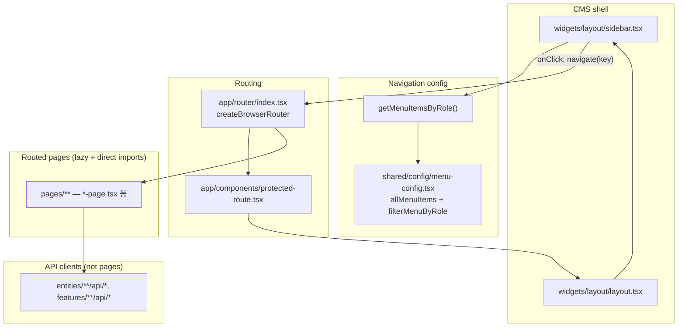

# CMS cleanup reference — unused pages & components (sidebar-based)

This document records a static analysis of `apps/cms`: what is **not** reachable from the left navigation bar (LNB) when only **`sidebar.tsx` → `getMenuItemsByRole` → `menu-config.tsx`** is considered, plus **page modules not wired in the router**.

**Constraints used for the analysis**

- Do **not** treat this as a deletion checklist without review.
- **Keep** auth-related pages, error pages, and API client modules (`entities/**/api`, `features/**/api`, etc.).
- **No files were deleted** as part of producing this document.

---

## Method

- **Sidebar entrypoints** — Every menu item `key` that is `enabled !== false`, passes `filterMenuByRole`, and starts with `/` (from `allMenuItems` in `shared/config/menu-config.tsx`). Group keys such as `programs-group` are not navigated directly.
- **Indirect entry** — A route that is the **immediate redirect target** of a sidebar path (e.g. `/my-learning` → role-specific URLs in `pages/my-learning/my-learning-page.tsx`).
- **Child / workflow routes** — Paths under those prefixes (e.g. `/programs/...`, `/users/...`, CRUD, apply flows).
- **Excluded from “unused”** — Auth routes, error routes, legacy redirects, and `ComingSoonPage` / catch-all behaviors as documented in the prior analysis.

---

## Unused pages (routed but no active LNB item)

These routes exist in `app/router/index.tsx` but **no active sidebar item** targets them (or a parent that clearly covers them the way `/programs` covers `/programs/:id`). They may still be opened via bookmarks, dashboard widgets, in-app links, or if menu items are re-enabled later.

| Area | Paths (representative) | Page module(s) |
|------|------------------------|----------------|
| 신청 관리 (admin) | `/applications`, `/applications/new`, `/:id/...` | `application-list-page`, `application-form-page`, `application-result-page` |
| 강의 신청 관리 | `/instructor-applications` | `instructor-application-list-page` |
| 역할별 신청/진행 | `/my/applications`, `/school/applications`, `/instructor/applications` (+ `:id`) | `my-program-applications-page`, `application-progress-page` |
| 실적 v2 | `/education-records-v2` | `education-record-list-page-v2` |
| 실적 통계 대시보드 | `/performance` | `performance-dashboard-page` |
| 일정 (관리자 캘린더 루트) | `/schedules` (index) | `schedule-calendar-page` — *`/schedules/my` 등은 `/my-learning` 리다이렉트로 간접 진입 가능* |
| 일정 협의 | `/schedule-negotiations`, `/settlements/schedule-negotiations` | `schedule-negotiation-list-page` |
| 매칭 | `/matchings` | `matching-list-page` |
| 정산 (운영·관리자용 일괄 화면) | `/settlements`, `/settlements/overview`, `/settlements/monthly`, `/settlements/calculation-settings`, `/settlements/payment-statements`, `/settlements/pending`, `review`, `paid` | `settlement-list-page`, `settlement-overview-page`, `monthly-settlement-page`, `settlement-calculation-settings-page`, `payment-statement-list-page` |
| 면접 | `/interviews`, `/interviews/my`, `/interviews/apply`, … | `interview-list-page`, `my-interview-page`, `volunteer-detail-page` (apply), `instructor-application-page` |
| 할 일 | `/todos/:id` | `todo-detail-page` |
| 보고서 | `/reports`, `/reports/new` | `report-list-page`, `report-form-page` |
| 강의 상세 | `/lectures/:id` | `lecture-detail-page` |
| 봉사자/봉사 프로그램 묶음 | `/volunteers` 및 하위 전부 | `volunteer-list-page`, `volunteer-program-list-page`, `volunteer-detail-page`, `my-volunteer-*`, `volunteer-education-plan-page` |
| 이력 | `/histories`, `/histories/:id` | `history-list-page`, `history-detail-page` |
| 신청 경로 관리 | `/application-paths` | `application-path-list-page` — *메뉴 항목은 있으나 `enabled: false`* |
| 마이페이지 루트 | `/mypage` (index) | `mypage-main-page` — *LNB에는 하위 항목만 있음* |
| 게시글 관리 루트 | `/admin/posts` (index) | `post-list-page` — *LNB는 notices/faq/inquiries만* |
| 정산 검토 (admin) | `/admin/settlements` | `admin-settlement-review-page` |
| 권한 요청 | `/admin/permission-requests` | `permission-request-list-page` |
| 감사 로그 | `/admin/logs/audit` | `audit-log-list-page` — *LNB는 `/logs/bug`, `/logs/issue` (다른 트리)* |

**Auth / error (intentionally out of “unused”)**

- `/login`, `/register`, `/auth/mfa`, `/forbidden`, `/error`, `ComingSoonPage` usages, legacy `/posts/*` redirects, catch-all `*`.

---

## Unused components (page modules not imported by the router)

These files live under `pages/` but **`app/router/index.tsx` never lazy-imports them**:

- `pages/logs/log-list-page.tsx` (`LogListPage`)
- `pages/surveys/survey-list-page.tsx`
- `pages/settlements/settlement-pending-page.tsx` (`SettlementPendingPage`)
- `pages/settlements/settlement-review-page.tsx` (`SettlementReviewPage`)
- `pages/settlements/settlement-paid-page.tsx` (`SettlementPaidPage`)

The routes `/settlements/pending`, `/settlements/review`, `/settlements/paid` are wired to **`SettlementListPage`**, not the three settlement-specific page components above.

Non-page pieces (e.g. hooks and modals under `pages/programs/`) are omitted here; they support routed screens.

---

## Sidebar ↔ router caveat

The LNB includes keys such as `/templates/program-forms/application`, but the router only registers an **index** route under `/templates/program-forms`. Deeper segments like `/templates/program-forms/application` may not match a dedicated route and can fall through to the layout `path: '*'` `ComingSoonPage`. This is a **path mismatch** risk, not strictly “unused page” classification.

---

## Dependency graph

**Role summary**

- **`sidebar.tsx`** — Renders Ant Design `Menu` from `getMenuItemsByRole`; clicking an item whose `key` starts with `/` calls `navigate(key)`.
- **`menu-config.tsx`** — Source of LNB paths; items with `enabled: false` are filtered out and do not appear.
- **`router/index.tsx`** — Canonical URL ↔ page mapping.
- **`my-learning-page.tsx`** — Sidebar path `/my-learning` redirects by role to `/instructor/schedule`, `/schedules/my`, or `/school/my-learning`, so some routes are **indirect** LNB entry points.

---

## Wider scope (not LNB): dashboard shortcuts

The admin home **menu shortcut** widget uses `SHORTCUT_ITEMS` in `features/dashboard/model/dashboard-settings-store.ts`. After **Phase A** (aggressive cleanup), `/performance` and `/admin/logs/audit` entries were removed from that list so shortcuts only target routes that remain in scope.

---

## Aggressive cleanup — Phase A (commit checkpoint)

**Goal:** Retarget navigation away from routes scheduled for removal in later phases, without changing the router yet.

- **`getApplicationUrl`** (`features/program/lib/program-helpers.ts`) → `/programs/{programId}/apply`.
- **Shortcuts:** Removed `performance` and `audit-log` from `SHORTCUT_ITEMS` and badge defaults; updated `menu-shortcut-widget` icons.
- **Post-apply / my programs:** `program-application-complete-page` and `instructor-mypage-page` → `/programs/my`; `my-program-applications-page` approved rows → `/programs/my/{programId}`.
- **Sidebar:** Program-management `openKeys` no longer treats `/applications` or `/instructor-applications`; removed admin `settlements-group` open key (no LNB group for ops settlements).
- **Dashboard widgets / mocks:** Links to `/applications`, `/settlements` (admin list), `/matchings`, `/schedules` (index), `/performance`, `/volunteers/*`, etc. retargeted to `/programs/education/enrollment`, `/programs/education/instructor-recruitment`, `/schedules/my`, `/programs/education/schedule`, `/education-records`, `/settlements/my/*`, `/programs/volunteer`, `/instructor/reports`, and mock notification links aligned where applicable.
- **`data/mock/todos.ts`:** Sample `targetUrl` updated.

`pnpm run typecheck` in `apps/cms` passes after Phase A.

---

## Aggressive cleanup — Phase B (commit checkpoint)

**Goal:** Remove route trees and lazy imports for pages targeted by the cleanup plan; keep `/schedules/my*`, `/settlements/my*`, auth, and error routes.

- **Removed route modules** from [`app/router/index.tsx`](apps/cms/src/app/router/index.tsx): `/applications`, role-scoped `*/applications` (replaced with `Navigate` to `/programs/my` or enrollment), `/instructor-applications`, `/application-paths`, `/education-records-v2`, `/performance`, `/schedule-negotiations`, `/matchings`, `/interviews`, `/todos`, `/reports`, `/lectures`, `/volunteers`, `/histories`, admin `/admin/settlements`, `/admin/permission-requests`, `/admin/logs/audit` (page components removed from router).
- **Settlements (ops):** `/settlements` index and admin branches redirect to `/programs/education/enrollment`; **`/settlements/my/**` unchanged**.
- **Schedules:** index `/schedules` redirects to `/programs/education/schedule`; **`/schedules/my`, `my/calendar`, `:id` unchanged**.
- **Redirects:** `/mypage` index → `/mypage/profile`; `/admin/posts` index → `/admin/posts/notices`; legacy `posts` root redirect for admin → `/admin/posts/notices`.
- **Bookmark redirects:** Added `Navigate` routes for removed top-level paths (e.g. `applications/*`, `volunteers/*`, `performance`, …) where practical.

`pnpm run typecheck` in `apps/cms` passes after Phase B.

---

## Aggressive cleanup — Phase C (commit checkpoint)

**Goal:** Delete page modules and instructor-application **list** UI that the router no longer loads; keep `manual-assignment-modal.tsx` (used from `program-detail-drawer`).

- **Removed** under `pages/`: applications CRUD/progress, instructor-application list page, application-paths, `education-record-list-page-v2`, performance dashboard, schedule-negotiations, matchings, interviews (list/my/apply), todos detail, reports, lectures detail, volunteers subtree, histories, mypage index, admin settlement review / permission-requests / audit log, post-list index, schedule calendar root, log-list, survey-list, ops settlement pages (`settlement-list`, overview, monthly, calculation-settings, payment-statements, pending/review/paid).
- **Kept** under `pages/settlements/`: `my-*` settlement routes only.
- **Removed** `features/instructor-application/ui/instructor-application-list.tsx`, `instructor-application-detail-drawer.tsx`, and `hooks/use-instructor-application-review.ts`.
- **Empty directories** under `pages/` for removed areas were removed.

`pnpm run typecheck` in `apps/cms` passes after Phase C.

---

## Aggressive cleanup — Phase D (commit checkpoint)

**Goal:** Remove `features/`, `entities/`, `data/mock`, and `types` modules with no remaining importers after Phase C.

- **Deleted features:** `matching`, `interview`, `volunteer`, `performance`, `schedule-negotiation`, `audit-log`; removed `application/ui/application-list.tsx` and `report/hooks/use-lecture-report-submit.ts`.
- **Entities:** Removed `interview`, `schedule-negotiation`, `performance`; trimmed `matching` to **`api/matching-service.ts` only** (still used by `use-settlement-detail`).
- **Mocks / types:** Removed `data/mock/interviews.ts`, `schedule-negotiations.ts`, `performance-stats.ts` and their barrel exports; removed `types/interview.ts`, `types/volunteer.ts` and `export * from './volunteer'` in `types/index.ts`.

`pnpm run typecheck` and `pnpm run build` in `apps/cms` pass after Phase D.

---

## Source files referenced

- `apps/cms/src/widgets/layout/sidebar.tsx`
- `apps/cms/src/shared/config/menu-config.tsx`
- `apps/cms/src/app/router/index.tsx`
- `apps/cms/src/pages/my-learning/my-learning-page.tsx`
- `apps/cms/src/features/dashboard/model/dashboard-settings-store.ts`
