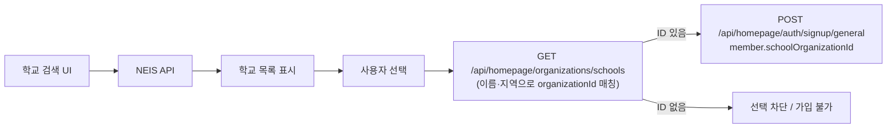

# Handover: 홈페이지 일반회원 가입 — 학교(`schoolOrganizationId`) 연동

**대상:** 백엔드  
**앱:** Platform (사용자 홈페이지)  
**일시:** 2026-07-28  
**환경:** 로컬 Platform → ngrok 백엔드 (`GET /api/homepage/organizations/schools` 기준)

---

## 1. 요약

홈페이지 **일반회원 · 재학 중** 가입 시 백엔드가 `member.schoolOrganizationId`를 필수로 검증합니다.

프론트는 학교 **검색 UX를 NEIS API**로 전환했지만, 가입에 넣는 ID는 여전히 **백엔드 기관 캐시**(`GET /api/homepage/organizations/schools`)에서 조회합니다.  
현재 로컬/ngrok 백엔드의 기관 캐시가 **비어 있어** NEIS에서 학교를 고른 뒤에도 `organizationId`를 확보하지 못하고, 가입 API가 아래 오류로 실패합니다.

```text
INVALID_CREDENTIALS: schoolOrganizationId is required for enrolled general members.
```

---

## 2. 프론트 현재 동작



| 단계 | 데이터 소스 | 비고 |
|------|-------------|------|
| 학교 검색·목록 | **NEIS** (프론트 직접 호출) | CMS 회원 등록과 동일 UX |
| 선택 시 `organizationId` | **`GET /api/homepage/organizations/schools`** | keyword / regionSido / regionSigungu로 매칭 |
| 가입 요청 | **`POST /api/homepage/auth/signup/general`** | 재학 중이면 `schoolOrganizationId` 필수 |

관련 코드:

- 검색 모달: `apps/platform/src/features/auth/sign-up/ui/school-search-modal/school-search-modal.tsx`
- 가입 매핑: `apps/platform/src/features/auth/sign-up/model/mapper/map-signup-request.ts`
- 엔드포인트: `apps/platform/src/features/auth/sign-up/api/endpoints.ts`

---

## 3. 재현 (현재 백엔드)

```http
GET /api/homepage/organizations/schools?keyword=강서&page=0&size=20
GET /api/homepage/organizations/schools?page=0&size=5
```

응답 예시 (둘 다 동일하게 비어 있음):

```json
{
  "content": [],
  "page": 0,
  "size": 20,
  "totalElements": 0,
  "source": "LOCAL_ORGANIZATION_CACHE"
}
```

→ `source: LOCAL_ORGANIZATION_CACHE` 이지만 **캐시/시드 데이터가 없음**.  
NEIS에서는 학교가 검색되므로, UX상 “학교는 보이는데 선택·가입이 안 되는” 상태가 됩니다.

가입 시 (재학 중, `schoolOrganizationId` 누락):

```http
POST /api/homepage/auth/signup/general
```

```text
INVALID_CREDENTIALS: schoolOrganizationId is required for enrolled general members.
```

OpenAPI 참고 스키마: `MemberSignupRequest.schoolOrganizationId` — “재학중 선택 시 학교/기관 ID”.

---

## 4. 프론트에서 이미 한 가드 (참고)

실 API 연동 시:

1. 기관 캐시에서 `organizationId`를 못 찾으면 **학교 선택 완료를 막음**
2. 재학 중인데 `schoolOrganizationId`가 없으면 **프로필 다음 단계 / 제출 차단**
3. 학교명 필드는 **검색 선택만** 허용 (자유 입력으로 ID가 빠지는 것 방지)

즉 프론트만으로는 “빈 캐시”를 우회할 수 없습니다. **백엔드 데이터 또는 API 계약 변경**이 필요합니다.

임시 우회(프론트): 학교 상태를 **해당 없음(NOT_ENROLLED)** 으로 두면 `schoolOrganizationId` 없이 가입 시도 가능.

---

## 5. 백엔드에 확인·요청할 사항

### A. 단기 (로컬/스테이징 검증용)

1. `LOCAL_ORGANIZATION_CACHE`에 **학교 기관 시드**가 있는지, local profile에서 자동 적재되는지
2. 비어 있다면 **시드/동기화 절차** (문서 또는 스크립트) 공유
3. 시드 후 아래가 채워지는지 확인  
   `GET /api/homepage/organizations/schools?keyword={학교명}`

### B. 중기 (NEIS ↔ 기관 ID 계약)

프론트 검색은 이미 NEIS입니다. 가입까지 NEIS만으로 가려면 아래 중 하나가 필요합니다.

| 옵션 | 설명 |
|------|------|
| **B-1** | 기관 캐시를 NEIS(또는 전국 학교) 기준으로 **상시 동기화**하고, 기존 `schools` 검색 API로 ID 제공 (현 계약 유지) |
| **B-2** | 가입 요청에 **NEIS 학교코드**를 받고, 서버가 organization을 **resolve/create** 후 `schoolOrganizationId` 부여 |
| **B-3** | `GET /api/homepage/organizations/schools`가 NEIS를 프록시하면서 **항상 organizationId**를 내려줌 |

원하시면 프론트는 B-2/B-3에 맞춰 필드(`neisCode` 등)를 추가할 수 있습니다. **현재 OpenAPI에는 가입 요청에 NEIS 코드 필드가 없고**, `schoolOrganizationId`(int64)만 있습니다.

### C. 에러 코드

`schoolOrganizationId` 누락이 `INVALID_CREDENTIALS`로 내려옵니다.  
검증 실패라면 `INVALID_REQUEST` / `VALIDATION_ERROR` 쪽이 UX·모니터링에 더 맞을 수 있습니다. (선택 개선)

---

## 6. 관련 API (계약 요약)

| Method | Path | 용도 |
|--------|------|------|
| `GET` | `/api/homepage/organizations/schools` | 가입용 학교·기관 검색 → `organizationId` |
| `POST` | `/api/homepage/auth/signup/general` | 일반회원 가입 (`member.schoolOrganizationId` 재학 시 필수) |
| `POST` | `/api/homepage/auth/signup/teacher` | 교사회원 (`teacher.organizationId` 필수) |

학교 검색 응답 항목(`HomepageOrganizationSearchItem`): `organizationId`, `name`, `organizationCategory`, `regionSido`, `regionSigungu`, `zipcode`, `address`  
→ **NEIS 코드 필드는 응답에 없음.**

---

## 7. 백엔드 회신 부탁

1. 로컬/ngrok에서 기관 캐시가 비는 것이 **의도(시드 미실행)** 인지, **버그**인지  
2. 검증용으로 쓸 수 있는 **샘플 `organizationId` + 학교명**  
3. 장기적으로 **A(캐시 유지)** / **B-2·B-3(NEIS 연동)** 중 어떤 방향을 쓸지  

회신 주시면 Platform 쪽 매핑·가드를 그에 맞게 맞추겠습니다.
